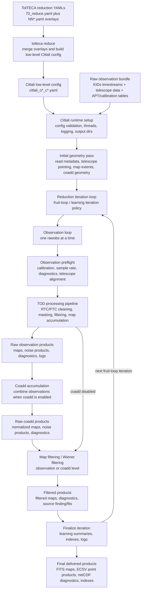
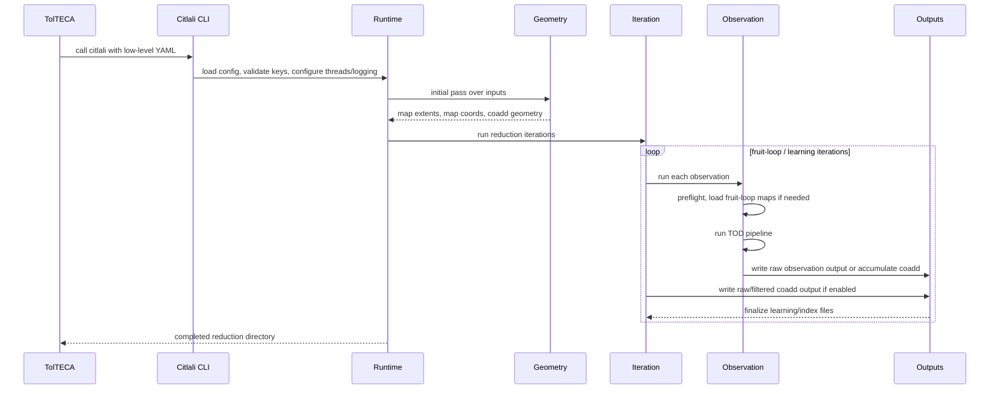
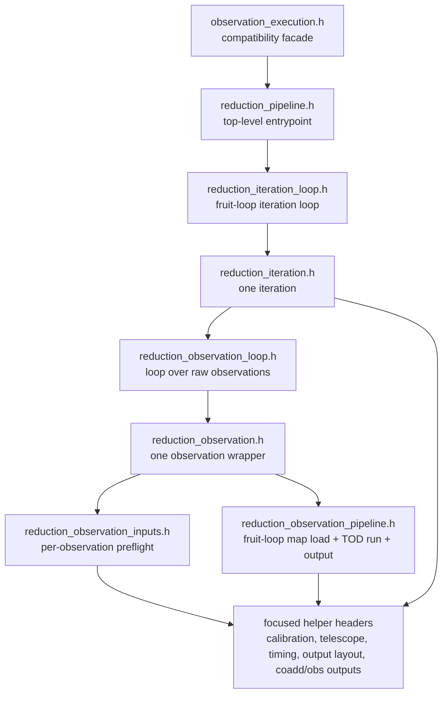
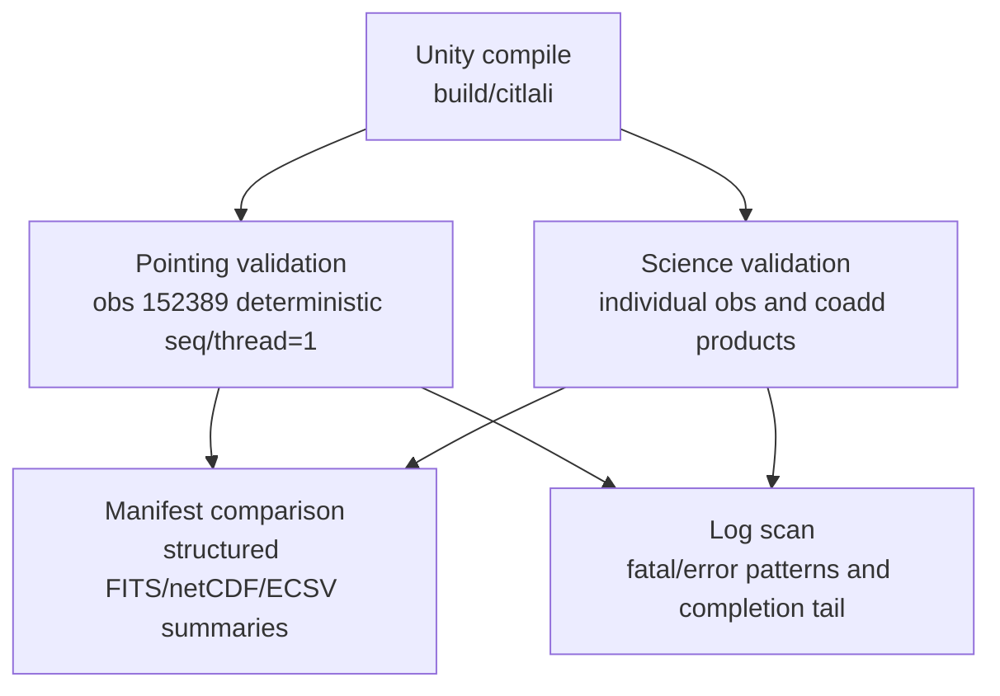

# Citlali Analysis Flow: Raw Data to Science Products

This note is a visual map of the current Citlali/TolTECA reduction flow as used
by the structural refactor validation work. It is intentionally higher level
than the C++ helper split: the goal is to show what happens scientifically and
operationally from raw observation inputs to the products we compare.

## End-to-End Flow

The fruit-loop back edge intentionally returns to the reduction iteration loop,
not to TolTECA config generation or the initial geometry pass. In the current
control flow, each fruit-loop iteration repeats the per-observation reduction
loop, including observation input prep, fruit-loop map loading, TOD processing,
observation output/coadd accumulation, and iteration finalization. The initial
map geometry pass is outside that loop and is reused.

## Product Families by Reduction Type

```mermaid
flowchart LR
    common["Common raw inputs<br/>KIDs files, telescope file, APT/calibration, config"]

    pointing["Pointing"]
    oof["OOF / focus holography"]
    beammap["Beammap"]
    science["Science"]

    pointing_products["Pointing products<br/>raw array maps, point-source fit table, diagnostics"]
    oof_products["OOF products<br/>PSF/beam-shape maps, focus/holography diagnostics"]
    beammap_products["Beammap products<br/>per-detector maps, detector flags, beam parameters"]
    science_products["Science products<br/>raw/filtered coadds, science maps, noise/diagnostic sidecars"]

    common --> pointing --> pointing_products
    common --> oof --> oof_products
    common --> beammap --> beammap_products
    common --> science --> science_products
```

## Runtime Control Flow

## Where the Current Refactor Boundaries Land

The current structural split is converging on these conceptual boundaries:

## Validation Hook Points

The most useful validation checkpoints for the refactor remain:

- compile on Unity after each batch of structural commits
- deterministic pointing reduction against the protected OG baseline
- science individual-observation product comparison
- science filtered/coadded comparison when Wiener-filter runtime is practical
- log scan for fatal/error patterns plus product manifest parity
