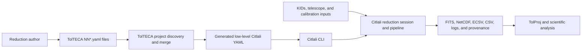
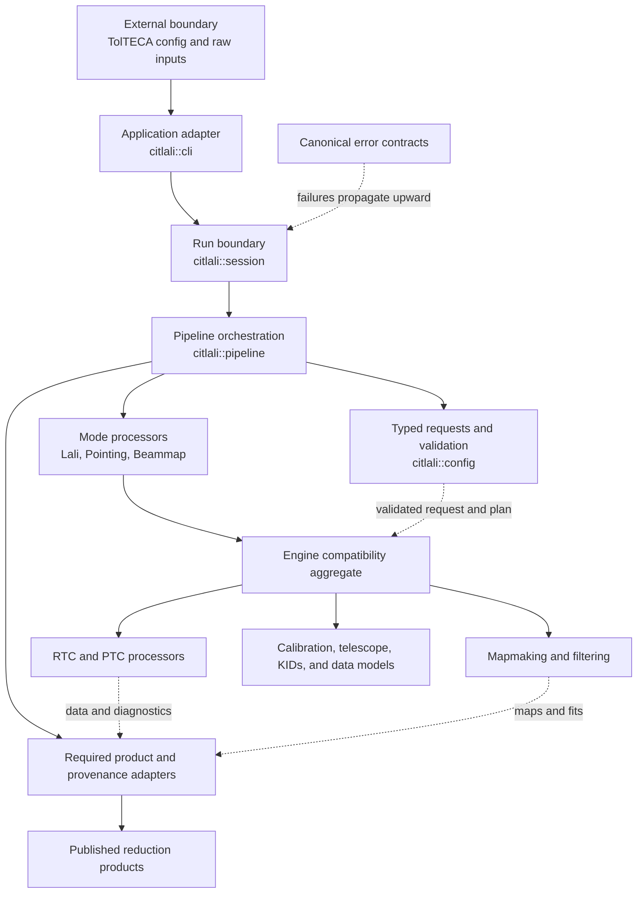
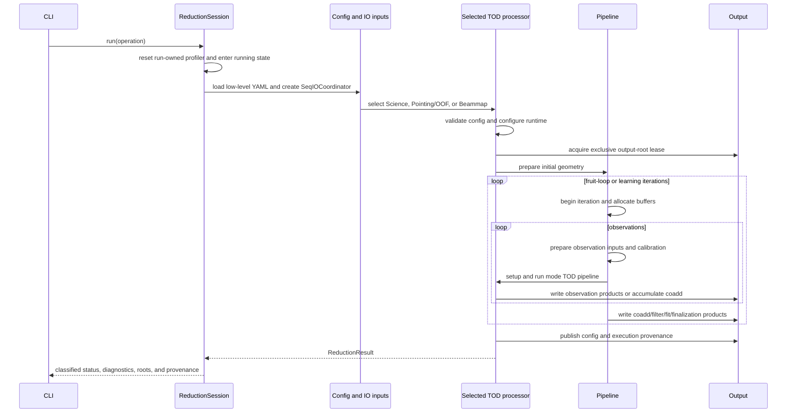
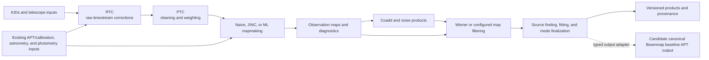

# Citlali Architecture

## APT-PROD-003 compact v2 repair boundary

All APT-dependent validation and new baseline issuance are suspended until the
compact v2 gates pass. The verbose observation APT v1 contract is historical:
its detector-by-field transformation ledger is not admitted by any ordinary
producer or guardian. The current authority is
[`CANONICAL_APT_V2.md`](CANONICAL_APT_V2.md) and [ADR 0012](adr/0012-canonical-apt-v2-compact-normalization.md).

V2 is a normalized, content-addressed set of transparent ECSV components with
one root manifest and one root receipt. Its logical size is O(target rows +
fields + genuine exceptions). Citlali owns encoding, validation, issuance,
guardian admission, and publication; TolAPT owns matching science; TolProj
orchestrates only. Runtime consumers receive a scientific APT table only after
the root receipt and every component have been verified once. Bare ECSV, v1,
migration-marked v2, or synthesized fallback APTs are rejected by default.

Pointing-derived flux calibration follows the same ownership boundary. TolProj
owns correction estimation and its request/report evidence; Citlali alone
issues and admits the immutable calibrated-v2 child. The child retains the
matched detector relation, changes only positive finite `flxscale` cells under
typed exceptions, and binds its matched parent plus all three exact array
factors. Science setup selects the recorded child rather than mutating or
copying an APT into a parallel library.

## Status And Authority

This document is the canonical human-readable map of the current Citlali
software architecture. It describes the active executable path, the intended
direction of dependencies, lifecycle ownership, compatibility boundaries, and
the rules for extending the system without reopening the structural refactor.

It is deliberately honest about the transition. Citlali now has explicit
configuration, session, orchestration, failure, provenance, and validation
contracts, but much of the established numerical implementation is still
header-defined and operates through the broad `Engine` aggregate. The desired
dependency direction in this document governs new work; it does not assert
that every historical include already conforms to that direction.

Use these companion authorities:

- [`REFACTOR_STATUS.md`](REFACTOR_STATUS.md) for the current phase, gates, and
  accepted validation snapshots;
- [`SCIENTIFIC_CONVENTIONS.md`](SCIENTIFIC_CONVENTIONS.md) for scientific
  identities, units, coordinate frames, indexing, and validity;
- [`CANONICAL_APT_V1.md`](CANONICAL_APT_V1.md) for the accepted, currently
  unactivated Citlali-produced canonical Beammap baseline APT contract;
- [`CANONICAL_APT_OBSERVATION_V1.md`](CANONICAL_APT_OBSERVATION_V1.md) for the
  accepted, currently unactivated observation-specific canonical APT contract
  and machine boundary;
- [`RETAINED_DEBT.md`](RETAINED_DEBT.md) for deliberate limitations, role
  owners, reopening triggers, and exit conditions;
- [`adr/README.md`](adr/README.md) for durable consequential decisions;
- `validation/product_contracts.json` for executable product requirements;
- `tools/config/config_leaf_contract_resolved.json` for low-level config
  ownership and value domains; and
- `validation/validation_profiles.json` and `validation/accepted_runs.json`
  for active numerical policy and evidence.

A disagreement among this document, executable contracts, and active code is a
defect to resolve. Historical plans and handoff notes explain how the project
arrived here but do not override the living status or this architecture map.

## System Context

Citlali is the C++ reduction engine in a larger operational system. It does not
discover reduction projects or merge the user-facing numbered configuration
files used by TolTECA.

The ownership boundary is:

- TolTECA owns discovery, ordering, and merge semantics for `NN*.yaml`
  authoring files, input collection, and upstream calibration selection.
- The generated low-level YAML is Citlali's immutable configuration boundary.
- Citlali owns validation and execution from that boundary through required
  product publication and provenance.
- TolProj and downstream tools own calibrator selection, higher-level
  interpretation, and analysis beyond Citlali's declared product contracts.

The CLI can technically accept and merge more than one low-level config path.
The normal TolTECA workflow supplies the generated low-level file. Citlali
records the source paths and exact merged content it actually received; it
does not reconstruct unavailable upstream overlay history.

## Active Build And Entry Points

The active CMake graph has two production targets:

| Target | Role | Active implementation |
| --- | --- | --- |
| `citlali` / `citlali::citlali` | Static library and shared include/dependency boundary | Eight compiled implementation files plus the header-defined numerical and orchestration graph |
| `citlali_cli` | Production executable, emitted as `citlali` | `src/citlali/cli/main.cpp` plus the unactivated canonical-APT protocol adapter, linked to `citlali::citlali` |

The eight compiled library sources currently cover timestream enum
definitions, output-root leasing, restart-checkpoint publication, calibration,
telescope data, Gaussian models, PTC sensitivity, and map primitives. Mode
engines, much of pipeline orchestration, and mature numerical code remain
template- or header-defined. This is the current physical build shape, not the
desired final compilation boundary.

The only supported production executable entry is
`src/citlali/cli/main.cpp`. It:

1. dispatches the explicit versioned canonical-APT contract protocol, when
   requested, before reduction configuration or logging is initialized;
2. handles the uncontaminated default-config dump path;
3. initializes logging and parses process arguments;
4. applies process-control policy such as dry-run handling;
5. configures and restores the CLI run environment; and
6. invokes the standard reduction session, reports diagnostics, and returns
   the selected process exit code.

The contract protocol is a strict JSON request/response control boundary. It
does not serialize APT scientific data as JSON, enter ordinary reduction
dispatch, or activate the candidate product in a production profile.

No scientific processor or reusable library component may choose a process
exit code.

## Component Map

The following map combines the active control path with the intended direction
for new dependencies.

The solid arrows describe control and implementation use. Failure propagation
moves in the opposite direction through return values and exceptions until the
session classifies it and the CLI applies process policy.

### Dependency Rules For New Work

1. `citlali::config` and scientific value contracts are lower-level islands.
   They must not depend on CLI policy or the mutable engine aggregate.
2. `citlali::session` is the reusable run/result boundary. Its only pipeline
   dependency should be a narrow run-owned service such as profiling, not
   scientific mode state.
3. `citlali::pipeline` owns orchestration and cold-boundary policy. It may
   invoke mode and numerical interfaces, but it must not depend on CLI process
   behavior.
4. RTC, PTC, mapmaking, calibration, and telescope code must not depend on the
   CLI or select process outcomes.
5. Output adapters consume explicit product identity and state. Required
   output failures propagate; they are not converted to log-only success.
6. New cross-cutting mutable state does not go into `Engine`. Add a bounded
   owner or pass an existing context explicitly.
7. A new reverse dependency requires an architectural reason, a focused test,
   and documentation. Convenience alone is not sufficient.

Historical exceptions remain in the header graph. In particular, engine
headers include many pipeline helpers, and pipeline templates operate on
engine-shaped arguments without always naming an interface. These are finite
compatibility costs, not patterns to copy.

## Runtime Control Flow

The active runtime is a session around a fresh set of reduction inputs and a
fresh selected mode processor.

### Startup

`load_standard_reduction_inputs` loads the accepted YAML and constructs a
`SeqIOCoordinator` for the configured input collection. Processor selection
constructs one of these by value:

- `TimeOrderedDataProc<Lali>` for science;
- `TimeOrderedDataProc<Pointing>` for the distinct pointing and OOF reduction
  identities, which deliberately share one numerical processor; or
- `TimeOrderedDataProc<Beammap>` for Beammap.

`TimeOrderedDataProc` owns its mode engine by value. The selected variant is
local to the session operation, so a subsequent run constructs fresh config,
coordinator, processor, and engine state.

### Runtime Preparation

Before scientific execution, Citlali validates the startup schema, reads the
typed configuration, constructs effective execution plans, reports config
diagnostics, configures logging and thread policy, and acquires an exclusive
lease on the output root. The lease prevents two Citlali processes from
publishing into the same reduction directory at the same time.

### Geometry, Iterations, And Observations

The initial observation pass establishes map extents, map coordinates, coadd
geometry, and observation-resolved setup needed before iteration. It is
outside the fruit-loop back edge.

Each reduction iteration then:

1. begins the fruit-loop, mapmaking, pointing, post-processing, and Beammap
   lifecycles that apply to the selected mode;
2. prepares iteration output layout and buffers;
3. visits each input observation in order;
4. prepares calibration, sample rate, detector diagnostics, telescope and
   pointing data, map buffers, timing gaps, and output layout;
5. runs the selected mode's RTC/PTC and mapmaking pipeline when enabled;
6. writes raw observation products or accumulates the observation into a
   coadd; and
7. writes iteration coadds, filtering/fitting products, learning records, the
   required restart checkpoint when fruit loops are enabled, and finalization
   outputs.

The next fruit-loop iteration returns to step 1. It does not rerun TolTECA
merge logic or the initial geometry pass.

An exact fruit-loop continuation is initialized at the iteration boundary from
an explicit completed reduction directory. The local iteration owner restores
the compacted operational learning state and absolute next iteration before
the loop begins. The first resumed pass reads the source map from that completed
directory and publishes into a newly prepared output layout; following passes
use the ordinary preceding-output rule. The checkpoint is required and atomic,
and incompatible observation order, fruit-loop type, learning policy, schema,
or state fails before science execution. Diagnostic learning history is not
runtime state and is not restored. See ADR 0006.

## Scientific Data Flow

The control architecture wraps, but does not replace, the established
scientific data path.

The candidate canonical baseline APT is an output-only product constructed at
the Beammap product boundary from current raw/telescope inventory and the
unchanged Beammap table values. It does not feed RTC, PTC, mapmaking, or fitting.
The existing APT/calibration input arrow above refers to established calibration
ingestion, not permission to seed the canonical producer from historical APTs.
Historical APTs remain historical or test-only for this new contract.

RTC, PTC, JINC, and Wiener implementations are mature, performance-sensitive
code. The structural architecture supplies checked inputs, explicit failure
contracts, lifecycle ownership, and validation around them. It does not grant
permission for broad numerical rewrites. A hot-path change requires measured
motivation and a successor validation record when behavior changes.

## Configuration Architecture

Configuration facts move in one direction:

- **Requested** means what the accepted low-level YAML asked for.
- **Effective** means the context-free policy Citlali will execute after
  activation, defaults, and compatibility rules are resolved.
- **Observation-resolved** means values that require observation metadata,
  sample rate, calibration, or support observations.
- **Realized** means what actually ran and what products were completed.

All current low-level leaves have an explicit authority disposition. Typed
requests and execution plans live in `citlali::config` and
`citlali::pipeline`; the aggregate `ReductionConfigState` is currently stored
inside the compatibility engine. Established numerical processors may still
receive legacy-shaped fields through one-way adapters. Those fields are
downstream execution inputs, not a second authority, and must never update the
typed request in reverse.

YAML access belongs at config loading and observation-resolution boundaries.
Migrated core execution paths do not reread raw YAML. The compact-config tools
are translation and compatibility tooling only; compact config is not the
production authority.

The `inputs` subtree is externally owned by TolTECA. Citlali validates its own
low-level schema while preserving that explicit upstream boundary.

## State And Lifetime Ownership

| Lifetime | Current owner | Architectural rule |
| --- | --- | --- |
| Process | CLI argument, logging, signal, and environment helpers | Process policy stays outside reusable execution. |
| One sequential run | `ReductionSession` | Own run state and `StageProfileCollector`; reject nested use and classify the final result. |
| One invocation's inputs | `StandardReductionInputs` and selected processor variant | Load a fresh config/coordinator and construct a fresh mode engine for each run. |
| Reduction | Selected `TimeOrderedDataProc`, its engine, execution plans, and `OutputRootLease` | Keep output identity and reduction-wide plans bounded to the run. |
| Fruit-loop iteration | Local `ReductionIterationState` plus temporary compatibility fields in `Engine::iteration` | Local state is authoritative; exact restart restores it and compacted learning state at this boundary; compatibility fields must not become a new shared owner. |
| Observation | Local KIDs processor and `ReductionObservationContext`; observation plans plus compatibility state in `Engine` | Observation-specific calibration, astrometry, photometry, and buffers are replaced or reset at observation boundaries. |
| Scan/chunk | RTC/PTC processor state, explicit cursors, chunk contexts, and writer tasks | Validate identity and bounds before hot loops; do not use process-lifetime mutable cursors. |
| Ordered output | `OrderedWriter`, product-specific file owners, atomic publication helpers | Record the first failure, cancel/wake waiting work, and propagate required failures. |

Sequential repeated reductions in one process are supported and tested,
including recovery after a failed run. Concurrent reductions in one process
are not a requirement. Concurrent processes must use distinct output roots.

No new mutable process static, singleton, or implicit reset protocol is
allowed. If state cannot be assigned a clear lifetime owner, its interface is
not ready to be added.

## The Engine Compatibility Boundary

`Engine` currently inherits or contains calibration, telescope, I/O,
diagnostic, RTC, PTC, mapmaking, filtering, config-plan, output, observation,
iteration, and progress state. `Lali`, `Pointing`, and `Beammap` inherit from
it, and `TimeOrderedDataProc` owns the selected mode object.

This aggregate remains necessary to preserve the validated numerical
implementation while ownership is made explicit around it. Its status is:

- **active:** the standard reduction path uses it;
- **transitional:** it is not the desired general-purpose library interface;
- **frozen for growth:** new cross-cutting public state must not be added; and
- **replaceable by bounded contracts:** a field may leave only when a named
  owner, one-way adapter, and validation gate make the change safer.

The presence of a typed object inside `Engine` does not make `Engine` its
conceptual owner. The session, reduction, iteration, observation, or product
lifecycle named by the object is the architectural owner.

## Failure And Success Contract

Reusable code reports failure through canonical `citlali::error::Error`
categories, structured config diagnostics, or an explicit unsuccessful stage
result. `ReductionSession` converts escaping errors and exceptions into a
`ReductionResult` with one of these statuses:

- invalid request;
- processor selection failure;
- input/output I/O failure;
- execution failure;
- required product output failure;
- unhandled exception; or
- invalid session state.

The result also carries path-aware diagnostics, published product roots, and
published provenance artifacts. The CLI alone prints those diagnostics and
maps the status to an exit code.

Required outputs are part of reduction success. A failed required FITS,
NetCDF, ECSV, CSV, manifest, or required provenance write must fail the run.
Optional diagnostics must be explicitly classified as optional; a catch-all
log-and-continue policy is not acceptable. Ordered concurrent writers must
cancel safely and wake every waiter after a failure.

For the candidate canonical baseline APT, the adjacent envelope-bound receipt
is the publication-completion transition. The producer stages and rereads the
typed ECSV, recomputes semantic, envelope, and exact-byte identities, publishes
the artifact without replacement, revalidates it, and publishes the receipt
last. The receipt is not a product-identity or raw-relation sidecar and cannot
substitute for the embedded contract. This candidate protocol is not yet an
active production-profile requirement.

The observation-specific candidate uses the same completion rule for exactly
one final `.apt.ecsv` and its adjacent receipt. Its complete target and relation
records are integrity-covered metadata inside that ECSV, not separately
published products. Publication refuses to replace either final path, makes the
receipt visible last, and treats a missing receipt as incomplete.

A successful reduction has:

- a successful session result and zero exit status;
- zero unexpected error-, critical-, or fatal-level log records;
- every config-requested required product present;
- every disabled product absent when the contract requires absence;
- valid required provenance; and
- complete expected schema and cardinality.

## Product And Provenance Boundary

Scientific product identity does not come from filesystem position alone.
`validation/product_contracts.json` defines the required FITS, NetCDF, ECSV,
and CSV families for point, OOF, science, and Beammap. The contract checker
resolves configuration-controlled requirements in both directions: what was
requested must be delivered, and what was disabled must not appear.

The unactivated `apt-prod-001-canonical-baseline-apt-v1` artifact contract is a
separate producer/product seam. Its `contract_schema_version` describes the
executable contract object; its `schema_version` pins the embedded ECSV schema
`citlali-canonical-apt-v1`. It admits only the exact built-in structural,
required, and optional field catalogs documented in
[`CANONICAL_APT_V1.md`](CANONICAL_APT_V1.md). A general C++ strict-extension
seam does not authorize self-declared artifact fields. New registry members
require a successor accepted artifact contract.

The canonical APT uses three deliberately separate identities:

- order-independent semantic SHA-256 for schema, scientific context, raw
  relation, declarations, and values;
- envelope SHA-256 for semantic identity plus opaque occurrence/event and
  producer provenance; and
- byte-transport SHA-256 for exact canonical ECSV bytes.

`uid` in this artifact is only a unique nonnegative artifact-local row key in
the exact v1 range `0..2^53-1`; it is not persistent detector identity. The
embedded `uid -> (network, channel)` relation is complete against the raw
manifest. Persistent measured-detector and tune identities remain omitted.

### Canonical Observation APT v1 Candidate

APT-PROD-002 preserves the established APT-family ECSV product model while
removing row-position correspondence from the observation application
boundary. Its persisted result is exactly one observation-specific canonical
APT ECSV plus its envelope-bound receipt. The target manifest and generalized
match relation remain complete typed logical records and integrity-covered
provenance embedded in the final ECSV; neither is independently published in
v1. JSON is used only by the strict versioned machine request/response
protocol, never as an APT scientific-data representation.

Every target, relation, and output reference binds the verified parent schema,
semantic/envelope identities, opaque artifact occurrence, and a key meaningful
only inside that occurrence. The final output receives a new opaque
Citlali-issued occurrence and new output-local `uid` values. Baseline, target,
relation, and output keys do not establish a persistent detector identity, and
row or sequence position is never an identity. Target source order, target
application order, seed source order, and output presentation order are
separate complete permutations recorded only as nonidentity facts.

The embedded relation retains its complete accepted cardinality and
referential integrity: every target is exactly matched or unmatched, every
baseline seed is exactly matched or unused, and every pair is named
reciprocally by both endpoint dispositions. Unmatched or unused dispositions
have no fabricated endpoint. Pair and disposition keys share one
relation-occurrence-local namespace, so a collision fails closed. One-to-many
and many-to-one pair sets are valid contract shapes; Citlali validates their
representation but does not select or implement matcher policy. A caller that
starts from matcher ordinals must translate them back to occurrence-scoped
local references before invoking the protocol.

Citlali owns the schemas, closed field registries, canonical serialization and
digests, baseline reread and verification, output occurrence/event and
software-revision issuance, ECSV codec, receipt, and no-replace publication.
TolProj remains the legitimate value issuer for target/relation logical
occurrences and envelope context, selected observation/raw/KMP/network/channel
facts, match pairs and dispositions, matcher/network evidence, and associated
observation-specific provenance. Supplying those values does not transfer
contract, encoding, final-output issuance, publication, or matcher-policy
authority.

The target and relation retain their accepted logical semantic and envelope
preimages even though they are embedded rather than separately transported.
The final observation APT has its own semantic, envelope, and exact-byte
transport identities; embedding does not collapse any of those scopes.

The observation registry authorizes only `kids_fr`, `kids_f_out`, `kids_Qr`,
and optional `kids_flag`. Extra unregistered KMP diagnostics may remain in an
immutable source whose complete byte count and digest are bound, but their
presence grants no canonical meaning. They are not copied into output,
interpreted, assigned units, or accepted as identity, matching,
transformation, output, or authority facts. Adding another diagnostic requires
a separately accepted field-specific successor contract; there is no generic
column or diagnostic-bag seam.

Per output field, the embedded transformation evidence records exact typed
before and after values, source authority and row, relation pair where
applicable, and provenance. The only v1 operations preserve an authorized
target field or copy an exact verified baseline value for a selected pair,
using typed null for an unmatched target's baseline-derived field. Structural
and raw-relation fields cannot be issuer-declared transformations. The
immutable baseline bytes, its occurrence and receipt, every baseline quantity
admitted by the closed output catalog with its unit, and the complete lineage
remain explicitly bound. Target `kids_flag`, when present, is reserved against
the baseline field of the same name so the baseline copy cannot overwrite or
supply it.

This candidate boundary is unactivated: it is absent from validation profiles,
accepted runs, ingestion, CAL, ALIGN, and production/downstream dispatch. It
does not modify ordinary Beammap production, detector membership/order,
scientific values, TolProj matching policy, or any sibling repository.

Its accepted implementation limitations are deliberately retained. The
receipt-last protocol is not an `fsync`/crash-durable transaction before the
receipt becomes visible; an interruption can leave a receipt-absent incomplete
artifact. A stdout write can fail after successful receipt publication and
therefore report a false-negative acknowledgement; the protocol's `validate`
operation recovers the authoritative published state. The protocol has no
owner-specified absolute stdin size quota. These limitations do not weaken the
rule that only a valid ECSV-and-receipt pair is complete.

Provenance records the accepted config source, requested state, effective
plans, observation-resolved decisions, and realized execution where those
facts exist. Provenance is evidence about the run, not an alternative control
path. Writers must not infer execution by rereading provenance, and provenance
must not report inactive expert values as executed behavior.

The detailed scientific meaning of arrays, detectors, maps, Stokes slots,
frames, units, indexing, and missing values is defined in
[`SCIENTIFIC_CONVENTIONS.md`](SCIENTIFIC_CONVENTIONS.md).

## Source Organization

| Path | Architectural role |
| --- | --- |
| `src/citlali/cli` and `include/citlali/core/cli` | Process adapter, config file loading, standard mode selection, result reporting, runtime environment policy, and the unactivated strict-JSON canonical-APT contract protocol |
| `include/citlali/core/session` | Reusable sequential run and structured result boundary |
| `include/citlali/core/config` | Typed configuration values, enums, validation, and runtime planning |
| `include/citlali/core/pipeline` | Reduction/iteration/observation orchestration, execution plans, cold-boundary validation, output policy, provenance, and compatibility adapters |
| `include/citlali/core/engine` | Active compatibility aggregate, mode processors, calibration/telescope/KIDs integration, and contextual implementation fragments |
| `include/citlali/core/timestream` | RTC/PTC data structures, contracts, diagnostics, and mature timestream algorithms |
| `include/citlali/core/mapmaking` | Map buffers, mapmakers, filtering, and hot map operations |
| `src/citlali/core` | Current compiled implementation boundary for selected cold/non-template code |
| `tests` | Focused C++ contract, safety, session, writer, header-isolation, and multi-translation-unit tests |
| `tools/config` | Config schema, authority, compact-translation, and preflight gates |
| `tools/baseline` | Run audit, product contract, numerical comparison, validation ledger, and performance evidence |
| `validation` | Versioned accepted snapshots, profiles, product contracts, and intended science changes |

`citlali::pipeline` remains broader than an ideal single-responsibility
namespace. New files should identify whether they are orchestration, policy,
validation, execution plan, output adapter, or provenance. Do not add another
generic helper merely because the namespace already contains many helpers.

## Header And Compiled-Code Policy

The current tree is header-dominant because established templates and
contextual engine implementations were extracted without broad algorithm
rewrites. The following rules prevent further textual decomposition:

1. A public boundary header compiles in isolation and does not depend on a
   prior include order.
2. Contextual `engine/detail` fragments are private implementation mechanics,
   even though the current header topology places them under `include/`.
3. Keep templates and measured hot loops in headers when compilation requires
   it. Move cold, non-template implementation to `.cpp` only when the change
   creates a coherent owner or reduces a demonstrated dependency cost.
4. Do not split a file solely to reduce line count. A split needs a named
   contract, owner, test seam, or dependency benefit.
5. Avoid new allocation, type erasure, or virtual dispatch in established hot
   loops without performance evidence.
6. A compiled-boundary change requires local header/link tests and mode
   validation proportionate to the touched behavior.

Compilation-side modernization is currently deferred pending review of
TolTECA's revised C++ integration approach. This policy describes the intended
shape; it does not authorize CMake, dependency, preset, CI-build, install, or
cluster-helper changes during the deferral.

## Active, Transitional, Legacy, And Deferred Paths

### Active And Supported

- `src/citlali/cli/main.cpp` and the `citlali_cli` target;
- `citlali::session::ReductionSession` and `ReductionResult`;
- the standard science, pointing/OOF, and Beammap processor variant;
- the reduction, iteration, observation, output, provenance, and profiling
  path reached from `standard_reduction_execution.h`;
- typed config and execution plans for all accepted low-level authority
  domains; and
- point, OOF, science, and Beammap validation profiles.

### Active But Transitional

- `Engine` and the mode classes that inherit it;
- one-way adapters from typed/effective plans to legacy numerical fields;
- contextual `engine/detail` and header-defined pipeline implementations; and
- Boolean stage completion paths that are converted to structured session
  failure when no more specific canonical error is available.

These paths may be narrowed through measured, validated changes. They are not
grounds for a replacement rewrite.

### Generated Artifacts

`citlali_config/config.h` and `citlali_config/default_config.h` are generated
under the build tree at configure time. `citlali_config/gitversion.h` is
initialized at configure time and refreshed from the current Git checkout by
an always-run, change-sensitive dependency before active targets compile. An
unchanged identity leaves the header timestamp untouched so a true no-op build
remains a no-op. These headers are generated inputs to the active targets, not
editable source modules. The checked-in
`config_leaf_schema_generated.h` is likewise generated from the resolved
low-level leaf contract, but is retained in source so startup validation can
compile without invoking Python; `generate_config_schema_header.py --check`
guards drift. Generated files do not define an independent architecture or
authority.

### Unbuilt Legacy Or Experimental Source

The following files are not part of either active CMake production target and
must not be treated as supported entry points:

- `src/citlali/main_old.cpp`;
- `src/citlali/mpi_main.cpp`;
- `src/citlali/kids_main.cpp`; and
- `src/citlali/lali_main.cpp`.

Empty or placeholder files such as the commented mode `.cpp` entries and
`src/citlali/dummy.cpp` are not active module boundaries or promises of future
architecture. Phase 5 may remove, relocate, or mark these paths more visibly
after the exact validated tree is preserved.

### Explicitly Deferred

- build-system, dependency, preset, CI-build, install/export, and cluster
  helper modernization until the TolTECA integration direction is reviewed;
- production rollout of compact config;
- broad RTC, PTC, JINC, or Wiener numerical cleanup;
- enabled polarimetry until a supported scientific contract and validation
  reference exist;
- execution of the auxiliary measured R channel until its measured-data
  contract is approved;
- concurrent reductions in one process;
- redesign of fruit-loop reduction directory identity; and
- external-library install/export support unless it becomes an explicit user
  requirement.

## Change Routing

Use the smallest boundary that owns the requested change.

| Change | Primary location | Required evidence |
| --- | --- | --- |
| New or changed low-level config fact | Typed config, validator, execution plan, one-way adapter, provenance | Config preflight, focused C++ tests, affected mode validation |
| New required product | Product writer and `product_contracts.json` | Failure injection, schema/cardinality test, affected mode profile |
| New reduction mode | Mode processor plus standard selection and explicit product/config contracts | Unit/integration coverage and a new immutable validation profile |
| Observation-specific calibration rule | Observation-resolved plan and observation setup boundary | Multi-observation test and a mode exercising interpolation/replacement |
| Numerical algorithm change | Owning RTC/PTC/mapmaking implementation | Intended-science ledger entry, measured performance when hot, successor validation epoch |
| Output metadata correction | Product adapter plus scientific convention/contract | Exact schema audit and numerical non-regression unless values intentionally change |
| Performance optimization | Measured hot boundary | Before/after stage evidence, RSS when relevant, unchanged or explicitly accepted science |
| Downstream analysis channel | Explicit typed channel contract outside primary science state | Shape/unit/missing-data policy and independent validation before execution |

## Validation Architecture

Validation is layered according to blast radius:

1. **Compile and focused C++ tests:** interface, lifecycle, failure, and writer
   behavior.
2. **Config preflight:** schema, leaf authority, one-way adapter, compact
   compatibility, and provenance coverage.
3. **Standalone artifact contract:** exact canonical ECSV parsing and
   reserialization, fixed catalog and value-domain admission, raw-manifest
   bijection, complete embedded observation target/relation validation,
   independent digest recomputation, and envelope-bound receipt.
4. **Run audit:** completion, log severity, required provenance, and structural
   product contract.
5. **Numerical comparison:** profile-specific exact or scientific-tolerance
   comparison against an immutable accepted snapshot.
6. **Performance evidence:** naturally collected timing/RSS records, with a
   controlled campaign only when a defined trigger is present.

The canonical candidate command is `tools/baseline/validate_reduction.py` with
the appropriate active profile. It composes existing gates rather than
reimplementing scientific comparison. Accepted snapshots are immutable;
intentional algorithm/default/schema/product changes create a successor epoch
and an entry in `validation/intended_science_changes.json`.

## Architectural Invariants

Future work must preserve these invariants:

- YAML is parsed at the application or observation-resolution boundary, not
  throughout numerical code.
- Each migrated fact has one authority and at most one downstream legacy
  adapter.
- Requested, effective, observation-resolved, and realized state are distinct.
- A fresh session operation creates fresh reduction inputs and mode state.
- Mutable state has a reduction, iteration, observation, scan/chunk, or output
  owner; no new process-wide state is introduced.
- Required output failure fails the reduction and reaches the CLI.
- Library code never calls `exit()` and never chooses process policy.
- Scientific identity, units, frame, shape, indexing, and validity are checked
  at subsystem boundaries.
- An APT `uid` is treated only within its declared artifact scope; no code may
  infer persistent detector identity from an artifact-local row key.
- Observation APT joins use occurrence-scoped local references, never row or
  sequence position, and relation coverage remains complete for both target
  and baseline-seed domains.
- Mature hot algorithms change only from evidence and receive proportionate
  scientific and performance validation.
- A successful validation does not skip required products or tolerate
  unexpected error-level logs.

## Known Architectural Debt

The following debt remains visible and bounded:

- `Engine` is still a broad ambient compatibility aggregate.
- `pipeline` mixes orchestration, policy, output, and compatibility helpers.
- The physical build is still header-dominant, and many contextual fragments
  are not independently enforceable modules.
- Some generic stage paths return Boolean failure before session
  classification rather than a precise typed error.
- Legacy and placeholder sources remain physically beside active code even
  though this document now classifies them.
- Some NetCDF and legacy ECSV products lack complete unit/fill metadata. The
  canonical APT v1 candidate instead carries exact unit, nullability,
  authority, and non-finite declarations.
- Build and dependency reproducibility cannot be closed until the deferred
  TolTECA integration direction is known.
- External library consumption and concurrent in-process reductions are not
  accepted requirements.

These are not invitations for open-ended cleanup. Each item moves only through
a bounded project with an owner, completion criterion, and validation plan.

## Completion Boundary

This architecture document closes the missing canonical-map portion of the
external review. It does not by itself make the refactor complete.

Phase 4 remains complete only when its active validation, performance,
scientific-contract, and eventually reproducible-build gates are satisfied.
Phase 5 will use this map to consolidate integration documentation, mark or
remove legacy paths, preserve the exact validated snapshot, and decide whether
install/export support is required.

The structural stop rule is simple: if a proposed change does not strengthen
an owner, contract, dependency boundary, failure path, reproducibility gate, or
measured performance property, it is outside this refactor.
