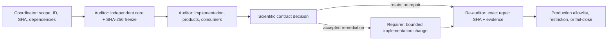
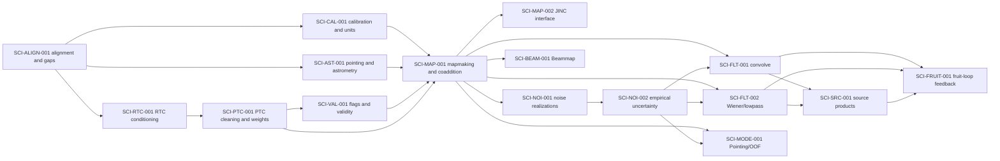

# Citlali Scientific-Contract Audit Program

## Status and authority

This directory defines a small, human-maintained process for auditing one
Citlali scientific transformation at a time. The initial inventory was made
against `codex/refactor-mainline` at
`9aae0e669384c5c0c0dda93debc194d6b8dac787`. That SHA is an inventory
snapshot, not blanket scientific approval of every transformation.

The canonical architecture and scientific vocabulary remain
`doc/ARCHITECTURE.md` and `doc/SCIENTIFIC_CONVENTIONS.md`. Executable product,
configuration, and validation authorities remain under `validation/` and
`tools/config/`. This directory records scientific-contract work without
replacing any of those authorities.

## Purpose and non-goals

The program exists to make the claimed estimator, its uncertainty and
response, the implementation at an exact SHA, the validation evidence, and
the authorized downstream uses independently reviewable.

It does not:

- treat historical behavior, accepted snapshots, or plausible-looking maps as
  the scientific contract;
- authorize code changes, integration, production use, or relaxed validation
  merely because an audit document exists;
- create an audit CLI, database, formal schema, generator, CI system, or
  alternate provenance system;
- require a rewrite of mature RTC, PTC, JINC, or Wiener algorithms without
  evidence that their internals violate an approved contract;
- force every package to use every possible validation method; or
- revoke already accepted operational behavior implicitly while its contract
  is being reviewed.

The ledger and templates are deliberately hand-maintained Markdown, YAML, and
LaTeX. Automating them is a separate decision that requires demonstrated
maintenance value.

## Audit package

An **audit package** is one bounded scientific transformation together with
its input contract, configuration and data-dependent state, uncertainty,
response, products, metadata, and downstream consumers. It is not necessarily
a source directory, namespace, reduction mode, or configuration domain.

Split a proposed package when its parts have independently meaningful
estimators, responses, uncertainty models, repair decisions, or validation
gates. Keep parts together when they form one estimator whose product meaning
cannot be reviewed coherently in isolation. Overlap is allowed only when one
package names the other by stable ID as a dependency; each product or decision
must still have one primary package owner.

Package IDs are permanent. Names and scope descriptions may be clarified, but
an ID is never reused. Findings use `<PACKAGE-ID>-FNNN` and retain their IDs
after closure.

## Common audit dimensions

Every audit addresses the following dimensions or gives an explicit, specific
`not_applicable` rationale:

1. Package identity, bounded scope, exclusions, governing SHA, worktree, and
   branch.
2. Input contract and upstream assumptions.
3. Claimed estimator: affine `y = A x + c`, nonlinear or data-dependent
   `y = F(x, theta)`, or iterative/stateful
   `s_(n+1) = G(s_n, x), y = H(s_n, x)` as appropriate.
4. Classification of every consequential quantity as random, fixed, fitted,
   selected, data-derived, or conditioned upon.
5. Spatial, temporal, beam/template, extended-mode, photometric, and
   iteration-to-iteration response as applicable.
6. Formal variance and full covariance, empirical variance,
   calibration/systematic uncertainty, and response uncertainty.
7. Separate meanings for variance, inverse variance, support, validity, hits,
   coverage, confidence, and response.
8. Units, coordinate frames, indexing, shape, normalization, and non-finite or
   missing-data policy.
9. Requested configuration, effective policy, observation-resolved choices,
   and realized execution state.
10. Implementation trace through signal, formal uncertainty, empirical/noise
    realizations, simulations, masks, sequential/OpenMP paths, writers, and
    metadata.
11. Product and consumer matrix:
    `input -> operator -> estimator -> units -> metadata -> consumer`.
12. Analytic limits, deterministic fixtures, injections, blank controls,
    parallel equivalence, same-SHA external evidence, and astronomical
    recovery where applicable.
13. Explicit consumer allowlist, restricted-use conditions, and fail-closed
    policy.
14. Findings, unresolved assumptions, dependencies, scientific decisions,
    verdict, and proposed ledger update.

An omission is never justified only by the package tier. For example, a Tier B
audit may mark an astronomical injection study not applicable when the
operator's established interface response is completely exercised by analytic
and retained real-data evidence, but it must state that reasoning.

## Audit tiers

| Tier | Required depth | Typical use |
| --- | --- | --- |
| A - full scientific contract | Derive the estimator, uncertainty/covariance, response, units, selection, products, consumers, and all applicable evidence independently. | Any process affecting scientific amplitude, uncertainty, response, source selection, or iterative feedback. |
| B - interface and response | Audit the input/output contract, normalization, transfer/response, boundaries, effective/realized state, products, metadata, and consumers. Open mature numerical internals only when evidence requires it. | Mature RTC/PTC/JINC/Wiener algorithms whose kernels are not presently suspect. |
| C - engineering contract | Audit authority, ownership, lifecycle, requested/effective/realized state, provenance, reproducibility, and failure propagation. | Deterministic plumbing that does not itself alter the estimator. |

A package is promoted to Tier A when interface evidence exposes an unresolved
amplitude, covariance, response, unit, source-selection, or feedback question.

## Authority and evidence

No evidence class substitutes for all the others:

| Item | What it establishes | What it does not establish |
| --- | --- | --- |
| Approved scientific contract | The estimator and allowed scientific interpretation. | That code conforms or real data validate it. |
| Source at the governing SHA | The implementation actually assessed. | Scientific correctness merely because it is historical or deployed. |
| Analytic tests and local fixtures | Mathematical and implementation conformity for covered cases. | Cluster behavior, astronomical recovery, or production authorization. |
| Same-SHA Unity reductions | External execution, products, provenance, and configured-mode evidence. | The contract by themselves, or behavior outside the returned evidence. |
| Blank controls, injections, and astronomical observations | Empirical calibration, recovery, and failure-mode evidence. | A waiver for contradictory mathematics or implementation. |
| Historical output or visual plausibility | Context and regression clues. | Silent definition of an estimator or acceptance threshold. |

Use `observed`, `derived`, `suspected`, and `owner_decision` to label the basis
of a claim. A scientific contract changes only through an explicit documented
scientific decision. It is not revised merely to match existing output; an
approved revision creates a successor contract and retains the old record.

## Configuration and state vocabulary

- **Requested** is the immutable low-level Citlali request accepted at the
  application boundary, including values inside disabled sections.
- **Effective** is context-free activation, normalization, and compatibility
  policy selected from that request.
- **Observation-resolved** is state requiring observation identity, sample
  rate, calibration, pointing support, source context, or hardware
  availability.
- **Realized** is what execution actually applied and produced, including
  counts, selected fallbacks, validity, and product cardinality.

These states move in one direction. A legacy adapter may receive effective or
observation-resolved state, but processor state does not rewrite the request.
Provenance must label the state it records.

## Independent status axes

The ledger never compresses package state into a single word such as
`audited`, `blocked`, or `complete`.

| Axis | Controlled values | Meaning |
| --- | --- | --- |
| `contract_status` | `not_started`, `independent_draft_frozen`, `proposed`, `approved`, `superseded` | Progress and authority of the scientific contract. `approved` requires an explicit scientific decision. |
| `implementation_status` | `not_assessed`, `conformant`, `conditionally_conformant`, `nonconformant` | Conformity of the exact governing SHA. Conditional conformity requires named, falsifiable dependency assumptions. |
| `validation_status` | `not_started`, `planned`, `in_progress`, `external_pending`, `complete`, `failed` | State of the applicable evidence plan. `complete` does not authorize production. |
| `production_status` | `fail_closed`, `existing_use_only`, `restricted_use`, `approved`, `retired` | Allowed operational scope. `existing_use_only` preserves accepted behavior while forbidding new interpretations or consumers. |
| `verdict` | `pending`, `retain`, `amend`, `split`, `supersede`, `reject` | Disposition of the assessed package or proposal. |

`external_pending` means all applicable local gates are accepted and a precise
external request is the only remaining validation gate. Use `in_progress` when
contract, local, and external gaps coexist. A blocking cause belongs in a
finding or dependency, not in an overloaded status.

Verdict meanings are:

- `retain`: keep the assessed contract and implementation subject to recorded
  evidence and production decisions;
- `amend`: preserve package identity but make bounded contract,
  implementation, metadata, or evidence changes;
- `split`: replace the over-broad unit with named successor package IDs;
- `supersede`: replace the estimator or approved contract while preserving its
  history; and
- `reject`: prohibit the assessed proposal or use.

## Findings and priority

Finding class is independent of severity, evidence basis, confidence, and
status.

| Finding class | Meaning |
| --- | --- |
| `implementation_defect` | Code at the exact SHA deviates from the contract or applies inconsistent operators across signal, uncertainty, simulation, parallel, or output paths. |
| `contract_gap` | Estimator, response, normalization, uncertainty, validity, units, metadata, or consumer meaning is missing or ambiguous. |
| `scientific_policy_decision` | Multiple plausible choices alter scientific meaning or authorization and require an owner decision. |
| `evidence_gap` | A claim lacks a falsifiable required test, fixture, reduction, observation, or returned artifact. |
| `dependency_gap` | A required upstream or downstream contract is unresolved; the finding names a stable package ID. |

P0 means correctness/data-corruption/invalid-success or unsafe-failure risk;
P1 means material scientific ambiguity, reproducibility risk, or severe
operational failure; P2 means measured performance/resource risk or a
high-value maintainability barrier; and P3 means useful cleanup without
current correctness or scientific impact. Optional confidence is `low`,
`medium`, or `high`. Severity never converts a scientific decision or evidence
gap into a software defect.

## Package lifecycle and role separation

1. The **coordinator** fixes the package ID, scope, tier, dependencies,
   governing SHA, and initial consumer policy. The coordinator owns canonical
   ledger integration but does not derive the estimator or repair code.
2. A fresh **auditor** worktree and thread verify repository state, read
   governing project-level authorities, and quarantine identified package
   implementation sources. The auditor drafts the mathematical core in a
   separate exact file or byte range, records all prior exposure, computes its
   SHA-256 digest, and makes those bytes immutable before opening package
   source.
3. The auditor traces implementation, products, metadata, simulations,
   parallel paths, and consumers; writes falsifiable gates; records findings,
   verdict, and a machine-readable ledger proposal; and changes no application
   code.
4. The scientific owner approves, amends, supersedes, or rejects the proposed
   contract and resolves policy decisions needed for repair.
5. A separate **repairer** worktree and thread implement only accepted
   remediation against the named contract. The repairer may not rewrite the
   contract to fit output.
6. A fresh **re-auditor** worktree and thread assess the exact repair SHA,
   returned evidence, and every open finding.
7. Production receives an explicit allowlist, restriction, or fail-closed
   disposition. Reopening requires a finding, dependency change, scientific
   successor, or evidence trigger.

The same person may serve in several roles, but never in the same thread or
mutable worktree. Only create repair and re-audit branches when those stages
are needed. Suggested branch names are `codex/audit-<package>`,
`codex/repair-<package>`, and `codex/reaudit-<package>`. Do not push or merge
without separate authorization.

Hash the independent core itself, not an evolving whole audit document. The
audit records the path or byte-range extraction method, SHA-256 value, freeze
commit, timestamp, and the first implementation-inspection event. A claim of
independence without reproducible frozen bytes is recorded as an evidence gap.

## Dependencies and conditional conclusions

Dependencies use stable package IDs and one of `open`, `conditioned`,
`satisfied`, or `superseded`. Before a package is dispatched for audit, each
dependency states the exact required contract fact and the consequence while
it remains open. A bare edge in the initial inventory is explicitly an
`inventory-only` placeholder; the coordinator must complete it before
dispatch rather than letting the auditor invent the upstream contract.

`conditionally_conformant` is allowed only when the assessed code matches the
contract under a named upstream assumption and a test could falsify that
assumption. Known code/contract mismatch remains `nonconformant`. A package
with an open dependency may produce a useful audit, but its dependent
production consumer stays restricted or fail-closed. Cycles must be broken by
splitting estimator stages or by making iteration state explicit; they are not
hidden in prose.

## Process and dependency graph

The package diagram below is a readable critical-path projection, not the
exhaustive edge list. The hand-maintained `upstream_dependencies` records in
`audit-ledger.yaml` are authoritative; they include secondary unit, response,
validity, mode, and consumer prerequisites omitted from the drawing.

`ENG-STATE-001` is a parallel Tier C review of lifecycle, provenance,
required-product publication, and exact-SHA evidence. It supports every
package but does not define their estimators.

## Initial inventory and dependency-aware queue

| Package ID | Tier | Bounded package | Primary upstream packages | Queue |
| --- | --- | --- | --- | --- |
| `SCI-MAP-001` | A | Shared/naive mapmaking signal, formal weight, kernel, hits/coverage, validity, and observation coaddition | `SCI-CAL-001`, `SCI-AST-001`, `SCI-PTC-001`, `SCI-VAL-001` may begin as explicit abstract inputs | First new audit |
| `SCI-ALIGN-001` | A | Sample/telescope alignment, scan slicing, and gap interpolation | external input identity | Foundation wave 1 |
| `SCI-CAL-001` | A | Detector calibration, extinction, flux scaling, and map-unit transfer | `SCI-ALIGN-001` | Foundation wave 1 |
| `SCI-AST-001` | A | Pointing corrections, detector coordinates, frames, and WCS | `SCI-ALIGN-001` | Foundation wave 1 |
| `ENG-STATE-001` | C | Requested/effective/realized lifecycle, provenance, required products, and failure flow | architecture and product authorities | Parallel foundation wave |
| `SCI-RTC-001` | B | Mature RTC filtering/conditioning interface and temporal response | `SCI-ALIGN-001`, `SCI-CAL-001`, `SCI-AST-001` | Foundation wave 2 |
| `SCI-PTC-001` | B | Mature correlated-mode cleaning, selection, and detector-weight interface | `SCI-RTC-001`, `SCI-AST-001` | Foundation wave 2 |
| `SCI-VAL-001` | A | Cross-stage flags, detector/sample eligibility, non-finite policy, and map support | `SCI-ALIGN-001`, `SCI-RTC-001`, `SCI-PTC-001` | Foundation wave 2 |
| `SCI-MAP-002` | B | Mature JINC gridding interface, normalization, support, and response | approved/shared `SCI-MAP-001` product contract | Map successor wave |
| `SCI-NOI-001` | A | Jackknife/noise randomization and propagation through selected operators | `SCI-PTC-001`, `SCI-VAL-001`, `SCI-MAP-001` | Uncertainty wave 3 |
| `SCI-NOI-002` | A | Empirical variance/covariance, global calibration, statistical weight, and S/N semantics | `SCI-NOI-001`, `SCI-MAP-001` | Uncertainty wave 3 |
| `SCI-FLT-001` | A | Fixed map-domain `convolve` signal, uncertainty, response, and support | `SCI-MAP-001`, `SCI-NOI-002`, `SCI-CAL-001` | Existing audit; amend/re-audit wave 4 |
| `SCI-FLT-002` | B | Mature Wiener and lowpass filtering interface, normalization, and response | `SCI-MAP-001`, `SCI-NOI-001`, `SCI-NOI-002` | Product wave 4 |
| `SCI-SRC-001` | A | Generic map-domain source finding, Gaussian fitting, and source tables | map/filter, `SCI-NOI-002`, `SCI-AST-001` | Product wave 4 |
| `SCI-MODE-001` | A | Pointing/OOF map fitting, significance, astrometric/shape products | `SCI-MAP-001`, `SCI-NOI-002`, `SCI-AST-001`, `SCI-CAL-001` | Mode wave 4 |
| `SCI-BEAM-001` | A | Beammap detector-map iteration, priors, fits, flags, sensitivity, and APT products | calibration, astrometry, RTC/PTC, validity, mapmaking | Mode wave 4 |
| `SCI-FRUIT-001` | A | Science/pointing map-to-TOD feedback, state, convergence, and restart contract | map, uncertainty, filters, source/point products | Last; filtered inputs fail-closed |

The first audit intentionally derives `SCI-MAP-001` against explicit abstract
calibration, pointing, validity, and timestream-weight/covariance inputs. Its
findings then sharpen the foundational package contracts without making an
implementation guess.

Material deviations from the initial candidate decomposition are:

- alignment/gap interpolation is separated from flags/validity because it
  constructs values on a common sample axis, while validity selects which
  values may enter later estimators;
- RTC temporal filtering and PTC correlated-mode cleaning/weighting are
  sequential operators with distinct response and state;
- JINC is a mapmaker, not a post-map filter, so it receives a Tier B package
  under the shared mapmaking product contract;
- jackknife construction/propagation is separated from the estimator that
  converts realizations into empirical variance and calibrated weight;
- `convolve` and Wiener/lowpass are different estimators and remain separate;
- generic source catalogs, Pointing/OOF fits, and Beammap detector products
  have different estimator identities and consumers;
- Beammap's internal iteration is distinct from science/pointing fruit-loop
  feedback; and
- the Tier C state/provenance package is explicit so empirical evidence can be
  interpreted without pretending provenance defines science.

Maximum-likelihood mapmaking, dormant destriping, enabled polarimetry, and the
measured R channel are not active queue packages. Current production either
rejects or does not execute those capabilities. Reopening one first requires a
capability decision, stable package ID, contract scope, and reference evidence;
it is not silently folded into an active package.

## Definitions of done

An **audit report** is complete when it records the exact SHA/worktree and
frozen-core digest; addresses every common dimension or a justified
`not_applicable`; traces products and consumers; owns every finding, decision,
and dependency; defines falsifiable gates; and supplies a verdict plus
machine-readable ledger proposal. A report with verdict `amend` can be
complete while its package is not done.

A **package** is done only through one of two terminal paths:

- approved or restricted production: contract approved, exact implementation
  conformant, applicable validation complete, allowed-use dependencies
  satisfied, no unowned P0/P1 findings, and consumer allowlist/restrictions
  explicit; or
- nonproduction terminal: rejected, retired, or superseded with every affected
  consumer fail-closed and the historical contract/evidence retained.

`pending`, `amend`, `external_pending`, `in_progress`, and
`existing_use_only` are not package completion.

The **program** is done when every active scientific transformation has one
primary package; every package reaches a terminal path; no production claim
depends on an unresolved contract or dependency; every consumer is explicitly
allowed, restricted, or fail-closed; applicable evidence is complete at exact
SHAs; and no unowned P0/P1 or undecided scientific policy leaks into
production. Finite owned P2/P3 work and retained debt may remain. Completion
does not require rewriting mature algorithms or erasing history.
