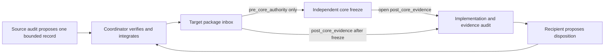
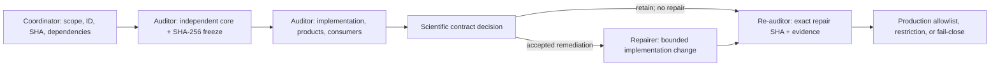
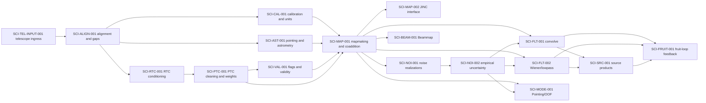

# Citlali Scientific-Contract Audit Program

## Status and authority

This directory defines a small, human-maintained process for auditing one
Citlali scientific transformation at a time. The initial inventory was made
against `codex/refactor-mainline` at
`9aae0e669384c5c0c0dda93debc194d6b8dac787`. That SHA is an inventory
snapshot, not blanket scientific approval of every transformation.

The canonical architecture and scientific vocabulary remain
`doc/ARCHITECTURE.md` and `doc/SCIENTIFIC_CONVENTIONS.md`. Executable product,
configuration, and validation authorities remain under `validation/` and
`tools/config/`. This directory records scientific-contract work without
replacing any of those authorities.

## Current program checkpoint — 2026-08-08

The pushed canonical application mainline is
`origin/codex/refactor-mainline` at
`46ad23888a40f5102cdfd50c06e49a549bdf8a20`. `SCI-MAP-001` and
`SCI-NOI-002` are integrated only within the bounded contracts, limitations,
and `existing_use_only` restrictions recorded on that exact application line.
CAL retains its separately recorded bounded state. The MAP-002 third successor
`86f1582fad92bdd0453bca3264ce39478b00c227` is independently re-audited at
`a70424a69365d7ed20fb39c45bc6334cc9e7bafe` and
[owner-accepted](packages/SCI-MAP-002_THIRD_SUCCESSOR_OWNER_ACCEPTANCE_2026-08-09.md)
for the bounded repair findings only. Its axes are `approved`, `conformant`,
`complete`, and `existing_use_only`, with verdict `accept`; no application
merge, production expansion, Unity/reduction, BEAM, or downstream launch is
authorized. The exact imported
[re-audit report](packages/SCI-MAP-002_THIRD_SUCCESSOR_REAUDIT_2026-08-09.md)
has SHA-256
`fe07901504ad26916cab2c5589f452b1873c11ef215239653ed938f45eefd4d5`.

On 2026-08-13 the owner accepted the `SCI-CAL-001` successor-7
[return-for-repair disposition](packages/SCI-CAL-001_SUCCESSOR_7_OWNER_ACCEPTANCE_2026-08-13.md)
for exact pushed candidate `9037314fd84241fa535c486d4ffb28966bb0394d`,
audited at `0461d1e6ce484d52bf654afcfc563703943fb847`. The exact
[report](SCI-CAL-001_SUCCESSOR_7_REAUDIT_2026-08-13.md) and
[evidence](evidence/SCI-CAL-001_SUCCESSOR_7_LOCAL_EVIDENCE_2026-08-13.yaml)
are immutable. F002--F007 retain their accepted bounded dispositions,
F001/F010 remain conditioned, and F008/local F009 remain open only for the
four bounded F008-A/F008-B/F009-A/F009-B defects. The CAL axes stay
`approved`, `nonconformant`, `in_progress`, and `fail_closed`, with verdict
`amend`. The frozen
[successor-8 handoff](packages/SCI-CAL-001_SUCCESSOR_8_BOUNDED_REPAIR_HANDOFF_2026-08-13.md)
and [finding ledger](proposals/SCI-CAL-001_SUCCESSOR_8_REPAIR_FINDING_LEDGER_2026-08-13.yaml)
record the exact nine-path ceiling, focused counterexamples, and complete
fresh broad matrix. Historical readiness remains
`failed_owner_waived_never_passed`, `sig2noise_pixel_I` remains prohibited for
new/current products, and the v4 epoch/profiles remain `preparing`. No repair,
Unity, reduction, production, re-audit, merge, push, external contact, or
downstream work is launched.

On 2026-08-12 the owner accepted the `SCI-CAL-001` successor-6
[return-for-repair disposition](packages/SCI-CAL-001_SUCCESSOR_6_OWNER_ACCEPTANCE_2026-08-12.md)
for exact pushed candidate `211e2f16f6354609de3ce6c6ee526d8aa4c6c59c`,
audited at `24e00dbfee31a13db2c00c7e9706216a67ec0c42`. The exact
[report](SCI-CAL-001_SUCCESSOR_6_REAUDIT_2026-08-12.md) and
[evidence](evidence/SCI-CAL-001_SUCCESSOR_6_LOCAL_EVIDENCE_2026-08-12.yaml)
are immutable. F002--F006 retain bounded closures, F001/F010 remain
conditioned, and F007/F008/local F009 remain open. The CAL axes stay
`approved`, `nonconformant`, `in_progress`, and `fail_closed`, with verdict
`amend`. The frozen
[successor-7 handoff](packages/SCI-CAL-001_SUCCESSOR_7_BOUNDED_REPAIR_HANDOFF_2026-08-12.md)
and [finding ledger](proposals/SCI-CAL-001_SUCCESSOR_7_REPAIR_FINDING_LEDGER_2026-08-12.yaml)
record the exact 22-path ceiling, response-identity-only F007 scope,
per-artifact F008 publication, authoritative F009 package joins, and exact
seven-profile restoration. Historical readiness remains failed-owner-waived,
never passed; no repair, Unity, reduction, production, re-audit, merge, push,
external contact, or downstream work is launched.

On 2026-08-12 the owner accepted the `SCI-CAL-001` successor-5
[return-for-repair disposition](packages/SCI-CAL-001_SUCCESSOR_5_OWNER_ACCEPTANCE_2026-08-12.md)
for exact pushed candidate `5dfc414a13fe69e6b063608906d87e3b30491ec7`,
audited at `900b7f8b3dac59246f7628a116923de07f678b16`. The exact
[report](SCI-CAL-001_SUCCESSOR_5_REAUDIT_2026-08-12.md) and
[evidence](evidence/SCI-CAL-001_SUCCESSOR_5_LOCAL_EVIDENCE_2026-08-12.yaml)
are immutable. F002/F003/F004/F006 retain their bounded closures, F001/F010
remain conditioned, and F005/F007/F008/local F009 remain open. The CAL axes
stay `approved`, `nonconformant`, `in_progress`, and `fail_closed`, with
verdict `amend`. The frozen
[successor-6 handoff](packages/SCI-CAL-001_SUCCESSOR_6_BOUNDED_REPAIR_HANDOFF_2026-08-12.md)
and [finding ledger](proposals/SCI-CAL-001_SUCCESSOR_6_REPAIR_FINDING_LEDGER_2026-08-12.yaml)
record the exact 33-path ceiling and authority-sensitive v1--v3 stop. They
preserve mandatory per-artifact atomic publication and do not launch repair
or authorize Unity, reductions, production, re-audit, merge, push, external
contact, or downstream work.

On 2026-08-11 the owner accepted the `SCI-CAL-001` successor-4
[return-for-repair disposition](packages/SCI-CAL-001_SUCCESSOR_4_OWNER_ACCEPTANCE_2026-08-11.md)
for candidate `693f1b107855e3ae9b36617323ca14aac868f304`, audited at
`7163dfa45b269b04e9525c224ec1cb5c4525ea61`. F002/F003/F004/F006 retain
their bounded closures, F001/F010 remain conditioned, and
F005/F007/F008/local F009 remain open. The CAL axes stay `approved`,
`nonconformant`, `in_progress`, and `fail_closed`, with verdict `amend`. The
frozen [successor-5 handoff](packages/SCI-CAL-001_SUCCESSOR_5_BOUNDED_REPAIR_HANDOFF_2026-08-11.md)
and [finding ledger](proposals/SCI-CAL-001_SUCCESSOR_5_REPAIR_FINDING_LEDGER_2026-08-11.yaml)
record the owner-resolved bounded repair and exact 27-path ceiling against
base `693f1b107855...`; they do not launch repair or authorize Unity,
reductions, production, re-audit, merge, push, or downstream work.

On 2026-08-11 the owner accepted the `SCI-CAL-001` successor-3
[return-for-repair disposition](packages/SCI-CAL-001_SUCCESSOR_3_OWNER_ACCEPTANCE_2026-08-11.md)
for candidate `3af6faf996fa002b2647adca8f33991002d49ff1`, audited at
`0b597ec5eaaf52477c995af6f2f4fa3eddb2a5de`. F003/F004 close,
F002/F006 retain their bounded closures, F005/F007/F008/local F009 remain
open, and F001/F010 remain conditioned. The CAL axes stay `approved`,
`nonconformant`, `in_progress`, and `fail_closed`, with verdict `amend`. The
frozen [successor-4 handoff](packages/SCI-CAL-001_SUCCESSOR_4_BOUNDED_REPAIR_HANDOFF_2026-08-11.md)
and [finding ledger](proposals/SCI-CAL-001_SUCCESSOR_4_REPAIR_FINDING_LEDGER_2026-08-11.yaml)
authorize only a later role-separated repair against exact pushed base
`3af6faf996fa...`; they do not launch it or authorize Unity, reductions,
production, re-audit, merge, push, or downstream work.

ALIGN/3C273 evidence remains owner-managed and active, while AST repair waits
for an accepted and re-audited ALIGN successor. The RTC audit at
`3319d7424c732c1c9fc300c336e4d428e6f91068` is integrated, owner decisions
D001--D004 are recorded, and its axes remain `proposed`, `nonconformant`,
`in_progress`, and `existing_use_only`, with verdict `amend`.

On 2026-08-11 the owner accepted the learned-sampling Stage A successor-2
[return-for-repair disposition](packages/SCI-RTC-001_LEARNED_SAMPLING_STAGE_A_SUCCESSOR_2_OWNER_ACCEPTANCE_2026-08-11.md)
at audit commit `f935f25c...`. Exactly 15 findings, `S2RA-001` through
`S2RA-015` (11 P1 and four P2), remain open. The
[successor-3 handoff](packages/SCI-RTC-001_LEARNED_SAMPLING_STAGE_A_SUCCESSOR_3_REPAIR_HANDOFF_2026-08-11.md)
and [finding ledger](proposals/SCI-RTC-001_LEARNED_SAMPLING_STAGE_A_SUCCESSOR_3_REPAIR_FINDING_LEDGER_2026-08-11.yaml)
are authorized for a later role-separated launch but do not launch it. The
separate [core phase-zero amendment](packages/SCI-RTC-001_CORE_PHASE_ZERO_DOWNSAMPLING_OWNER_AMENDMENT_2026-08-11.md)
preserves phase-zero point selection and rejects arithmetic-mean downsampling.
Core RTC and Stage A remain separate. Integration remains MAP followed by
accepted CAL consolidation; Stage A remains separate until accepted.

The PTC audit at
`01ee247461d6c19bc4db81ccac4fec21af162c88` is integrated with contract
`approved`, implementation `nonconformant`, validation `in_progress`,
production `existing_use_only`, and verdict `amend`. D001--D006 are
owner-approved and the contract-decision set is complete. The
[D003 owner amendment](packages/SCI-PTC-001_D003_OWNER_AMENDMENT_2026-08-09.md)
identifies the current kernel as the estimated map-center point-source
response after the declared analysis, and the separate
[optional transfer-characterization plan](packages/SCI-PTC-001_OPTIONAL_TRANSFER_CHARACTERIZATION_PLAN_2026-08-09.md)
is prepared but neither authorized nor an ordinary repair gate.
The [D004 owner amendment](packages/SCI-PTC-001_D004_OWNER_AMENDMENT_2026-08-09.md)
preserves existing detector-weight families as scalar analysis/gridding
coefficients with exact family metadata and explicit covariance availability;
it does not promote them to precision, inverse-variance, significance, or
independent-noise authority.
The [D005 owner replacement](packages/SCI-PTC-001_D005_OWNER_REPLACEMENT_2026-08-09.md)
rejects the uniform immutable-bundle/replay proposal: the authoritative
PTC-to-mapmaking state is the in-memory transformed timestream, while any
persisted timestream declares a diagnostic or requested-derived role and
carries provenance according to scientific authority and declared consumption.
The [D006 owner amendment](packages/SCI-PTC-001_D006_OWNER_AMENDMENT_2026-08-09.md)
requires eligible-finite-only fitted arithmetic, coupled signal/mask
surrogates, explicit unavailable/rejected insufficient support, typed
fallbacks, deterministic random-output identity, and honest selection-
uncertainty availability.
VAL, MAP, NOI, and BEAM remain unlaunched by this review and retain their
existing restrictions. FLT
successor-repair dispatch remains held until CAL has an accepted, independently
re-audited, integrated successor. The returned ENG-STATE-001 static package is
accepted with F001/F002 open and unchanged package axes; further ENG work
requires a fresh static-only scope checkpoint.

The exact queue, active-lane boundaries, PTC launch interpretation, and exact
post-core PTC/VAL routing are recorded in
[`SCIENTIFIC_AUDIT_PROGRAM_CHECKPOINT_2026-08-08.md`](packages/SCIENTIFIC_AUDIT_PROGRAM_CHECKPOINT_2026-08-08.md).
The completed RTC dispatch and frozen authority manifest are
[`SCI_RTC_001_AUDIT_PROMPT.md`](prompts/SCI_RTC_001_AUDIT_PROMPT.md) and
[`SCI-RTC-001_INBOX_AUTHORITY_MANIFEST_2026-08-08.yaml`](handoffs/SCI-RTC-001/SCI-RTC-001_INBOX_AUTHORITY_MANIFEST_2026-08-08.yaml).
The owner decisions are
[`SCI-RTC-001_OWNER_DECISION_2026-08-08.md`](packages/SCI-RTC-001_OWNER_DECISION_2026-08-08.md).
The frozen, not-yet-launched PTC packet is
[`SCI_PTC_001_AUDIT_PROMPT.md`](prompts/SCI_PTC_001_AUDIT_PROMPT.md) with
[`SCI-PTC-001_INBOX_AUTHORITY_MANIFEST_2026-08-08.yaml`](handoffs/SCI-PTC-001/SCI-PTC-001_INBOX_AUTHORITY_MANIFEST_2026-08-08.yaml).
The completed PTC coordinator review and remaining owner choices are
[`SCI-PTC-001_COORDINATOR_DECISION_BRIEF_2026-08-08.md`](packages/SCI-PTC-001_COORDINATOR_DECISION_BRIEF_2026-08-08.md).
The smallest FLT readiness record is
[`SCI-FLT-001_SUCCESSOR_REPAIR_DISPATCH_READINESS_2026-08-08.md`](packages/SCI-FLT-001_SUCCESSOR_REPAIR_DISPATCH_READINESS_2026-08-08.md).

There is no blanket ban on new audits. New work must still enter through a
bounded package, explicit dependencies, role separation, a frozen manifest,
resource allocation, and the scope/cost checkpoints below. Repair debt,
consumer restrictions, and concurrent scope are actively controlled.

### Registered cross-repository telescope-ingress product

On 2026-08-08 the project owner registered `SCI-TEL-INPUT-001`, **Telescope-
file preparation, row identity, and Citlali ingress**, as a Tier B
audit -> bounded repair -> independent re-audit product. It covers the
operational TolTECA raw `tel*.nc` to `*_recomputed.nc` producer boundary and
Citlali telescope-file admission while preserving ALIGN, AST, ENG-STATE, and
VAL ownership of their adjacent contracts. The
[product registration](packages/SCI-TEL-INPUT-001_PRODUCT_REGISTRATION_2026-08-08.md)
does not dispatch the audit, authorize TolTECA or Citlali edits, request Unity,
or approve a timing correction. Existing use remains `existing_use_only`.

On 2026-08-09 the owner adopted the
[ALIGN-deferred compatibility boundary](packages/ALIGN_DEFERRED_COMPATIBILITY_BOUNDARY_OWNER_POLICY_2026-08-09.md).
The exact assigned-time grid is a compatibility interface, never proof of the
physical integration event. The TEL packet was frozen as
[`SCI_TEL_INPUT_001_AUDIT_PROMPT.md`](prompts/SCI_TEL_INPUT_001_AUDIT_PROMPT.md)
with
[`SCI-TEL-INPUT-001_INBOX_SOURCE_SET_MANIFEST_2026-08-09.yaml`](handoffs/SCI-TEL-INPUT-001/SCI-TEL-INPUT-001_INBOX_SOURCE_SET_MANIFEST_2026-08-09.yaml).
ALIGN `08f0a673...` remains quarantined post-core evidence and an unavailable
dependency, not a correction or pre-core authority. The completed audit at
`518e0ccb...` is [owner-accepted](packages/SCI-TEL-INPUT-001_OWNER_ACCEPTANCE_2026-08-09.md)
with contract `proposed`, implementation `nonconformant`, validation
`bounded_incomplete`, production `existing_use_only`, and verdict `amend`.
F001--F010 and the Tier-A stops remain open; repair scope and ownership await a
separate owner decision. The
[phase-independent RTC repair handoff](packages/SCI-RTC-001_PHASE_INDEPENDENT_BOUNDED_REPAIR_HANDOFF_2026-08-09.md)
is also prepared but unlaunched. BEAM remains held.

### Registered OOF residual-transfer product

On 2026-08-14 the project owner approved the
[`SCI-MAP-003` product registration](packages/SCI-MAP-003_PRODUCT_REGISTRATION_2026-08-14.md),
**OOF residual transfer-function estimation and product**, as a Tier A
independent audit -> separately authorized bounded repair -> separately
launched fresh independent re-audit product. It is queued after
`SCI-MAP-002` and before any `SCI-MODE-001` LMTOOF consumer admission without
preempting active CAL, ALIGN, RTC, or PTC work.

The selected governing application source is the exact pushed mainline
`origin/codex/refactor-mainline` at
`46ad23888a40f5102cdfd50c06e49a549bdf8a20`. A separate launch must
revalidate that exact authority and refreeze the packet if it changes. The
registration preserves existing OOF as `existing_use_only`; the new transfer
product and every LMTOOF use remain unauthorized. No audit, handoff packet,
manifest, prompt, numerical study, application or LMTOOF edit, repair,
re-audit, integration, production expansion, merge, rebase, or push is
launched by this record.

## Purpose and non-goals

The program exists to make the claimed estimator, its uncertainty and
response, the implementation at an exact SHA, the validation evidence, and
the authorized downstream uses independently reviewable.

It does not:

- treat historical behavior, accepted snapshots, or plausible-looking maps as
  the scientific contract;
- authorize code changes, integration, production use, or relaxed validation
  merely because an audit document exists;
- create a general audit CLI, database, report generator, CI system, or
  alternate provenance system. The narrow machine-readable schemas and
  validator required to control costly numerical studies are an exception;
- require a rewrite of mature RTC, PTC, JINC, or Wiener algorithms without
  evidence that their internals violate an approved contract;
- force every package to use every possible validation method; or
- revoke already accepted operational behavior implicitly while its contract
  is being reviewed.

The ledger and templates are deliberately hand-maintained Markdown, YAML, and
LaTeX. Automating the general audit program is a separate decision that
requires demonstrated maintenance value. Costly-study condition registers,
model-free preflight reports, and execution-readiness certificates are
validated under `FRAMEWORK-NUM-001` because a hidden runtime guard can consume
or discard expensive evidence before a human can review it.

## Audit package

An **audit package** is one bounded scientific transformation together with
its input contract, configuration and data-dependent state, uncertainty,
response, products, metadata, and downstream consumers. It is not necessarily
a source directory, namespace, reduction mode, or configuration domain.

Split a proposed package when its parts have independently meaningful
estimators, responses, uncertainty models, repair decisions, or validation
gates. Keep parts together when they form one estimator whose product meaning
cannot be reviewed coherently in isolation. Overlap is allowed only when one
package names the other by stable ID as a dependency; each product or decision
must still have one primary package owner.

Package IDs are permanent. Names and scope descriptions may be clarified, but
an ID is never reused. Findings use `<PACKAGE-ID>-FNNN` and retain their IDs
after closure.

## Common audit dimensions

Every audit addresses the following dimensions or gives an explicit, specific
`not_applicable` rationale:

1. Package identity, bounded scope, exclusions, governing SHA, worktree, and
   branch.
2. Input contract and upstream assumptions.
3. Claimed estimator: affine `y = A x + c`, nonlinear or data-dependent
   `y = F(x, theta)`, or iterative/stateful
   `s_(n+1) = G(s_n, x), y = H(s_n, x)` as appropriate.
4. Classification of every consequential quantity as random, fixed, fitted,
   selected, data-derived, or conditioned upon.
5. Spatial, temporal, beam/template, extended-mode, photometric, and
   iteration-to-iteration response as applicable.
6. Formal variance and full covariance, empirical variance,
   calibration/systematic uncertainty, and response uncertainty.
7. Separate meanings for variance, inverse variance, support, validity, hits,
   coverage, confidence, and response.
8. Units, coordinate frames, indexing, shape, normalization, and non-finite or
   missing-data policy.
9. Requested configuration, effective policy, observation-resolved choices,
   and realized execution state.
10. Implementation trace through signal, formal uncertainty, empirical/noise
    realizations, simulations, masks, sequential/OpenMP paths, writers, and
    metadata.
11. Product and consumer matrix:
    `input -> operator -> estimator -> units -> metadata -> consumer`.
12. Analytic limits, deterministic fixtures, injections, blank controls,
    parallel equivalence, same-SHA external evidence, and astronomical
    recovery where applicable.
13. Explicit consumer allowlist, restricted-use conditions, and fail-closed
    policy.
14. Findings, unresolved assumptions, dependencies, scientific decisions,
    verdict, and proposed ledger update.
15. Every inbound cross-audit handoff in the frozen dispatch manifest, its
    permitted review phase and recipient disposition, plus every outbound
    handoff proposed for another stable package ID.

An omission is never justified only by the package tier. For example, a Tier B
audit may mark an astronomical injection study not applicable when the
operator's established interface response is completely exercised by analytic
and retained real-data evidence, but it must state that reasoning.

## Audit tiers

| Tier | Required depth | Typical use |
| --- | --- | --- |
| A - full scientific contract | Derive the estimator, uncertainty/covariance, response, units, selection, products, consumers, and all applicable evidence independently. | Any process affecting scientific amplitude, uncertainty, response, source selection, or iterative feedback. |
| B - interface and response | Audit the input/output contract, normalization, transfer/response, boundaries, effective/realized state, products, metadata, and consumers. Open mature numerical internals only when evidence requires it. | Mature RTC/PTC/JINC/Wiener algorithms whose kernels are not presently suspect. |
| C - engineering contract | Audit authority, ownership, lifecycle, requested/effective/realized state, provenance, reproducibility, and failure propagation. | Deterministic plumbing that does not itself alter the estimator. |

A package is promoted to Tier A when interface evidence exposes an unresolved
amplitude, covariance, response, unit, source-selection, or feedback question.

## Model and reasoning-effort allocation

**Policy ID:** `FRAMEWORK-EFFORT-001`

**Effective date:** 2026-08-02

**Scope:** future dispatches and future phases only

The program maximizes scientific reliability per unit of Codex usage. Model
and effort are selected from the consequence and ambiguity of the question,
whether the task is mechanically settled or scientifically interpretive,
whether the scientific contract remains open, and whether the task is one
coherent problem or several independent hard investigations. They do not
alter package tier, scientific authority, evidence gates, role separation, or
the costly-study controls in `FRAMEWORK-NUM-001`.

| Task shape | Default allocation | Examples |
| --- | --- | --- |
| Mechanical and settled | Terra Medium | Exact SHA/worktree checks, manifests, checksums, known commands, routine metadata extraction, and fully specified mechanical edits. |
| Bounded engineering judgment | Terra High | Audit management, dispatches, ledger/dependency work, bounded tracing, approved repairs, ordinary build/test interpretation, and handoff integration. |
| Difficult scientific analysis | Sol High or XHigh | Evidence and consumer synthesis; signal/variance/weight/support/response/validity interpretation; cross-process tracing; consequential decision briefs. |
| One deep coherent scientific problem | Sol Max | Independent foundational derivation; a covariance, response, unit, timing, calibration, normalization, or validity contradiction; final adjudication of one tightly coupled contract. |
| Several independent hard investigations requiring synthesis | Sol Ultra | A written, broad adversarial review divided into independent mathematical, implementation, product/metadata, validation, and consumer workstreams. |

`XHigh` is the Codex effort-setting name for the intermediate level sometimes
described as “Extra High.” Terra Medium is not the default for a full
scientific audit, and Ultra is not a generic safety margin for an important,
large, or long task.

### Phase defaults

Unless a dispatch records a specific reason to depart, a Tier A lifecycle uses:

1. launch checkpoint and source inventory — Terra High;
2. independent scientific core — Sol Max;
3. implementation, product, and consumer tracing — Sol High or XHigh;
4. scientific decision brief — Sol XHigh, escalating to Sol Max only for one
   remaining coherent question;
5. approved repair — Terra High, or Sol High when an implementation choice can
   alter estimator or product meaning;
6. mechanical validation — Terra Medium;
7. validation interpretation — Terra High or Sol High according to whether it
   can change scientific meaning; and
8. fresh re-audit — Sol Max when it assesses one coherent contract.

Tier B interface/response work normally begins at Terra High or Sol High and
uses Sol Max only after a specific mathematical or scientific reopen trigger.
Tier C work normally remains Terra High, with Terra Medium reserved for its
settled execution steps. The same defaults apply to the analogous phase of an
amendment or successor task; completed and frozen audit artifacts are never
relabeled retroactively.

### Ultra, parallelism, and task lifecycle

An Ultra escalation is permitted only when a dispatch identifies the
unresolved question, why XHigh or Max is insufficient, the independent
subproblems, the reconciliation owner and method, and the exact stop rule.
Ultra ends when that decomposable synthesis phase ends. No currently active
package receives an implicit Ultra escalation from this policy.

Parallelism is a latency and independence tool, not a credit-saving device.
It is permitted only for operationally and scientifically independent work
with explicit authority boundaries, predetermined output owners, and a named
synthesis point. Within a package, retain the required serial sequence:

```text
independent core -> freeze/hash/commit -> implementation inspection ->
findings -> owner decision -> repair -> validation -> fresh re-audit
```

End a task when its role changes (for example audit to repair or validation to
re-audit) and use a compact, frozen handoff. Role separation preserves
scientific independence and authority boundaries; it is not merely a context
or usage optimization.

### Dispatch and ledger record

Every future package or subtask dispatch includes the header defined in
`templates/PACKAGE_AUDIT_PROMPT_TEMPLATE.md`. The coordinator records the
actual selected allocation and any escalation in `audit-ledger.yaml` under
`resource_dispatch_history`. The README supplies defaults; the ledger records
only dispatched choices, departures, and their reasons, so it does not become
a redundant per-package planning table. Each record names the dispatch ID,
package ID, phase, exact dispatch commit, model, effort, task shape, rationale,
Ultra trigger, parallelism/synthesis plan, and stop rule.

## Scope control and coordinator checkpoints

**Policy ID:** `FRAMEWORK-SCOPE-001`

**Effective date:** 2026-08-02
**Scope:** future dispatches and future phases only

An audit's scientific importance does not authorize unbounded engineering or
local execution. Every task begins with a coordinator-reviewed scope
checkpoint before substantive work: application or validation edits, a local
Citlali reduction, a new executable helper, a new schema or verifier,
delegation, an independent review, or an external-evidence request. The
checkpoint is a concise report, not a new framework artifact. It names:

- the exact allowed paths and required deliverables;
- required versus prohibited execution, including `local Citlali reduction`
  and human-run Unity evidence;
- the planned tests and evidence, limited to the named deliverables;
- any permitted delegation or review; and
- the first viable artifact and the next mandatory return point.

The task stops for coordinator direction if a new artifact class, executable
tool, schema, wrapper, verifier, validation campaign, delegation, reduction,
or scientific/operational interpretation would be needed beyond that report.
Silence is prohibition. In particular, local Citlali reductions require an
explicit local-only rationale in the dispatch; Unity is the default reduction
evidence lane unless a named exception is approved.

The coordinator checks each task at three points: the initial scope
checkpoint, the first viable artifact, and before costly or local execution.
The first viable artifact demonstrates the named output only; it does not
authorize a new generalized control system or a perfection pass. Existing
scientific gates remain intact, but they are implemented only to the extent
the dispatch explicitly names. The full incident record and controls are in
`SCOPE_CONTROL_CORRECTIVE_ACTION_2026-08-02.md`.

## Authority and evidence

No evidence class substitutes for all the others:

| Item | What it establishes | What it does not establish |
| --- | --- | --- |
| Approved scientific contract | The estimator and allowed scientific interpretation. | That code conforms or real data validate it. |
| Source at the governing SHA | The implementation actually assessed. | Scientific correctness merely because it is historical or deployed. |
| Analytic tests and local fixtures | Mathematical and implementation conformity for covered cases. | Cluster behavior, astronomical recovery, or production authorization. |
| Same-SHA Unity reductions | External execution, products, provenance, and configured-mode evidence. | The contract by themselves, or behavior outside the returned evidence. |
| Blank controls, injections, and astronomical observations | Empirical calibration, recovery, and failure-mode evidence. | A waiver for contradictory mathematics or implementation. |
| Historical output or visual plausibility | Context and regression clues. | Silent definition of an estimator or acceptance threshold. |

Use `observed`, `derived`, `suspected`, and `owner_decision` to label the basis
of a claim. A scientific contract changes only through an explicit documented
scientific decision. It is not revised merely to match existing output; an
approved revision creates a successor contract and retains the old record.

## Configuration and state vocabulary

- **Requested** is the immutable low-level Citlali request accepted at the
  application boundary, including values inside disabled sections.
- **Effective** is context-free activation, normalization, and compatibility
  policy selected from that request.
- **Observation-resolved** is state requiring observation identity, sample
  rate, calibration, pointing support, source context, or hardware
  availability.
- **Realized** is what execution actually applied and produced, including
  counts, selected fallbacks, validity, and product cardinality.

These states move in one direction. A legacy adapter may receive effective or
observation-resolved state, but processor state does not rewrite the request.
Provenance must label the state it records.

## Independent status axes

The ledger never compresses package state into a single word such as
`audited`, `blocked`, or `complete`.

| Axis | Controlled values | Meaning |
| --- | --- | --- |
| `contract_status` | `not_started`, `independent_draft_frozen`, `proposed`, `approved`, `superseded` | Progress and authority of the scientific contract. `approved` requires an explicit scientific decision. |
| `implementation_status` | `not_assessed`, `conformant`, `conditionally_conformant`, `nonconformant` | Conformity of the exact governing SHA. Conditional conformity requires named, falsifiable dependency assumptions. |
| `validation_status` | `not_started`, `planned`, `in_progress`, `external_pending`, `complete`, `failed` | State of the applicable evidence plan. `complete` does not authorize production. |
| `production_status` | `fail_closed`, `existing_use_only`, `restricted_use`, `approved`, `retired` | Allowed operational scope. `existing_use_only` preserves accepted behavior while forbidding new interpretations or consumers. |
| `verdict` | `pending`, `retain`, `amend`, `split`, `supersede`, `reject` | Disposition of the assessed package or proposal. |

`external_pending` means all applicable local gates are accepted and a precise
external request is the only remaining validation gate. Use `in_progress` when
contract, local, and external gaps coexist. A blocking cause belongs in a
finding or dependency, not in an overloaded status.

Verdict meanings are:

- `retain`: keep the assessed contract and implementation subject to recorded
  evidence and production decisions;
- `amend`: preserve package identity but make bounded contract,
  implementation, metadata, or evidence changes;
- `split`: replace the over-broad unit with named successor package IDs;
- `supersede`: replace the estimator or approved contract while preserving its
  history; and
- `reject`: prohibit the assessed proposal or use.

## Findings and priority

Finding class is independent of severity, evidence basis, confidence, and
status.

| Finding class | Meaning |
| --- | --- |
| `implementation_defect` | Code at the exact SHA deviates from the contract or applies inconsistent operators across signal, uncertainty, simulation, parallel, or output paths. |
| `contract_gap` | Estimator, response, normalization, uncertainty, validity, units, metadata, or consumer meaning is missing or ambiguous. |
| `scientific_policy_decision` | Multiple plausible choices alter scientific meaning or authorization and require an owner decision. |
| `evidence_gap` | A claim lacks a falsifiable required test, fixture, reduction, observation, or returned artifact. |
| `dependency_gap` | A required upstream or downstream contract is unresolved; the finding names a stable package ID. |

P0 means correctness/data-corruption/invalid-success or unsafe-failure risk;
P1 means material scientific ambiguity, reproducibility risk, or severe
operational failure; P2 means measured performance/resource risk or a
high-value maintainability barrier; and P3 means useful cleanup without
current correctness or scientific impact. Optional confidence is `low`,
`medium`, or `high`. Severity never converts a scientific decision or evidence
gap into a software defect.

## Package lifecycle and role separation

The coordinator and audit manager also follow
`doc/audits/AUDIT_MANAGER_INSTRUCTIONS.md`. Any study classified as costly
must pass `FRAMEWORK-NUM-001` before execution. This adds a condition register,
model-free guard preflight, independent control review, readiness certificate,
and preregistered salvage plan; it does not change a package's scientific
contract or its four status axes.

1. The **coordinator** fixes the package ID, scope, tier, dependencies,
   governing SHA, initial consumer policy, and exact handoff-inbox manifest.
   The coordinator owns canonical ledger and handoff integration but does not
   derive the estimator or repair code.
2. A fresh **auditor** worktree and thread verify repository state, read
   governing project-level authorities, and quarantine identified package
   implementation sources and every handoff classified as
   `post_core_evidence`. Only coordinator-approved `pre_core_authority`
   handoffs may be opened before the core freeze. The auditor drafts the
   mathematical core in a separate exact file or byte range, records all prior
   exposure, computes its SHA-256 digest, and makes those bytes immutable
   before opening package source or post-core handoffs.
3. The auditor opens the frozen post-core handoff set, records that first
   exposure, then traces implementation, products, metadata, simulations,
   parallel paths, and consumers. The auditor writes falsifiable gates,
   records a disposition for every inbound handoff, proposes any outbound
   handoffs, records findings and verdict, and changes no application code or
   canonical handoff.
4. The scientific owner approves, amends, supersedes, or rejects the proposed
   contract and resolves policy decisions needed for repair.
5. A separate **repairer** worktree and thread implement only accepted
   remediation against the named contract. The repairer may not rewrite the
   contract to fit output.
6. A fresh **re-auditor** worktree and thread assess the exact repair SHA,
   returned evidence, and every open finding.
7. Production receives an explicit allowlist, restriction, or fail-closed
   disposition. Reopening requires a finding, dependency change, scientific
   successor, or evidence trigger.

The same person may serve in several roles, but never in the same thread or
mutable worktree. Only create repair and re-audit branches when those stages
are needed. Suggested branch names are `codex/audit-<package>`,
`codex/repair-<package>`, and `codex/reaudit-<package>`. Do not push or merge
without separate authorization.

Hash the independent core itself, not an evolving whole audit document. The
audit records the path or byte-range extraction method, SHA-256 value, freeze
commit, timestamp, and the first implementation-inspection event. A claim of
independence without reproducible frozen bytes is recorded as an evidence gap.

## Dependencies and conditional conclusions

Dependencies use stable package IDs and one of `open`, `conditioned`,
`satisfied`, or `superseded`. Before a package is dispatched for audit, each
dependency states the exact required contract fact and the consequence while
it remains open. A bare edge in the initial inventory is explicitly an
`inventory-only` placeholder; the coordinator must complete it before
dispatch rather than letting the auditor invent the upstream contract.

`conditionally_conformant` is allowed only when the assessed code matches the
contract under a named upstream assumption and a test could falsify that
assumption. Known code/contract mismatch remains `nonconformant`. A package
with an open dependency may produce a useful audit, but its dependent
production consumer stays restricted or fail-closed. Cycles must be broken by
splitting estimator stages or by making iteration state explicit; they are not
hidden in prose.

## Cross-audit handoffs

Cross-audit communication is durable, package-addressed, evidence-bound, and
coordinator-integrated. It does not occur by editing another audit's report or
worktree, and it does not promote a sender's conclusion into the recipient's
scientific contract. The canonical protocol and records live under
`doc/audits/handoffs/`; the reusable record is
`doc/audits/templates/CROSS_AUDIT_HANDOFF_TEMPLATE.yaml`.

Each record has exactly one source package and one target package. A message to
several packages is represented by separate records sharing related-handoff or
evidence identifiers, so each recipient can disposition its own message. The
target package ID determines the inbox directory and stable ID:

```text
doc/audits/handoffs/<TARGET-PACKAGE-ID>/<TARGET-PACKAGE-ID>-XAUD-NNN.yaml
```

The source audit proposes a complete record on its own branch and lists the ID
in its ledger proposal. The coordinator checks identity, scope, hashes, and
review phase before integrating it into the canonical handoff registry. The
recipient proposes a disposition on its own audit or re-audit branch; only the
coordinator updates the canonical record. Submission fields are immutable.
Corrections create a successor record and use `supersedes`/`superseded_by`.

Handoffs have two review phases:

- `pre_core_authority` is limited to an already approved scientific contract,
  owner decision, or canonical dependency fact. The coordinator must identify
  the exact authority and commit that permit pre-freeze exposure.
- `post_core_evidence` covers observations, downstream manifestations,
  suspected or derived defects, questions, and unapproved contract proposals.
  Its content remains quarantined until the independent core is frozen.

Before dispatch, the coordinator freezes a manifest containing every inbound
handoff ID, file SHA-256, review phase, and canonical commit. Late handoffs do
not silently enter an active audit. The coordinator either holds them for
re-audit, authorizes a dated amendment with explicit exposure, or records an
urgent production restriction independently of the scientific derivation.

Every resolved recipient disposition names one or more controlled actions and
links the resulting finding, dependency, contract section, restriction, test,
or re-audit trigger. `not_applicable` requires a scope-based rationale. A
handoff may sharpen or reopen work, but it cannot close a finding or authorize
production by itself. Evidence remains authoritative only for the bounded
claim its identity and limitations support.



## Process and dependency graph



The package diagram below is a readable critical-path projection, not the
exhaustive edge list. The hand-maintained `upstream_dependencies` records in
`audit-ledger.yaml` are authoritative; they include secondary unit, response,
validity, mode, and consumer prerequisites omitted from the drawing.



`ENG-STATE-001` is a parallel Tier C review of lifecycle, provenance,
required-product publication, and exact-SHA evidence. It supports every
package but does not define their estimators.

## Initial inventory and dependency-aware queue

| Package ID | Tier | Bounded package | Primary upstream packages | Queue |
| --- | --- | --- | --- | --- |
| `SCI-MAP-001` | A | Shared/naive mapmaking signal, formal weight, kernel, hits/coverage, validity, and observation coaddition | `SCI-CAL-001`, `SCI-AST-001`, `SCI-PTC-001`, `SCI-VAL-001` may begin as explicit abstract inputs | First new audit |
| `SCI-TEL-INPUT-001` | B | Raw telescope-file association, TolTECA preparation, row/time identity, allowed mutation, provenance, and Citlali admission | raw telescope producer event semantics unavailable; exact assigned-time compatibility interface only | Audit owner-accepted `amend`; F001--F010 open; repair not authorized |
| `SCI-ALIGN-001` | A | Sample/telescope alignment, scan slicing, and gap interpolation | `SCI-TEL-INPUT-001` | Foundation wave 1 |
| `SCI-CAL-001` | A | Detector calibration, extinction, flux scaling, and map-unit transfer | `SCI-ALIGN-001` | Foundation wave 1 |
| `SCI-AST-001` | A | Pointing corrections, detector coordinates, frames, and WCS | identified ALIGN assigned grid; physical event timing unavailable | Phase-independent coordinate mathematics admissible under separate launch; absolute placement fail closed |
| `ENG-STATE-001` | C | Requested/effective/realized lifecycle, provenance, required products, and failure flow | architecture and product authorities | Parallel foundation wave |
| `SCI-RTC-001` | B | Mature RTC filtering/conditioning interface and temporal response | exact assigned-grid compatibility plus conditioned CAL/AST seams | Core phase-independent handoff retains phase-zero point selection; Stage A successor-2 returned and successor-3 handoff authorized; lines separate and unlaunched |
| `SCI-PTC-001` | B | Mature correlated-mode cleaning, selection, and detector-weight interface | `SCI-RTC-001`, identified assigned grid; physical event timing unavailable | D001--D006 approved; contract complete; implementation nonconformant; repair and optional response characterization unlaunched |
| `SCI-VAL-001` | A | Cross-stage flags, detector/sample eligibility, non-finite policy, and map support | `SCI-ALIGN-001`, `SCI-RTC-001`, `SCI-PTC-001` | Foundation wave 2 |
| `SCI-MAP-002` | B | Mature JINC gridding interface, normalization, support, and response | approved/shared `SCI-MAP-001` product contract | Third successor owner-accepted `accept`; bounded findings closed; `existing_use_only`; no merge or downstream launch |
| `SCI-MAP-003` | A | OOF residual transfer-function estimator, validity domain, persisted response, and LMTOOF admission boundary | `SCI-MAP-001`, `SCI-MAP-002`, `SCI-RTC-001`, `SCI-PTC-001`, `SCI-VAL-001`, `SCI-AST-001`, `SCI-FRUIT-001`, `SCI-MODE-001` | Registered, unlaunched; after MAP-002 and before MODE LMTOOF admission; new product and consumer fail closed |
| `SCI-NOI-001` | A | Jackknife/noise randomization and propagation through selected operators | `SCI-PTC-001`, `SCI-VAL-001`, `SCI-MAP-001` | Uncertainty wave 3 |
| `SCI-NOI-002` | A | Empirical variance/covariance, global calibration, statistical weight, and S/N semantics | `SCI-NOI-001`, `SCI-MAP-001` | Uncertainty wave 3 |
| `SCI-FLT-001` | A | Fixed map-domain `convolve` signal, uncertainty, response, and support | `SCI-MAP-001`, `SCI-NOI-002`, `SCI-CAL-001` | Existing audit; amend/re-audit wave 4 |
| `SCI-FLT-002` | B | Mature Wiener and lowpass filtering interface, normalization, and response | `SCI-MAP-001`, `SCI-NOI-001`, `SCI-NOI-002` | Product wave 4 |
| `SCI-SRC-001` | A | Generic map-domain source finding, Gaussian fitting, and source tables | map/filter, `SCI-NOI-002`, `SCI-AST-001` | Product wave 4 |
| `SCI-MODE-001` | A | Pointing/OOF map fitting, significance, astrometric/shape products | `SCI-MAP-001`, `SCI-NOI-002`, `SCI-AST-001`, `SCI-CAL-001` | Mode wave 4 |
| `SCI-BEAM-001` | A | Beammap detector-map iteration, priors, fits, flags, sensitivity, and APT products | calibration, astrometry, RTC/PTC, validity, mapmaking | Held |
| `SCI-FRUIT-001` | A | Science/pointing map-to-TOD feedback, state, convergence, and restart contract | map, uncertainty, filters, source/point products | Last; filtered inputs fail-closed |

The first audit intentionally derives `SCI-MAP-001` against explicit abstract
calibration, pointing, validity, and timestream-weight/covariance inputs. Its
findings then sharpen the foundational package contracts without making an
implementation guess.

Material deviations from the initial candidate decomposition are:

- telescope-file preparation and Citlali admission are now a separate Tier B
  cross-repository package upstream of ALIGN; any observed row displacement or
  unresolved event, source-association, frame, uncertainty, or response
  question promotes it to Tier A before that work continues;
- alignment/gap interpolation is separated from flags/validity because it
  constructs values on a common sample axis, while validity selects which
  values may enter later estimators;
- RTC temporal filtering and PTC correlated-mode cleaning/weighting are
  sequential operators with distinct response and state;
- JINC is a mapmaker, not a post-map filter, so it receives a Tier B package
  under the shared mapmaking product contract;
- jackknife construction/propagation is separated from the estimator that
  converts realizations into empirical variance and calibrated weight;
- `convolve` and Wiener/lowpass are different estimators and remain separate;
- generic source catalogs, Pointing/OOF fits, and Beammap detector products
  have different estimator identities and consumers;
- Beammap's internal iteration is distinct from science/pointing fruit-loop
  feedback; and
- the Tier C state/provenance package is explicit so empirical evidence can be
  interpreted without pretending provenance defines science.

Maximum-likelihood mapmaking, dormant destriping, enabled polarimetry, and the
measured R channel are not active queue packages. Current production either
rejects or does not execute those capabilities. Reopening one first requires a
capability decision, stable package ID, contract scope, and reference evidence;
it is not silently folded into an active package.

## Definitions of done

An **audit report** is complete when it records the exact SHA/worktree and
frozen-core digest; addresses every common dimension or a justified
`not_applicable`; traces products and consumers; owns every finding, decision,
and dependency; defines falsifiable gates; and supplies a verdict plus
machine-readable ledger proposal. Every proposed study also has a documented
cost classification; any costly study is either held or carries the exact
`FRAMEWORK-NUM-001` control artifacts and launch-gate result. A report with
verdict `amend` can be complete while its package is not done.

A **package** is done only through one of two terminal paths:

- approved or restricted production: contract approved, exact implementation
  conformant, applicable validation complete, allowed-use dependencies
  satisfied, no unowned P0/P1 findings, and consumer allowlist/restrictions
  explicit; or
- nonproduction terminal: rejected, retired, or superseded with every affected
  consumer fail-closed and the historical contract/evidence retained.

`pending`, `amend`, `external_pending`, `in_progress`, and
`existing_use_only` are not package completion.

The **program** is done when every active scientific transformation has one
primary package; every package reaches a terminal path; no production claim
depends on an unresolved contract or dependency; every consumer is explicitly
allowed, restricted, or fail-closed; applicable evidence is complete at exact
SHAs; and no unowned P0/P1 or undecided scientific policy leaks into
production. Finite owned P2/P3 work and retained debt may remain. Completion
does not require rewriting mature algorithms or erasing history.
