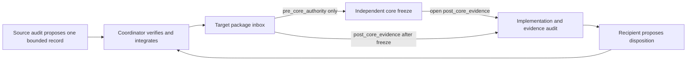
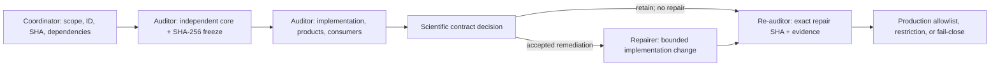
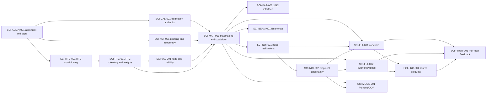

# Citlali Scientific-Contract Audit Program

## Status and authority

This directory defines a small, human-maintained process for auditing one
Citlali scientific transformation at a time. The initial inventory was made
against `codex/refactor-mainline` at
`9aae0e669384c5c0c0dda93debc194d6b8dac787`. That SHA is an inventory
snapshot, not blanket scientific approval of every transformation.

The canonical architecture and scientific vocabulary remain
`doc/ARCHITECTURE.md` and `doc/SCIENTIFIC_CONVENTIONS.md`. Executable product,
configuration, and validation authorities remain under `validation/` and
`tools/config/`. This directory records scientific-contract work without
replacing any of those authorities.

### SCI-MAP-001 current disposition — 2026-08-05

The bounded shared/naive MAP scientific contract is accepted at exact
application candidate `af0c849ce59a5f80e5efc8db435bb6662863052f` after the
completed repair/re-audit chain. The canonical axes are `approved`,
`conformant`, `complete`, and `existing_use_only`. The package-level
controlled verdict is `retain`; this is the existing-schema representation of
the coordinator's exact bounded-contract disposition `accept`.

F001--F011 are closed. F012 is controlled-status `closed` with the exact
bounded disposition `closed_bounded_owner_accepted`; the absent raw/sample
ledgers, pre-normalization traces, operational-chain records, and historical
same-case S-X files remain explicit limitations, not rerun requests. F013
remains controlled-status `open` with disposition `open_conditioned` on
SCI-ALIGN-001, SCI-CAL-001, SCI-AST-001, SCI-PTC-001, and SCI-VAL-001.

The byte-preserved [owner amendment](packages/SCI-MAP-001_OWNER_SCOPE_EVIDENCE_AMENDMENT_2026-08-05.md),
[final independent report](packages/SCI-MAP-001_FINAL_NARROW_INDEPENDENT_REAUDIT_2026-08-05.md),
[final decision](packages/SCI-MAP-001_FINAL_REAUDIT_DECISION_2026-08-05.md),
and [machine-readable proposal](packages/SCI-MAP-001_FINAL_REAUDIT_LEDGER_UPDATE_PROPOSAL_2026-08-05.yaml)
are indexed in the canonical ledger with their authority commits and SHA-256
digests. This closed the MAP repair/re-audit workflow only; it did not itself
authorize application-mainline integration, close an upstream dependency, or
expand production. A later separately authorized documentation-only
application-mainline integration is recorded at
`d5015fe716971bf8ea617e8a187311bf5af05185`. Production expansion still
requires resolution of F013 and a separate decision.

### SCI-FLT-001 current amendment — 2026-08-05

The [coordinator amendment](packages/SCI-FLT-001_COORDINATOR_AMENDMENT_2026-08-05.md)
records the current bounded disposition.

SCI-MAP-001 is now a `conditioned`, not satisfied, FLT dependency. At exact
`af0c849ce59a5f80e5efc8db435bb6662863052f`, MAP supplies the bounded signal,
nonprecision gridding/normalization coefficient `weight_I`, kernel,
facts/support/validity, and centered coefficient-weighted coaddition contract.
`weight_I` is not formal inverse variance. FLT must obtain any precision or
variance identity separately; MAP validity remains conditioned on PTC/VAL and
its production status remains `existing_use_only`.

Owner decision `SCI-FLT-001-D001` retains same-map median fill only as a
numerical boundary device. The scientific region must be eroded by the declared
effective filter footprint, and fill-influenced pixels remain invalid for
scientific weighting, significance, photometry, confidence, and feedback.
F004 therefore remains open pending exact-successor implementation,
edge/guard fixtures, sequential/OpenMP equality, and fresh re-audit; no
fill-covariance calculation is authorized for invalid pixels.

Owner decision `SCI-FLT-001-D002` approves a deliberately small
aperture-photometry contract: `signal_I` remains a fixed convolved amplitude,
and `kernel_I` must be the identically convolved, centered, and valid-region
mapmaking kernel under an explicit unit-source convention. Users may apply
kernel response to interior peaks or identically weighted aperture sums; the
pipeline emits no automatic correction, direct flux product, aperture catalog,
or response plane. Persisted kernel identity/normalization and inexpensive
peak, signed-integral, pixel-solid-angle, and effective-beam metadata require
implementation checks and re-audit. F005 and F006 remain open.

Owner decision `SCI-FLT-001-D003` retains one robust global empirical
calibration of the formal spatial pattern. Direct per-pixel jackknife variance
and S/N remain diagnostics pending SCI-NOI-002; aperture uncertainty uses blank
apertures or a future compact NOI-002 product, never independent-pixel
summation. FLT authorizes no spatial empirical model, full covariance matrix,
or long-term realization-stack requirement, and covariance-dependent consumers
remain fail closed. The available resource-admitted 64-realization validation
tier is operational only—not a routine default, universal requirement, or
beammap expectation; routine configurations and `write_realizations` behavior
remain unchanged.

SCI-NOI-001 repair and SCI-NOI-002 independent-audit dispatch packages are
prepared but neither task is launched, and CAL remains nonconformant and in
progress; neither empirical significance/covariance nor absolute photometry is
authorized. All substantive owner scientific-policy choices are resolved by
D001--D003; the [FLT decision brief](packages/SCI-FLT-001_COORDINATOR_DECISION_BRIEF_2026-08-05.md)
retains their exact boundary. The package remains
`proposed`/`conditionally_conformant`/`in_progress`/`fail_closed` with verdict
`amend` and re-audit `required`.

### SCI-NOI-001 re-audit and SCI-NOI-002 Phase 2 complete — 2026-08-06

The [frozen SCI-NOI-001 prompt](prompts/SCI_NOI_001_AUDIT_PROMPT.md),
[inbound manifest](handoffs/SCI-NOI-001/SCI-NOI-001_INBOX_MANIFEST_2026-08-05.yaml),
and [dispatch/readiness record](packages/SCI-NOI-001_COORDINATOR_DISPATCH_READINESS_2026-08-05.md)
record the accepted Terra-high Phase 0 checkpoint and completed Sol-ultra
Phase 1 in task `019fd40a-cf4d-7ad0-aa9b-9543d5236154`. The isolated worktree
started clean at detached `d5015fe716971bf8ea617e8a187311bf5af05185`; all
frozen handoff/manifest bytes matched and no quarantined implementation/test/
diff or post-core evidence was opened before the core freeze. R1 and R2 remain
immutable lineage; R3 at `5a027c94ef9fc9c4a6e6cadc84af1c8a550d3508`, with 54
preserved equation labels/order, is the sole authority for Phase 2 mapping.

Phase 2 completed at `bf6de403c2c50d55f54b8486424aea5543cdd346` as a clean
six-document, exact-d501 read-only trace. The final audit is `amend`:
NOI-001 contract is proposed, implementation nonconformant, validation
incomplete, and production remains `existing_use_only`. R3 remains the sole
authority for its 54-equation mapping; all eight P1 findings remain open.

The completed audit and [owner decision brief](packages/SCI-NOI-001_COORDINATOR_DECISION_BRIEF_2026-08-06.md)
preserve the boundary: NOI-002 exclusively owns finite-N normalization,
empirical variance/weight and downstream formula, S/N/significance/threshold/
feedback/aperture estimator, and production-count/default decisions. The
evidence design is proposed only and held for FRAMEWORK-NUM-001; 64 is optional
validation capacity only. The accepted handoffs are held for recipient core or
re-audit review, not dispatched automatically. JINC remains SCI-MAP-002-
conditioned and the residual interface SCI-FRUIT-001-conditioned.

NOI-001 has defined the conditional pre-mapmaking sign ensemble and its
ensemble second-moment imprint through realized map/coadd/filter interfaces.
Its bounded [repair prompt](prompts/SCI_NOI_001_REPAIR_PROMPT.md),
[authority manifest](handoffs/SCI-NOI-001/SCI-NOI-001_REPAIR_AUTHORITY_MANIFEST_2026-08-06.yaml),
and [readiness record](packages/SCI-NOI-001_REPAIR_DISPATCH_READINESS_2026-08-06.md)
completed their bounded repair at exact `38ef72860743636f59d226c9e1ff5ff776d0e9c0`
and have now completed their narrow independent re-audit at
`159a1a8f46e2197c6faee253d40e1ca7242bfb22`. F001, bounded-current-mode F003,
and explicit-opt-in F008 close; F002/F005 remain open only for a fresh,
unlaunched baseline-validator/FITS-inventory amendment, with F004/F006 still
excluded and F007 held. The frozen [prompt](prompts/SCI_NOI_001_REAUDIT_PROMPT.md),
[authority manifest](handoffs/SCI-NOI-001/SCI-NOI-001_REAUDIT_AUTHORITY_MANIFEST_2026-08-06.yaml),
and [readiness record](packages/SCI-NOI-001_REAUDIT_DISPATCH_READINESS_2026-08-06.md)
remain historical dispatch authority. The
independent [SCI-NOI-002 prompt](prompts/SCI_NOI_002_AUDIT_PROMPT.md),
[manifest](handoffs/SCI-NOI-002/SCI-NOI-002_INBOX_MANIFEST_2026-08-06.yaml),
and [readiness record](packages/SCI-NOI-002_DISPATCH_READINESS_2026-08-06.md)
record the completed exact-d501 Phase 2 audit at
`4f1fec36f7802f3b5e8ac067377679946930983c`. All eight P1 findings remain open
under verdict `amend`; its six recipient proposals are held, not dispatched.
Owner D001/F001 approves only a conditional finite-stack descriptive identity,
and D002/F002 only a global nonprecision-scale diagnostic. Qualified D003/F003
makes the reduction package the authoritative compact provenance unit, not
every detached product; F003 remains open for implementation,
package-integrity/join validation, and re-audit. Owner D004/F004 approves
distinct descriptive/engineering S/N-like identities and not-significance
legacy aliases; F004 remains open for implementation and re-audit, while
SCI-SRC-001 owns any future significance or catalog claim. Owner D005/F005
retains only `filtered_pixel_stack_scatter` and fixed-measurement realization
scatter diagnostics; F005 remains open for implementation and re-audit, with
no dense covariance requirement or physical-uncertainty claim. Owner D006/F006
retains MEDRMS only as a FRUIT scale-gate naive baseline, requires explicit
failure for an unavailable requested nonzero gate, and routes the defensible
bright-source map-uncertainty estimator to SCI-FRUIT-001; F006 remains open.
Owner D007/F007 treats Science=10 and Pointing=5 only as current user-configured
requests, preserves standard quicklook/Beammap disabled-zero behavior, and
requires requested/effective/completed counts plus truthful incomplete-execution
binding; F007 remains open for implementation, use-specific convergence
evidence, and re-audit. Owner D008/F008 freezes proportional exact local and
consumer-fixture classes, and exact-authorized-repair-SHA-only astronomical
validation with predeclared criteria; F008 remains open pending authorized
execution and re-audit. The resource-admitted 64-realization tier is neither a
default nor a requirement. No repair, evidence request, re-audit execution,
reduction, Unity action, integration, or production authorization follows from
these results.

All F001--F008 owner policies are now resolved at contract level; the findings
remain technically open. The frozen bounded SCI-NOI-002 successor repair
[prompt](prompts/SCI_NOI_002_REPAIR_PROMPT.md), [authority manifest](handoffs/SCI-NOI-002/SCI-NOI-002_REPAIR_AUTHORITY_MANIFEST_2026-08-06.yaml), and
[readiness record](packages/SCI-NOI-002_REPAIR_DISPATCH_READINESS_2026-08-06.md)
are `ready_pending_launch` from exact application SHA
`d5015fe716971bf8ea617e8a187311bf5af05185`; no task, worktree, branch, repair,
or re-audit has been launched.

The owner retains the v4-compatible Beammap jackknife/noise-map path as an
optional capability only. Standard Beammap configurations remain disabled by
default and do no realization/noise-product work; an inert configured count
while disabled resolves to effective zero and is not a requirement or adequacy
claim. F008 remains for deterministic behavior on explicit opt-in, while
SCI-NOI-002 may assess Beammap only as such an optional recipient.

### SCI-NOI-002 Cycle 1 re-audit and Cycle 2 dispatch — 2026-08-06

The first bounded repair candidate is exact application commit
`0bc4d95d6bb2117442d0ccdb79c57e42e0b79989`. Its fresh independent re-audit at
`e4cdf7b3ac42f536497a3249c0499d6e2de2f8c1` returns `amend`: contract remains
approved, implementation nonconformant, required validation failed at the
package/count boundary, and production remains `existing_use_only`.

The first repair closes F001, F002, and F008 within their bounded owner-approved
scope. F003, F004, and F007 remain open; F005 remains open and conditioned on
SCI-FLT; F006 remains SCI-FRUIT-001-owned. The four Cycle 2 P1 defects are
realized publication membership/atomicity, the active auditor's rejection of
approved disabled available-zero state, plan-derived rather than observed
completion counts, and filtered-scatter validity not derived from the actual
calculation. Two accepted P2 cleanups remove duplicate canonical HDUs and
repair residual Mapdiag terminology.

The owner-approved [Cycle 2 handoff](packages/SCI-NOI-002_CYCLE2_OWNER_DECISION_AND_REPAIR_HANDOFF_2026-08-06.md)
selects one physical plane under the compatible legacy `EXTNAME`; canonical
identity is carried by metadata and package joins, not duplicate data. The
frozen [prompt](prompts/SCI_NOI_002_CYCLE2_REPAIR_PROMPT.md), [manifest](handoffs/SCI-NOI-002/SCI-NOI-002_CYCLE2_REPAIR_AUTHORITY_MANIFEST_2026-08-06.yaml),
and [readiness record](packages/SCI-NOI-002_CYCLE2_REPAIR_DISPATCH_READINESS_2026-08-06.md)
continue the existing repair task from exact `0bc4d95d6`, never from the audit
or coordination line. They authorize no estimator/filter change, counts or
defaults, Unity/evidence work, integration, production expansion, or re-audit.

### SCI-NOI-002 Cycle 4 final coordination — 2026-08-08

The bounded repair/re-audit chain is complete. Exact application candidate
`5b29e13548a6fec884c67b192dec20c92f0bbb62` passed its fresh independent Cycle
4 re-audit at `6de648f5ae2b37f5bc65162feae221f19bb84a5a`. The controlled
verdict is `retain`: the contract is `approved`, implementation is
`conformant`, applicable deterministic validation is `complete`, and
production remains `existing_use_only`.

Cycle 4 requirements C4-R001--C4-R004 are satisfied. Cycle 3 P1 findings
C3RA-P1-001--P1-003 close, as do original findings F003/F004/F007 and repair
findings RA-B001/RA-B003 within their bounded contracts. F001/F002/F008 and
RA-B002/RA-R001/RA-R002 retain prior closure. F005 and RA-B004 remain
`open_conditioned` and SCI-FLT-001-owned; F006 remains `held_external` and
SCI-FRUIT-001-owned. F004 closure does not validate significance or catalog
claims, and F007 closure does not recommend a realization count or default.

The accepted [independent report](packages/SCI-NOI-002_CYCLE4_INDEPENDENT_REAUDIT_2026-08-07.md),
[machine-readable result](results/SCI-NOI-002_CYCLE4_REAUDIT_RESULT_2026-08-07.yaml),
[ledger proposal](proposals/SCI-NOI-002_CYCLE4_REAUDIT_LEDGER_UPDATE_PROPOSAL_2026-08-07.yaml),
and [coordinator closeout](packages/SCI-NOI-002_CYCLE4_COORDINATOR_CLOSEOUT_2026-08-08.md)
bind the exact candidate, evidence, dispositions, and retained restrictions.
This closeout neither integrates the application candidate onto the application
mainline nor expands production. Both remain separate decisions.

### DOC-MAP-001 queued user-facing map-semantics guide — 2026-08-06

The project owner requires a compact one-to-two-page explanation of what each
emitted map measures because the repaired product meanings now differ
materially from historical shorthand. This is a Citlali-owned cross-package
deliverable: Citlali owns the product identities and the effective and realized
configuration that can change their meaning. TolTECA and TolProj may surface or
copy the result, but they must not independently redefine the products.

The queued design is deliberately hybrid. A static canonical map dictionary
will state each product's identity, equation or operational definition, units,
normalization/calibration, filtering or kernel response, support/validity,
statistical status, safe uses, prohibited interpretations, and legacy aliases.
A compact per-reduction guide will then be rendered from the same product
contracts plus effective and realized state, listing only emitted maps and the
settings that materially determine their meaning. Requested configuration
alone is insufficient, and the user guide must link to rather than duplicate
the full provenance package.

Each map-producing audit or repair must contribute the facts needed by this
guide. Implementation is held until the applicable product identities are
stable enough to avoid churn, but completion is required before production
expansion and Phase 5 closeout. This task does not broaden an active audit,
alter a numerical algorithm, or launch a new audit package.

## Purpose and non-goals

The program exists to make the claimed estimator, its uncertainty and
response, the implementation at an exact SHA, the validation evidence, and
the authorized downstream uses independently reviewable.

It does not:

- treat historical behavior, accepted snapshots, or plausible-looking maps as
  the scientific contract;
- authorize code changes, integration, production use, or relaxed validation
  merely because an audit document exists;
- create a general audit CLI, database, report generator, CI system, or
  alternate provenance system. The narrow machine-readable schemas and
  validator required to control costly numerical studies are an exception;
- require a rewrite of mature RTC, PTC, JINC, or Wiener algorithms without
  evidence that their internals violate an approved contract;
- force every package to use every possible validation method; or
- revoke already accepted operational behavior implicitly while its contract
  is being reviewed.

The ledger and templates are deliberately hand-maintained Markdown, YAML, and
LaTeX. Automating the general audit program is a separate decision that
requires demonstrated maintenance value. Costly-study condition registers,
model-free preflight reports, and execution-readiness certificates are
validated under `FRAMEWORK-NUM-001` because a hidden runtime guard can consume
or discard expensive evidence before a human can review it.

## Audit package

An **audit package** is one bounded scientific transformation together with
its input contract, configuration and data-dependent state, uncertainty,
response, products, metadata, and downstream consumers. It is not necessarily
a source directory, namespace, reduction mode, or configuration domain.

Split a proposed package when its parts have independently meaningful
estimators, responses, uncertainty models, repair decisions, or validation
gates. Keep parts together when they form one estimator whose product meaning
cannot be reviewed coherently in isolation. Overlap is allowed only when one
package names the other by stable ID as a dependency; each product or decision
must still have one primary package owner.

Package IDs are permanent. Names and scope descriptions may be clarified, but
an ID is never reused. Findings use `<PACKAGE-ID>-FNNN` and retain their IDs
after closure.

## Common audit dimensions

Every audit addresses the following dimensions or gives an explicit, specific
`not_applicable` rationale:

1. Package identity, bounded scope, exclusions, governing SHA, worktree, and
   branch.
2. Input contract and upstream assumptions.
3. Claimed estimator: affine `y = A x + c`, nonlinear or data-dependent
   `y = F(x, theta)`, or iterative/stateful
   `s_(n+1) = G(s_n, x), y = H(s_n, x)` as appropriate.
4. Classification of every consequential quantity as random, fixed, fitted,
   selected, data-derived, or conditioned upon.
5. Spatial, temporal, beam/template, extended-mode, photometric, and
   iteration-to-iteration response as applicable.
6. Formal variance and full covariance, empirical variance,
   calibration/systematic uncertainty, and response uncertainty.
7. Separate meanings for variance, inverse variance, support, validity, hits,
   coverage, confidence, and response.
8. Units, coordinate frames, indexing, shape, normalization, and non-finite or
   missing-data policy.
9. Requested configuration, effective policy, observation-resolved choices,
   and realized execution state.
10. Implementation trace through signal, formal uncertainty, empirical/noise
    realizations, simulations, masks, sequential/OpenMP paths, writers, and
    metadata.
11. Product and consumer matrix:
    `input -> operator -> estimator -> units -> metadata -> consumer`.
12. Analytic limits, deterministic fixtures, injections, blank controls,
    parallel equivalence, same-SHA external evidence, and astronomical
    recovery where applicable.
13. Explicit consumer allowlist, restricted-use conditions, and fail-closed
    policy.
14. Findings, unresolved assumptions, dependencies, scientific decisions,
    verdict, and proposed ledger update.
15. Every inbound cross-audit handoff in the frozen dispatch manifest, its
    permitted review phase and recipient disposition, plus every outbound
    handoff proposed for another stable package ID.

An omission is never justified only by the package tier. For example, a Tier B
audit may mark an astronomical injection study not applicable when the
operator's established interface response is completely exercised by analytic
and retained real-data evidence, but it must state that reasoning.

## Audit tiers

| Tier | Required depth | Typical use |
| --- | --- | --- |
| A - full scientific contract | Derive the estimator, uncertainty/covariance, response, units, selection, products, consumers, and all applicable evidence independently. | Any process affecting scientific amplitude, uncertainty, response, source selection, or iterative feedback. |
| B - interface and response | Audit the input/output contract, normalization, transfer/response, boundaries, effective/realized state, products, metadata, and consumers. Open mature numerical internals only when evidence requires it. | Mature RTC/PTC/JINC/Wiener algorithms whose kernels are not presently suspect. |
| C - engineering contract | Audit authority, ownership, lifecycle, requested/effective/realized state, provenance, reproducibility, and failure propagation. | Deterministic plumbing that does not itself alter the estimator. |

A package is promoted to Tier A when interface evidence exposes an unresolved
amplitude, covariance, response, unit, source-selection, or feedback question.

## Model and reasoning-effort allocation

**Policy ID:** `FRAMEWORK-EFFORT-001`

**Effective date:** 2026-08-02

**Scope:** future dispatches and future phases only

The program maximizes scientific reliability per unit of Codex usage. Model
and effort are selected from the consequence and ambiguity of the question,
whether the task is mechanically settled or scientifically interpretive,
whether the scientific contract remains open, and whether the task is one
coherent problem or several independent hard investigations. They do not
alter package tier, scientific authority, evidence gates, role separation, or
the costly-study controls in `FRAMEWORK-NUM-001`.

| Task shape | Default allocation | Examples |
| --- | --- | --- |
| Mechanical and settled | Terra Medium | Exact SHA/worktree checks, manifests, checksums, known commands, routine metadata extraction, and fully specified mechanical edits. |
| Bounded engineering judgment | Terra High | Audit management, dispatches, ledger/dependency work, bounded tracing, approved repairs, ordinary build/test interpretation, and handoff integration. |
| Difficult scientific analysis | Sol High or XHigh | Evidence and consumer synthesis; signal/variance/weight/support/response/validity interpretation; cross-process tracing; consequential decision briefs. |
| One deep coherent scientific problem | Sol Max | Independent foundational derivation; a covariance, response, unit, timing, calibration, normalization, or validity contradiction; final adjudication of one tightly coupled contract. |
| Several independent hard investigations requiring synthesis | Sol Ultra | A written, broad adversarial review divided into independent mathematical, implementation, product/metadata, validation, and consumer workstreams. |

`XHigh` is the Codex effort-setting name for the intermediate level sometimes
described as “Extra High.” Terra Medium is not the default for a full
scientific audit, and Ultra is not a generic safety margin for an important,
large, or long task.

### Phase defaults

Unless a dispatch records a specific reason to depart, a Tier A lifecycle uses:

1. launch checkpoint and source inventory — Terra High;
2. independent scientific core — Sol Max;
3. implementation, product, and consumer tracing — Sol High or XHigh;
4. scientific decision brief — Sol XHigh, escalating to Sol Max only for one
   remaining coherent question;
5. approved repair — Terra High, or Sol High when an implementation choice can
   alter estimator or product meaning;
6. mechanical validation — Terra Medium;
7. validation interpretation — Terra High or Sol High according to whether it
   can change scientific meaning; and
8. fresh re-audit — Sol Max when it assesses one coherent contract.

Tier B interface/response work normally begins at Terra High or Sol High and
uses Sol Max only after a specific mathematical or scientific reopen trigger.
Tier C work normally remains Terra High, with Terra Medium reserved for its
settled execution steps. The same defaults apply to the analogous phase of an
amendment or successor task; completed and frozen audit artifacts are never
relabeled retroactively.

### Ultra, parallelism, and task lifecycle

An Ultra escalation is permitted only when a dispatch identifies the
unresolved question, why XHigh or Max is insufficient, the independent
subproblems, the reconciliation owner and method, and the exact stop rule.
Ultra ends when that decomposable synthesis phase ends. No currently active
package receives an implicit Ultra escalation from this policy.

Parallelism is a latency and independence tool, not a credit-saving device.
It is permitted only for operationally and scientifically independent work
with explicit authority boundaries, predetermined output owners, and a named
synthesis point. Within a package, retain the required serial sequence:

```text
independent core -> freeze/hash/commit -> implementation inspection ->
findings -> owner decision -> repair -> validation -> fresh re-audit
```

End a task when its role changes (for example audit to repair or validation to
re-audit) and use a compact, frozen handoff. Role separation preserves
scientific independence and authority boundaries; it is not merely a context
or usage optimization.

### Dispatch and ledger record

Every future package or subtask dispatch includes the header defined in
`templates/PACKAGE_AUDIT_PROMPT_TEMPLATE.md`. The coordinator records the
actual selected allocation and any escalation in `audit-ledger.yaml` under
`resource_dispatch_history`. The README supplies defaults; the ledger records
only dispatched choices, departures, and their reasons, so it does not become
a redundant per-package planning table. Each record names the dispatch ID,
package ID, phase, exact dispatch commit, model, effort, task shape, rationale,
Ultra trigger, parallelism/synthesis plan, and stop rule.

## Scope control and coordinator checkpoints

**Policy ID:** `FRAMEWORK-SCOPE-001`

**Effective date:** 2026-08-02
**Scope:** future dispatches and future phases only

An audit's scientific importance does not authorize unbounded engineering or
local execution. Every task begins with a coordinator-reviewed scope
checkpoint before substantive work: application or validation edits, a local
Citlali reduction, a new executable helper, a new schema or verifier,
delegation, an independent review, or an external-evidence request. The
checkpoint is a concise report, not a new framework artifact. It names:

- the exact allowed paths and required deliverables;
- required versus prohibited execution, including `local Citlali reduction`
  and human-run Unity evidence;
- the planned tests and evidence, limited to the named deliverables;
- any permitted delegation or review; and
- the first viable artifact and the next mandatory return point.

The task stops for coordinator direction if a new artifact class, executable
tool, schema, wrapper, verifier, validation campaign, delegation, reduction,
or scientific/operational interpretation would be needed beyond that report.
Silence is prohibition. In particular, local Citlali reductions require an
explicit local-only rationale in the dispatch; Unity is the default reduction
evidence lane unless a named exception is approved.

The coordinator checks each task at three points: the initial scope
checkpoint, the first viable artifact, and before costly or local execution.
The first viable artifact demonstrates the named output only; it does not
authorize a new generalized control system or a perfection pass. Existing
scientific gates remain intact, but they are implemented only to the extent
the dispatch explicitly names. The full incident record and controls are in
`SCOPE_CONTROL_CORRECTIVE_ACTION_2026-08-02.md`.

## Authority and evidence

No evidence class substitutes for all the others:

| Item | What it establishes | What it does not establish |
| --- | --- | --- |
| Approved scientific contract | The estimator and allowed scientific interpretation. | That code conforms or real data validate it. |
| Source at the governing SHA | The implementation actually assessed. | Scientific correctness merely because it is historical or deployed. |
| Analytic tests and local fixtures | Mathematical and implementation conformity for covered cases. | Cluster behavior, astronomical recovery, or production authorization. |
| Same-SHA Unity reductions | External execution, products, provenance, and configured-mode evidence. | The contract by themselves, or behavior outside the returned evidence. |
| Blank controls, injections, and astronomical observations | Empirical calibration, recovery, and failure-mode evidence. | A waiver for contradictory mathematics or implementation. |
| Historical output or visual plausibility | Context and regression clues. | Silent definition of an estimator or acceptance threshold. |

Use `observed`, `derived`, `suspected`, and `owner_decision` to label the basis
of a claim. A scientific contract changes only through an explicit documented
scientific decision. It is not revised merely to match existing output; an
approved revision creates a successor contract and retains the old record.

## Configuration and state vocabulary

- **Requested** is the immutable low-level Citlali request accepted at the
  application boundary, including values inside disabled sections.
- **Effective** is context-free activation, normalization, and compatibility
  policy selected from that request.
- **Observation-resolved** is state requiring observation identity, sample
  rate, calibration, pointing support, source context, or hardware
  availability.
- **Realized** is what execution actually applied and produced, including
  counts, selected fallbacks, validity, and product cardinality.

These states move in one direction. A legacy adapter may receive effective or
observation-resolved state, but processor state does not rewrite the request.
Provenance must label the state it records.

## Independent status axes

The ledger never compresses package state into a single word such as
`audited`, `blocked`, or `complete`.

| Axis | Controlled values | Meaning |
| --- | --- | --- |
| `contract_status` | `not_started`, `independent_draft_frozen`, `proposed`, `approved`, `superseded` | Progress and authority of the scientific contract. `approved` requires an explicit scientific decision. |
| `implementation_status` | `not_assessed`, `conformant`, `conditionally_conformant`, `nonconformant` | Conformity of the exact governing SHA. Conditional conformity requires named, falsifiable dependency assumptions. |
| `validation_status` | `not_started`, `planned`, `in_progress`, `external_pending`, `complete`, `failed` | State of the applicable evidence plan. `complete` does not authorize production. |
| `production_status` | `fail_closed`, `existing_use_only`, `restricted_use`, `approved`, `retired` | Allowed operational scope. `existing_use_only` preserves accepted behavior while forbidding new interpretations or consumers. |
| `verdict` | `pending`, `retain`, `amend`, `split`, `supersede`, `reject` | Disposition of the assessed package or proposal. |

`external_pending` means all applicable local gates are accepted and a precise
external request is the only remaining validation gate. Use `in_progress` when
contract, local, and external gaps coexist. A blocking cause belongs in a
finding or dependency, not in an overloaded status.

Verdict meanings are:

- `retain`: keep the assessed contract and implementation subject to recorded
  evidence and production decisions;
- `amend`: preserve package identity but make bounded contract,
  implementation, metadata, or evidence changes;
- `split`: replace the over-broad unit with named successor package IDs;
- `supersede`: replace the estimator or approved contract while preserving its
  history; and
- `reject`: prohibit the assessed proposal or use.

## Findings and priority

Finding class is independent of severity, evidence basis, confidence, and
status.

| Finding class | Meaning |
| --- | --- |
| `implementation_defect` | Code at the exact SHA deviates from the contract or applies inconsistent operators across signal, uncertainty, simulation, parallel, or output paths. |
| `contract_gap` | Estimator, response, normalization, uncertainty, validity, units, metadata, or consumer meaning is missing or ambiguous. |
| `scientific_policy_decision` | Multiple plausible choices alter scientific meaning or authorization and require an owner decision. |
| `evidence_gap` | A claim lacks a falsifiable required test, fixture, reduction, observation, or returned artifact. |
| `dependency_gap` | A required upstream or downstream contract is unresolved; the finding names a stable package ID. |

P0 means correctness/data-corruption/invalid-success or unsafe-failure risk;
P1 means material scientific ambiguity, reproducibility risk, or severe
operational failure; P2 means measured performance/resource risk or a
high-value maintainability barrier; and P3 means useful cleanup without
current correctness or scientific impact. Optional confidence is `low`,
`medium`, or `high`. Severity never converts a scientific decision or evidence
gap into a software defect.

## Package lifecycle and role separation

The coordinator and audit manager also follow
`doc/audits/AUDIT_MANAGER_INSTRUCTIONS.md`. Any study classified as costly
must pass `FRAMEWORK-NUM-001` before execution. This adds a condition register,
model-free guard preflight, independent control review, readiness certificate,
and preregistered salvage plan; it does not change a package's scientific
contract or its four status axes.

1. The **coordinator** fixes the package ID, scope, tier, dependencies,
   governing SHA, initial consumer policy, and exact handoff-inbox manifest.
   The coordinator owns canonical ledger and handoff integration but does not
   derive the estimator or repair code.
2. A fresh **auditor** worktree and thread verify repository state, read
   governing project-level authorities, and quarantine identified package
   implementation sources and every handoff classified as
   `post_core_evidence`. Only coordinator-approved `pre_core_authority`
   handoffs may be opened before the core freeze. The auditor drafts the
   mathematical core in a separate exact file or byte range, records all prior
   exposure, computes its SHA-256 digest, and makes those bytes immutable
   before opening package source or post-core handoffs.
3. The auditor opens the frozen post-core handoff set, records that first
   exposure, then traces implementation, products, metadata, simulations,
   parallel paths, and consumers. The auditor writes falsifiable gates,
   records a disposition for every inbound handoff, proposes any outbound
   handoffs, records findings and verdict, and changes no application code or
   canonical handoff.
4. The scientific owner approves, amends, supersedes, or rejects the proposed
   contract and resolves policy decisions needed for repair.
5. A separate **repairer** worktree and thread implement only accepted
   remediation against the named contract. The repairer may not rewrite the
   contract to fit output.
6. A fresh **re-auditor** worktree and thread assess the exact repair SHA,
   returned evidence, and every open finding.
7. Production receives an explicit allowlist, restriction, or fail-closed
   disposition. Reopening requires a finding, dependency change, scientific
   successor, or evidence trigger.

The same person may serve in several roles, but never in the same thread or
mutable worktree. Only create repair and re-audit branches when those stages
are needed. Suggested branch names are `codex/audit-<package>`,
`codex/repair-<package>`, and `codex/reaudit-<package>`. Do not push or merge
without separate authorization.

Hash the independent core itself, not an evolving whole audit document. The
audit records the path or byte-range extraction method, SHA-256 value, freeze
commit, timestamp, and the first implementation-inspection event. A claim of
independence without reproducible frozen bytes is recorded as an evidence gap.

## Dependencies and conditional conclusions

Dependencies use stable package IDs and one of `open`, `conditioned`,
`satisfied`, or `superseded`. Before a package is dispatched for audit, each
dependency states the exact required contract fact and the consequence while
it remains open. A bare edge in the initial inventory is explicitly an
`inventory-only` placeholder; the coordinator must complete it before
dispatch rather than letting the auditor invent the upstream contract.

`conditionally_conformant` is allowed only when the assessed code matches the
contract under a named upstream assumption and a test could falsify that
assumption. Known code/contract mismatch remains `nonconformant`. A package
with an open dependency may produce a useful audit, but its dependent
production consumer stays restricted or fail-closed. Cycles must be broken by
splitting estimator stages or by making iteration state explicit; they are not
hidden in prose.

## Cross-audit handoffs

Cross-audit communication is durable, package-addressed, evidence-bound, and
coordinator-integrated. It does not occur by editing another audit's report or
worktree, and it does not promote a sender's conclusion into the recipient's
scientific contract. The canonical protocol and records live under
`doc/audits/handoffs/`; the reusable record is
`doc/audits/templates/CROSS_AUDIT_HANDOFF_TEMPLATE.yaml`.

Each record has exactly one source package and one target package. A message to
several packages is represented by separate records sharing related-handoff or
evidence identifiers, so each recipient can disposition its own message. The
target package ID determines the inbox directory and stable ID:

```text
doc/audits/handoffs/<TARGET-PACKAGE-ID>/<TARGET-PACKAGE-ID>-XAUD-NNN.yaml
```

The source audit proposes a complete record on its own branch and lists the ID
in its ledger proposal. The coordinator checks identity, scope, hashes, and
review phase before integrating it into the canonical handoff registry. The
recipient proposes a disposition on its own audit or re-audit branch; only the
coordinator updates the canonical record. Submission fields are immutable.
Corrections create a successor record and use `supersedes`/`superseded_by`.

Handoffs have two review phases:

- `pre_core_authority` is limited to an already approved scientific contract,
  owner decision, or canonical dependency fact. The coordinator must identify
  the exact authority and commit that permit pre-freeze exposure.
- `post_core_evidence` covers observations, downstream manifestations,
  suspected or derived defects, questions, and unapproved contract proposals.
  Its content remains quarantined until the independent core is frozen.

Before dispatch, the coordinator freezes a manifest containing every inbound
handoff ID, file SHA-256, review phase, and canonical commit. Late handoffs do
not silently enter an active audit. The coordinator either holds them for
re-audit, authorizes a dated amendment with explicit exposure, or records an
urgent production restriction independently of the scientific derivation.

Every resolved recipient disposition names one or more controlled actions and
links the resulting finding, dependency, contract section, restriction, test,
or re-audit trigger. `not_applicable` requires a scope-based rationale. A
handoff may sharpen or reopen work, but it cannot close a finding or authorize
production by itself. Evidence remains authoritative only for the bounded
claim its identity and limitations support.



## Process and dependency graph



The package diagram below is a readable critical-path projection, not the
exhaustive edge list. The hand-maintained `upstream_dependencies` records in
`audit-ledger.yaml` are authoritative; they include secondary unit, response,
validity, mode, and consumer prerequisites omitted from the drawing.



`ENG-STATE-001` is a parallel Tier C review of lifecycle, provenance,
required-product publication, and exact-SHA evidence. It supports every
package but does not define their estimators.

## Initial inventory and dependency-aware queue

| Package ID | Tier | Bounded package | Primary upstream packages | Queue |
| --- | --- | --- | --- | --- |
| `SCI-MAP-001` | A | Shared/naive mapmaking signal, nonprecision gridding/normalization coefficient `weight_I`, kernel, hits/coverage, validity, and observation coaddition | `SCI-CAL-001`, `SCI-AST-001`, `SCI-PTC-001`, `SCI-VAL-001` may begin as explicit abstract inputs | First new audit |
| `SCI-ALIGN-001` | A | Sample/telescope alignment, scan slicing, and gap interpolation | external input identity | Foundation wave 1 |
| `SCI-CAL-001` | A | Detector calibration, extinction, flux scaling, and map-unit transfer | `SCI-ALIGN-001` | Foundation wave 1 |
| `SCI-AST-001` | A | Pointing corrections, detector coordinates, frames, and WCS | `SCI-ALIGN-001` | Foundation wave 1 |
| `ENG-STATE-001` | C | Requested/effective/realized lifecycle, provenance, required products, and failure flow | architecture and product authorities | Parallel foundation wave |
| `SCI-RTC-001` | B | Mature RTC filtering/conditioning interface and temporal response | `SCI-ALIGN-001`, `SCI-CAL-001`, `SCI-AST-001` | Foundation wave 2 |
| `SCI-PTC-001` | B | Mature correlated-mode cleaning, selection, and detector-weight interface | `SCI-RTC-001`, `SCI-AST-001` | Foundation wave 2 |
| `SCI-VAL-001` | A | Cross-stage flags, detector/sample eligibility, non-finite policy, and map support | `SCI-ALIGN-001`, `SCI-RTC-001`, `SCI-PTC-001` | Foundation wave 2 |
| `SCI-MAP-002` | B | Mature JINC gridding interface, normalization, support, and response | approved/shared `SCI-MAP-001` product contract | Map successor wave |
| `SCI-NOI-001` | A | Jackknife/noise randomization and propagation through selected operators | `SCI-PTC-001`, `SCI-VAL-001`, `SCI-MAP-001` | Uncertainty wave 3 |
| `SCI-NOI-002` | A | Empirical variance/covariance, global calibration, statistical weight, and S/N semantics | `SCI-NOI-001`, `SCI-MAP-001` | Uncertainty wave 3 |
| `SCI-FLT-001` | A | Fixed map-domain `convolve` signal, conditional candidate variance, response, support, and downstream restrictions | conditioned `SCI-MAP-001`; `SCI-NOI-001`, `SCI-NOI-002`, and `SCI-CAL-001` open | Existing audit; owner amendment then amend/re-audit wave 4 |
| `SCI-FLT-002` | B | Mature Wiener and lowpass filtering interface, normalization, and response | `SCI-MAP-001`, `SCI-NOI-001`, `SCI-NOI-002` | Product wave 4 |
| `SCI-SRC-001` | A | Generic map-domain source finding, Gaussian fitting, and source tables | map/filter, `SCI-NOI-002`, `SCI-AST-001` | Product wave 4 |
| `SCI-MODE-001` | A | Pointing/OOF map fitting, significance, astrometric/shape products | `SCI-MAP-001`, `SCI-NOI-002`, `SCI-AST-001`, `SCI-CAL-001` | Mode wave 4 |
| `SCI-BEAM-001` | A | Beammap detector-map iteration, priors, fits, flags, sensitivity, and APT products | calibration, astrometry, RTC/PTC, validity, mapmaking | Mode wave 4 |
| `SCI-FRUIT-001` | A | Science/pointing map-to-TOD feedback, state, convergence, and restart contract | map, uncertainty, filters, source/point products | Last; filtered inputs fail-closed |

The first audit intentionally derives `SCI-MAP-001` against explicit abstract
calibration, pointing, validity, and timestream-weight/covariance inputs. Its
findings then sharpen the foundational package contracts without making an
implementation guess.

Material deviations from the initial candidate decomposition are:

- alignment/gap interpolation is separated from flags/validity because it
  constructs values on a common sample axis, while validity selects which
  values may enter later estimators;
- RTC temporal filtering and PTC correlated-mode cleaning/weighting are
  sequential operators with distinct response and state;
- JINC is a mapmaker, not a post-map filter, so it receives a Tier B package
  under the shared mapmaking product contract;
- jackknife construction/propagation is separated from the estimator that
  converts realizations into empirical variance and calibrated weight;
- `convolve` and Wiener/lowpass are different estimators and remain separate;
- generic source catalogs, Pointing/OOF fits, and Beammap detector products
  have different estimator identities and consumers;
- Beammap's internal iteration is distinct from science/pointing fruit-loop
  feedback; and
- the Tier C state/provenance package is explicit so empirical evidence can be
  interpreted without pretending provenance defines science.

Maximum-likelihood mapmaking, dormant destriping, enabled polarimetry, and the
measured R channel are not active queue packages. Current production either
rejects or does not execute those capabilities. Reopening one first requires a
capability decision, stable package ID, contract scope, and reference evidence;
it is not silently folded into an active package.

## Definitions of done

An **audit report** is complete when it records the exact SHA/worktree and
frozen-core digest; addresses every common dimension or a justified
`not_applicable`; traces products and consumers; owns every finding, decision,
and dependency; defines falsifiable gates; and supplies a verdict plus
machine-readable ledger proposal. Every proposed study also has a documented
cost classification; any costly study is either held or carries the exact
`FRAMEWORK-NUM-001` control artifacts and launch-gate result. A report with
verdict `amend` can be complete while its package is not done.

A **package** is done only through one of two terminal paths:

- approved or restricted production: contract approved, exact implementation
  conformant, applicable validation complete, allowed-use dependencies
  satisfied, no unowned P0/P1 findings, and consumer allowlist/restrictions
  explicit; or
- nonproduction terminal: rejected, retired, or superseded with every affected
  consumer fail-closed and the historical contract/evidence retained.

`pending`, `amend`, `external_pending`, `in_progress`, and
`existing_use_only` are not package completion.

The **program** is done when every active scientific transformation has one
primary package; every package reaches a terminal path; no production claim
depends on an unresolved contract or dependency; every consumer is explicitly
allowed, restricted, or fail-closed; applicable evidence is complete at exact
SHAs; and no unowned P0/P1 or undecided scientific policy leaks into
production. Finite owned P2/P3 work and retained debt may remain. Completion
does not require rewriting mature algorithms or erasing history.
