# End-to-End Scientific Data Story

## 1. Purpose and claim boundary

This document tells the scientific data story that can be derived from the six package contracts at repository commit `55efd8a54464636a24e621f6d1b60486d235b20e`. It is a horizontal synthesis, not another package contract. SCI-ALIGN, SCI-AST, SCI-RTC, SCI-CAL, SCI-PTC, and SCI-VAL remain the owners of their own meanings. SCI-MAP is a downstream reference used to ask whether the resulting bundle is sufficient. The story does not assert that any implementation realizes these contracts, that any prediction has been tested, or that any package is ready for production.

The result is an honest outcome B: the architecture is largely coherent and acyclic, but a finite set of source, policy, response, uncertainty, external-authority, and owner-decision blockers prevents a frozen or numerical MAP handoff. The story below therefore distinguishes three things throughout:

1. a source-backed invariant that the current contracts do establish;
2. an intended composition whose exact boundary or source binding is incomplete; and
3. a prohibited inference that would appear to close the chain but would change scientific meaning.

The complete issue statements are in
`SIX_PACKAGE_HORIZONTAL_COHERENCE_FINDINGS.md`; the crosswalk contains the 26
directive-required interface comparisons plus three closure interfaces, and the
22 directive-required candidate invariants plus two MAP owner-gate invariants.

## 2. The system is a synchronized multi-lane relation

The ordinary route cannot be represented faithfully as one pipe of numerical arrays. At least six relations advance together:

- the **signal lane** carries the detector quantity and its numerical parents;
- the **coordinate lane** carries time, direction, geometry, WCS, and role-specific grid parentage;
- the **policy lane** carries producer facts into exact named-use decisions and then consumer actions;
- the **response lane** carries the effect of every selected operation on an admitted source-domain perturbation or exact companion;
- the **uncertainty lane** carries conditional covariance, nuisance terms, selection/model uncertainty, and typed omissions; and
- the **provenance/lifecycle lane** binds request, source versions, plans, evidence, realization, decisions, products, and successor generations.

An optional conditioned-`r` branch shares identity and ordinary RTC operator state with conditioned `x` where available, yet it remains scientifically and numerically subordinate: it is uncalibrated, non-Stokes, not an alternate `x`, and unable to change the fixed-state numerical `x` branch. This optional branch is not a seventh way to close a missing main-lane fact.

The lanes synchronize on exact identity, not on array position or coincident numeric values. A coordinate can exist while signal payload is invalid. A signal can exist while complete response or total uncertainty is unavailable. An upstream VAL decision can exist while MAP contribution is still impossible. These are normal typed states, not inconsistencies.

## 3. One acyclic authority graph

The following graph states authority and parent order, not execution behavior:

```mermaid
flowchart LR
  TUNE[External Tune/readout mapping] --> ALIGN[SCI-ALIGN stable paired relation]
  TEL[External clock/fields/pointing] --> ALIGN
  ALIGN --> ASTA[SCI-AST ALIGN-grid role]
  ALIGN --> RTC[SCI-RTC immutable learn-resolve-apply]
  ASTA --> RTC
  RTC --> RTCO[RTC exact n-grid and support]
  RTCO --> ASTR[SCI-AST RTC-grid role/WCS]
  RTC --> CAL[SCI-CAL factor and target atmosphere]
  ALIGN --> CAL
  ASTR -. coordinate/geometry facts .-> PTC[SCI-PTC transformed calibrated signal]
  CAL --> PTC
  RTC -. ancestry .-> PTC
  ALIGN -. facts .-> REG[Exact owner-bound profiles]
  ASTA -. facts .-> REG
  RTC -. facts .-> REG
  CAL -. facts .-> REG
  PTC -. facts .-> REG
  REG --> VAL[SCI-VAL Core decision artifact]
  VAL --> ACTION[Use-owner consumer action]
  ASTR --> MAPB[Logical MAP bundle]
  PTC --> MAPB
  ACTION --> MAPB
  MAPB --> GREQ[MAP-owned projection request and estimator choices]
  GREQ --> GPI[Materialized G_pi producer/authority unresolved under OD-008]
  GPI --> MAPP[MAP support/normalization/response/covariance/final validity]
```

The graph is acyclic because the AST node before RTC and the AST node after RTC are different scientific roles. The first role is parented by the ALIGN slot; the second is parented by the exact RTC product, plan, grid, representative ALIGN slot, support, response, and status. The upstream role can inform RTC learning, source protection, and scan geometry without waiting for the final RTC plan. The downstream role cannot be used retroactively to alter the parent from which that plan was selected. A new coordinate-dependent selection would require a successor fact/plan generation, not mutation of the old graph.

The graph also shows why the presently blocked MAP route cannot be “completed” by drawing a direct arrow. `G_pi` is not AST's continuous coordinate and not VAL eligibility. MAP owns the projection request and estimator choices, while OD-008 leaves the materializer and exact projection authority unresolved. Similarly, a PTC analysis coefficient is neither `G_pi` nor precision. Every distinct node has a distinct authority.

## 4. Identity continuity from acquisition to pixel

### 4.1 Native occurrence and ALIGN identity

SCI-ALIGN begins only after an external Tune/readout authority has transformed native acquired `(I,Q)` into exact native paired `(x,r)` occurrences (`SCI-ALIGN-REQ-001`). The mapping identity, sign, reference, revision, Tune boundary, support, and uncertainty belong to that external authority. ALIGN cannot infer them, cross a mapping revision, or mix/fill one coordinate from the other (`REQ-004--006`). The absence of the exact external mapping is therefore a missing producer guarantee, not permission for ALIGN to derive it.

Within ALIGN, observation, parent, interface, native occurrence/row, detector, plan, grid, version, and stable slot are retained. Stable ALIGN identity is `(o,s)`. The symbol `j` is local storage row only; no downstream package may reconstruct `s` from `j`. `n` is explicitly reserved for RTC output identity (`SCI-ALIGN-REQ-003`). A corrected native event time, assigned nominal slot time, slot residual, acquisition support, nominal cell support, and exposure remain distinct facts (`REQ-015`).

ALIGN maps `x` and `r` through one paired source relation with identical native sources, temporal weights, residuals, slot identity, and origin/synthesis state, while preserving coordinate-local payload validity. That is an exact parent relation, not a claim that the two coordinates have identical numerical validity or physical meaning.

### 4.2 AST's first coordinate role

The exact boundary `SCI-ALIGN_TO_SCI-AST v0.1/r0.1` exists in byte-identical ALIGN and AST copies. AST consumes the immutable transfer and may not reconstruct clocks, assignments, interpolation, gaps, continuity synthesis, topology, or source mapping from shapes or values (`SCI-AST-REQ-006--009`). A finite `x^A` or `r^A` signal is not required merely to construct an otherwise defined coordinate (`REQ-010`).

The ALIGN-grid direction role `theta^A_ds` binds stable `(o,s)`, not local row `j`, together with detector occurrence, observing state, correction, geometry/rotation realization, frame, and exact ALIGN profile/plan/grid/source relation (`SCI-AST-REQ-073`). Direction, tangent coordinate, continuous pixel, nominal containing pixel, and WCS are layered roles. Numeric equality or shared shape does not make any two roles the same parent.

### 4.3 RTC identity and stable output sample

RTC consumes the admitted paired ALIGN parent. Its original immutable pair remains the parent for learning, evaluation, replay, and restart; a previously conditioned product does not become a new implicit learning parent (`SCI-RTC-REQ-115`, `REQ-140`). RTC distinguishes requested context, learned evidence, one resolved plan, and one realized record. Apply consumes that plan without adaptation (`REQ-035`, `REQ-056--058`, `REQ-124--125`).

The required numerical output is conditioned raw `x` on stable output sample `n`. Requested conditioned `r` occupies exactly the same grid where it is available. V0.1 downsampling is phase-zero point selection, not block averaging. The representative source occurrence is exactly `rho_dn=(d,Mn)` on the raw paired ALIGN parent before replacement and temporal propagation; the complete support is broader and includes every realized dependency (`SCI-RTC-DEF-011--012`, `SCI-RTC-REQ-028--029`).

`n` is therefore not an ALIGN slot and not a local array row, even when phase-zero selection makes its nominal coordinate numerically equal to one ALIGN-grid coordinate. The representative slot is a parent field of the RTC record; it does not collapse the identities.

### 4.4 AST's second coordinate role

After RTC resolves and realizes its grid, AST constructs `theta^RTC_dn`. This role extends an appropriate exact ALIGN-grid direction/tangent/pixel role and additionally binds `SCI-AST:rtc_output_grid_coordinates@1`, the RTC product/plan/grid, stable `n`, representative ALIGN slot, selected output time, scale, phase/delay/time-shift sign, segment, decimation, full support, correction state, temporal response, and status (`SCI-AST-REQ-074--075`). AST may not infer any of those from shape, cadence, or coincidence (`REQ-076--077`).

The two cores are compatible, and this composition closes the logical diamond without circularity. Source closure is nevertheless incomplete because the exact RTC-to-AST boundary body is absent at the pinned commit. The audit can enumerate the required transfer fields but cannot invent its version, digest, compatibility rule, or owner approval.

### 4.5 CAL, PTC, and MAP identities

CAL uses occurrence-scoped acquisition identity and a unique binding to measured/source and selected-child APT rows. Observation/Tune context, network/interface, and local channel/tone slot form the acquisition key; a global column is only a locator. Source APT, selected child APT, association edge, design identity, semantic identity, and byte-transport identity remain distinct (`SCI-CAL-REQ-006--012`). CAL's own local notation does not replace ALIGN's `s` or RTC's `n`; the chain must carry the explicit cross-package parent links.

PTC receives a sample-by-detector CAL matrix but requires the bijection from matrix positions to scientific identities, actual time grid and segments, detector occurrence/UID, exact CAL parent, and complete RTC lineage (`SCI-PTC-REQ-001--006`). A PTC pass has a new immutable product identity; a support-changing refit returns to the same immutable CAL parent rather than treating a prior cleaned output as input (`REQ-046`, `REQ-050`).

MAP refers to a candidate contribution `i` and pixel `p`, but `i` must resolve exact observation, array, network when applicable, map group, Stokes, input column, and occurrence/product-scoped detector-acquisition identity (`SCI-MAP-REQ-003`). Pixel identity comes only after an exact projection relation. Neither a nominal AST pixel nor a storage slot can stand in for MAP's contribution/pixel relation.

Thus the stable conceptual sequence is:

`native occurrence -> ALIGN (o,d,s) parent -> RTC (o,d,n) product -> CAL occurrence binding -> PTC pass/product -> MAP candidate i -> MAP pixel p`.

Every arrow preserves the upstream identity and adds a new owned role. No arrow is authorized to infer an upstream identity from row, name, shape, file, or equal numeric coordinate.

## 5. Quantity, unit, sign, reference, and operation order

### 5.1 Native and aligned readout coordinates

The native and ALIGN outputs are paired raw KID readout coordinates `x` and `r`; they are not Stokes parameters. ALIGN changes their sampling relation, not their physical calibration. It applies an admitted epoch normalization and interface offset exactly once before ordering, slot assignment, gap identity, interval construction, or interpolation (`SCI-ALIGN-REQ-008--010`). ALIGN preserves field units, topology, frames, origins, and producer semantics and does not assign CAL, PTC, or MAP meaning.

### 5.2 RTC conditioned raw `x`

RTC conditions the raw aligned pair. Its required `x` output is still the raw dimensionless detector coordinate `Delta f/f_res`; RTC does not make a calibrated product. Ordinary canonical filtering and sampling use one coordinate-diagonal paired operator, with zero fixed-state cross-coordinate numerical branches. Evidence in `r` may alter the resolved pair plan through cause-preserving Resolve, but no `r` value is numerically inserted into `x`. The exceptional donor recovery is `x`-only and belongs to the raw convention; it does not import downstream calibration (`SCI-RTC-REQ-013--018`, `REQ-092`, `REQ-117--123`).

RTC hands only conditioned `x` to CAL. Raw or conditioned `r` retains its raw detector-coordinate unit/sign/reference and is never CAL-calibrated (`SCI-RTC-REQ-103`, `REQ-137`).

### 5.3 CAL transformation

CAL's ordinary input is the measured `xs` stream interpreted as dimensionless fitted resonance-frequency change, increasing with absorbed optical power. CAL performs no additive baseline operation or further normalization (`SCI-CAL-REQ-001--003`). On admitted support it applies one canonical multiplier composed of the selected finite nonzero `flxscale`, target-atmosphere correction, and explicit unit identity. Each has realized application count one; factors already embodied in a child APT have runtime count zero (`SCI-CAL-REQ-013--016`).

The output convention is top-of-atmosphere, point-source-peak `mJy/beam` at reference airmass zero and named nominal frequencies/passband/spectrum convention. `responsivity`, `sens`, or an opaque `fcf` cannot become a second absolute calibration factor (`REQ-017--020`). CAL acts before PTC and its atmosphere/factor operations may not be repeated downstream (`REQ-039`).

The label requires care. CAL supplies a point-source-peak-equivalent nominal-beam convention. After a response-changing PTC or MAP operation, literal peak meaning survives only if the realized response has the required unit response for the declared beam/template/support, or an explicit response renormalization establishes it (`SCI-CAL-REQ-040--043`). Unit retention is not response preservation.

### 5.4 PTC transformation and current internal stop

PTC's intended primary input is the admitted CAL sample-by-detector `x` product in the same top-of-atmosphere, point-source-equivalent `mJy` per fixed nominal beam convention and with explicit response state (`SCI-PTC-REQ-001`). Ordinary transformed `x` retains that unit/convention but cannot be labeled preservation of point-source peak, absolute level, extended-source response, detector combinations, or beam shape (`REQ-010`).

PTC separates fit, loading, application, output, coefficient, response, empirical, and simulation supports. Its owner-approved architecture uses nonrestoring centering: a learned additive detector location `lambda` is subtracted and published as removed state, not restored, because detector `x` has no meaningful optical DC level. The complete null space and attenuated astronomical modes remain explicit (`REQ-022--023`, `REQ-083`). PTC then applies one selected frozen correlated-mode operation to the immutable CAL parent; a support-changing refit produces one complete model from that same parent and applies the final model once.

That intended story is not currently one exact frozen equation. `eq:ptc-subtraction` states `Z=Y-U_hat`, while `eq:center-scale` and the frozen owner decision require the operation on `Y-lambda` with nonrestoration. Since the core distinguishes `U_hat` and `lambda`, the audit cannot silently insert one into the other. F-001 is therefore the first main-signal hard stop for a PTC-dependent handoff.

### 5.5 MAP quantity boundary

MAP's reference contract accepts calibrated/processed Stokes-I samples labeled `mJy/beam`, an exact coordinate/projection relation, a finite positive ordinary analysis coefficient, eligibility, response state, exposure, support, uncertainty state, and immutable plan. It forms `a_pi=G_pi omega_i`, a signal numerator, and a normalization only after every precondition passes. The normalization is not automatically inverse variance or significance; fractional projection makes that distinction especially important (`SCI-MAP-REQ-006`, `REQ-010--021`).

At the pinned state, neither the concrete MAP-facing `omega_i` family nor the MAP request→materialized-`G_pi` authority is resolved. The logical signal can therefore reach a draft bundle, but no numerical contribution can be calculated.

## 6. Timing, coordinate, and geometry story

ALIGN owns the detector-reference sampling relation, not telescope event semantics. Each external native time coordinate must have event/epoch meaning, unit, acquisition/integration support, cadence, validity, and uncertainty or typed unavailability. ALIGN admits and applies an observation-constant clock offset with declared sign/stage/count, but refuses incomparable epochs, drift outside the declared model, or ambiguous sign (`SCI-ALIGN-REQ-007--011`). Detector acquisition support is not trimmed merely because a telescope field is missing (`REQ-012`).

Each observing-state field has its own registry identity, unit, unchanged source frame, topology, support, missing rule, operator, producer semantics, and uncertainty. A continuous scalar can use bounded adjacent interpolation; circular values use explicit topology; categorical/hardware states are never linearly interpolated (`SCI-ALIGN-REQ-016--019`). The detector-reference time is the exact occurrence time. Boresight, elevation, azimuth, and other state are evaluated/mapped at that time, while a source timestamp remains metadata rather than a competing current time (`REQ-020`). Pointing corrections are a separate producer-selected family and cannot be used to infer current elevation or another state (`REQ-021--022`).

AST adds the astrometric meanings. A named producer selects correction records; AST checks sign, basis, tangent versus coordinate increment, support, covariance, and application count, and never extrapolates or reuses a stale observation (`SCI-AST-REQ-013--022`). AST also requires an exact measured detector-geometry/APT authority and occurrence binding. It preserves representation, gauge, handedness, pivot, affine limitations, field-rotation law, support, covariance, and prior application counts (`REQ-023--034`). The missing detector-geometry/field-rotation boundary body means that this logical requirement is clear while the exact external transfer is not source-closed.

Direction is a typed vector in a declared frame; longitude topology, refraction/frame conversion, tangent basis, center, WCS, continuous pixel, nominal pixel, bounds, and coordinate validity are separate roles. Physical center selection remains target/product-owner authority. AST cannot search for a center or borrow a previous WCS when center authority is absent (`SCI-AST-REQ-036--057`). A valid direction can therefore coexist with unavailable WCS/pixel state without contradiction.

The RTC interaction is deliberately two-stage:

1. AST's ALIGN-grid role can supply source masks, source protection, scan geometry, and temporal-to-angular facts needed by an RTC plan.
2. RTC learns/resolves/applies one immutable plan and publishes its exact output grid and full support.
3. AST constructs the RTC-grid role with that plan/grid as a new parent.

There is no need for RTC to wait for its own downstream coordinate. AST does not need RTC response merely to construct the upstream ALIGN-grid direction. If a later generation uses new coordinate-dependent evidence, it creates a new fact set and plan rather than rewriting the coordinate parent used by the earlier plan.

Angular coordinates are never filtered using RTC signal coefficients. For response-aware work, the consumer retains the temporal operator and every contributing ALIGN-grid coordinate. The nominal coordinate associated with `rho_dn` is a convenient role fact, not a representation of the spatially distributed temporal response (`SCI-AST-REQ-078--079`).

At the MAP boundary, AST owns TAN/WCS and continuous coordinates. MAP owns every choice that changes the deposition kernel, normalization, boundary handling, conservation, or realized contribution. Before an exact MAP request, AST may publish only continuous pixel, optional declared nominal pixel, and bounds. It may materialize `G_pi` only for a complete MAP-owned request with kernel class, parameters, support, normalization, boundary, conservation claim, artifact form, response/covariance role, plan identity, and version (`SCI-AST-REQ-080--083`). MAP `OD-008` leaves those facts open, so the coordinate lane terminates at a valid logical continuous-coordinate member, not at numerical deposition.

## 7. Origin, cause, support, influence, and exposure

### 7.1 ALIGN origin and exposure

ALIGN separates ordinary field interpolation from detector-signal synthesis. A field can be interpolated while the detector signal remains original. Conversely, an authorized signal surrogate carries exact source rows/weights, mapping identity, conditional response, uncertainty status, synthesized origin, and zero added acquired exposure (`SCI-ALIGN-REQ-024--028`). A synthesized value never becomes an original independent occurrence, direct hit, independent statistical weight, degree of freedom, or significance count because it is finite.

Physical acquired exposure, valid-original exposure, synthesized support, missing/unoccupied support, guard/retained/use-qualified exposure, and downstream weight are separate (`SCI-ALIGN-REQ-030`). Payload invalidity or later use policy does not rewrite physical acquisition. This distinction explains why scenario 2—original detector signal with an interpolated telescope field—can preserve independent exposure while scenario 3—synthesized detector occurrence—cannot.

### 7.2 RTC representative origin and transitive influence

RTC preserves two different relations:

- **representative origin** asks what happened to the exact `rho_dn=(d,Mn)` source occurrence; and
- **transitive influence** is the cause-preserving closure through ALIGN, donor relations, filters, state, boundaries, and phase-zero selection.

If the representative source was ALIGN-synthesized or RTC-replaced, the output is universally excluded as an original independent detector measurement. A synthesized or replaced source elsewhere in the nonrepresentative support is not universally excluded; RTC supplies its cause/influence and the downstream named-use owner decides (`SCI-RTC-DEF-013`, `SCI-RTC-REQ-019--020`, `REQ-052`). This is a coherent narrowing, not permission to erase the nonrepresentative numerical effect.

Influence can be exact or conservative and confirmed or possible. Those attributes survive into VAL. A conservative influence graph is never promoted to exact; a possible edge is not treated as confirmed. The use-owner profile must choose permit, exclude, scientific unavailability, or review for possible influence, and “review” remains action metadata rather than a new eligibility value (`SCI-VAL-REQ-021--022`).

### 7.3 PTC support families and nonretroactivity

PTC correctly distinguishes basis-fit support, loading-fit support, operator-application support, output support, coefficient/QC support, response support, empirical population, simulation population, and downstream use. Fit exclusion need not imply application or output exclusion; application at a fit-excluded occurrence is allowed only when the frozen operator has every required coefficient, neighbor, metric, binding, transform, and boundary input (`SCI-PTC-REQ-015`, `REQ-089`). Post-fit output rejection or coefficient-only action does not rewrite the fitted state (`REQ-047`). A fit-support change triggers a new complete refit from the immutable CAL parent (`REQ-046`).

This staged architecture matches VAL's nonretroactive generation rule. The route is:

`facts F_k -> decision V_k -> consumer action A_k -> new facts F_(k+1) -> new decision V_(k+1)`.

Neither a later classification nor an aggregate may change the earlier fit membership, decision, reasons, or action. This is especially important for detector refinement and feedback: any recurrence belongs to a separate owner and a new PTC pass has a new parent and identity.

### 7.4 Exposure handoff gap

The chain remains strict about what exposure is not: it is not sample support, hit count, positive weight, normalization, confidence, or significance. MAP requires both upstream-eligible exposure and retained exposure under a named projection/accounting convention (`SCI-MAP-REQ-007`, `REQ-025`, `REQ-029--030`). Yet PTC defines no explicit exposure object or transparent-carrier rule that binds ALIGN exposure through RTC/CAL/PTC output retention to the final occurrence. MAP is forbidden to reconstruct it from timestamps or coefficients. That is F-019 and XOD-018: the signal record can continue while the exposure members remain unavailable.

## 8. The response story

Response is not one scalar label. The complete chain potentially composes:

`source/beam basis -> ALIGN mapping -> RTC temporal/detector operator -> CAL multiplier/atmosphere -> PTC fixed or full procedure -> AST continuous geometry -> MAP deposition/normalization`.

Each arrow has a declared domain, codomain, parent, support, state dependence, and application count. Noncommuting operations remain in order. In particular:

- ALIGN supplies an exact conditional mapping response or typed availability for its admitted tier; DC preservation is not promoted to time-varying unity response (`SCI-ALIGN-REQ-037`).
- RTC supplies a complete realized local conditioned-`x` response and requested available conditioned-`r` response, or typed unavailable. End-to-end native response is a separate composition with ALIGN and cannot repeat ALIGN (`SCI-RTC-REQ-037--041`).
- CAL supplies the realized multiplier and preserves the source beam/template basis. It distinguishes originating Beammap response from downstream realized map/filter response (`SCI-CAL-REQ-039--043`).
- PTC distinguishes the local frozen derivative, the complete chain response obtained by composing admitted upstream response once, a propagated CAL-grid companion, and a full-procedure response that reruns centering/fitting/selection from the immutable parent (`SCI-PTC-REQ-061--068`, `REQ-087`).
- AST supplies coordinate/Jacobian facts but explicitly does not label a map-center astrometric Jacobian as source amplitude, beam, RTC temporal, MAP transfer, or point-source response (`SCI-AST-REQ-065--068`).
- MAP uses the same admitted membership, geometry, and support-row selection for signal and every linear response companion. A stored tracer is a realized response only when its source parent and composed identity are proved (`SCI-MAP-REQ-016--017`).

The operation-count audit finds no cross-package clause that authorizes duplicate epoch/offset, field rotation, ALIGN mapping, RTC filter, `flxscale`, target atmosphere, or PTC application. The danger is not an authorized double application; it is an unavailable link being silently replaced by identity. The contracts consistently prohibit that substitution.

The response does not close at the pinned state. The external source/beam authority is outside the packet; ALIGN and RTC allow typed unavailability; PTC's exact application identity is internally conflicted; the concrete MAP coefficient and `G_pi` are absent; and MAP `OD-003` does not decide whether any restricted consumer may accept a response-unavailable map. Consequently, complete source-to-map response is unavailable. A finite signal can still exist with this typed state, but it cannot support a response-dependent, literal peak, compact-source, or total-transfer claim.

The optional conditioned-`r` branch illustrates correct local failure. Ordinary shared RTC filtering/sampling is coordinate diagonal. When an `x`-only donor repair occurs, no donor-derived `r` is fabricated; conditioned `r`, its response, and dependent covariance become unavailable over the full causal influence, while the common grid, raw-`r` parent, causes, and otherwise valid conditioned `x` remain (`SCI-RTC-DEF-048--049`, `SCI-RTC-REQ-131--135`). PTC may use an available compatible conditioned `r` only for inert/advisory diagnostics; it cannot alter `x` membership, subtraction, output, or coefficients (`SCI-PTC-REQ-030`).

## 9. The uncertainty story

Every stage distinguishes an available numerical value from the completeness of its uncertainty:

- ALIGN can propagate admitted covariance through its mapping and retain cross-time, cross-detector, and cross-stream terms. Timing, interpolation-model, mapping, and selection terms remain typed unavailable when not supplied (`SCI-ALIGN-REQ-038--039`).
- AST can propagate pointing support covariance and typed map-center Jacobians. Pivot, affine, frame, model, selection, calibrator, geometry, and cross-covariance terms remain separate, and a total covariance requires complete claimed components/assumptions (`SCI-AST-REQ-022`, `REQ-029`, `REQ-065--072`).
- RTC can propagate fixed-state conditional covariance, preserve admitted cross-coordinate blocks, and state donor reuse, shared selectors, learned-parameter, model, and selection omissions. Unknown components do not become diagonal, white, stationary, independent, zero, or scalar weight (`SCI-RTC-REQ-042--045`, `REQ-135`).
- CAL does not estimate measurement covariance or create statistical weight. A downstream conditional covariance must use the same support and realized multiplier. Detector `flxscale`, calibrator scale, TolProj rescale, WVR/atmosphere, passband, beam, and cross-array terms have quantified/not-applicable/unavailable states; several are presently unavailable (`SCI-CAL-REQ-032--038`).
- PTC distinguishes formal covariance, marginal variance, empirical scatter, calibration/systematic uncertainty, response uncertainty, selection uncertainty, and cross-coordinate covariance. Fixed-state propagation is conditional on the selected model. Between-selection/model terms and cross-observation covariance remain unavailable when absent (`SCI-PTC-REQ-057--060`).
- VAL evaluates availability facts only under an owner-bound role—structural gate, required permission, decisive exclusion, or advisory. It neither computes uncertainty nor converts unavailable to zero (`SCI-VAL-REQ-025`).
- MAP's conditional covariance is the exact support-row-restricted propagation through the realized operator. Normalization becomes marginal inverse variance only under the stated coefficient, independence, and projection conditions. Full covariance persistence/lineage status and omitted nuisance terms remain explicit (`SCI-MAP-REQ-019--024`).

This is conceptually coherent: missing terms remain missing. It is numerically incomplete. Total calibrated uncertainty, full precision, empirical significance, and several cross-observation/systematic claims are unavailable. MAP `OD-004` also leaves the minimum persisted covariance representation open. No package may close the chain by writing zero for an absent cross term or by calling `Q_p` precision.

## 10. VAL policy and decision story

### 10.1 Authority split

The correct flow is:

`producer facts -> exact owner-bound registered profile -> VAL Core evaluation -> immutable cause-preserving decision artifact -> consumer numerical action -> later producer facts`.

Producers own atomic facts, explicit negatives, direct causes, and producer-local composites. The named-use owner owns the predicate, thresholds, missing behavior, exceptions, and scientific proposition. The Registry binds that policy. VAL Core owns shared knowledge semantics, four-axis evaluation, cause preservation, deterministic execution, and provenance. The consumer owns numerical action and final product validity (`SCI-VAL-REQ-001--010`, `REQ-043--044`).

VAL therefore cannot become the owner of a PTC fit policy or MAP admission rule. Conversely, a PTC or MAP clause cannot treat a VAL eligibility value as a numerical contribution. MAP admission is necessary but not sufficient for projection, contribution, normalization, response/covariance, support, coaddition, or final validity (`SCI-VAL-REQ-035`).

### 10.2 Four independent axes

For one exact profile/use, VAL carries:

- request: requested or not requested;
- applicability: applicable, inapplicable, or applicability unknown;
- eligibility: eligible, ineligible, or decision unavailable, but only when an eligibility proposition exists; and
- realization: realized, incomplete, failed, or not produced.

Not requested and inapplicable assert no eligibility proposition. An unresolved structural gate produces applicability unknown and, when a record can be produced, decision unavailable. A failed or unproduced artifact is not itself an eligibility disposition (`SCI-VAL-REQ-011--013`). An eligible decision does not mean that the consumer applied an operation; a realized decision artifact can faithfully record ineligible or unavailable.

### 10.3 Knowledge and cause semantics

Facts distinguish authoritative true, authoritative explicit false, unknown/silent, and conflicting/ambiguous/out-of-domain. Silence about a cause is unknown; only a complete producer-owned cause family can support an explicit negative assertion (`SCI-VAL-REQ-004--005`).

Structural conflicts in identity, parent, profile authority, source compatibility, applicability, or required scope block the domain before consumer mutation. After the domain is established, a known decisive false restriction yields ineligible even if an unrelated non-gating required fact is unknown/conflicting. If none is false and a required permission remains unknown/conflicting, the result is decision unavailable. Every reason is retained (`SCI-VAL-REQ-014--017`, `REQ-037`).

The direct representative-origin invariant in `SCI-VAL:independent_exposure@1` is nonexceptionable: an authoritative synthesized or replaced representative is not an original independent exposure. This does not automatically decide PTC application, output, diagnostics, or another named use. Nonrepresentative influence follows each owner's profile.

### 10.4 Current inability to evaluate the ordinary route

The architecture is coherent but the source state is not usable:

- the Source Binding Register names RTC r0.9 rather than frozen r0.12, CAL r0.3 rather than the active r0.5/r0.4 pair, and says ALIGN/AST lack standalone frozen versions although both are now frozen r0.3;
- the sole canonical profile row lacks an explicit aggregation/propagation compatibility or nonapplicability field required by the Registry Rule and also depends on stale RTC binding;
- all distinct PTC use names and MAP upstream admission are reserved/unbound;
- no aggregate or observation-coadd profile is registered; and
- SCI-VAL itself is not frozen.

VAL's own `REQ-010`, `REQ-029`, `REQ-044`, and `REQ-049` require exact binding and forbid ambient “current” substitution. The conservative result is applicability unknown/decision unavailable, not a guessed profile evaluation. Detailed row-level classification is in `VAL_CONGRUENCE_MATRIX.csv` and `VAL_PROFILE_COVERAGE_AND_BINDING_REPORT.md`.

## 11. Aggregation and coaddition

An aggregate decision is a new scientific proposition. VAL requires its own profile identity/version, actual owner and source, object type/domain, exact compatible atomic source profile, population/time support, counts on all four axes, denominator, missing treatment, operator, threshold/polarity, uncertainty, binding/advisory role, failure scope, propagation authority, and lifecycle generation (`SCI-VAL-REQ-030--034`). Base aggregation is homogeneous in atomic profile identity/version, lifecycle stage, object type, and applicability domain. Heterogeneous input is unavailable absent an explicit transformation profile (`REQ-047`). Reverse propagation creates successor-generation facts; it cannot rewrite a denominator decision or create a same-generation loop (`REQ-048`).

MAP independently requires one complete immutable observation bundle with signal, numerator/normalization identity, response, conditional uncertainty, eight distinct support/exposure/validity facts, units, WCS, indexing, estimator, lifecycle, parentage, and product identity. Coadd admission is atomic: one incompatibility rejects the entire observation before any accumulator, count, exposure, response, provenance, or product cardinality changes (`SCI-MAP-REQ-036--041`).

These rules are congruent. They also show why individual eligibility is insufficient for coaddition. Two observation bundles can each be eligible and still differ in WCS, shape, centered-integer placement, response state, support policy, coefficient meaning, unit, parent, or covariance assumptions. No percentage of individually eligible pixels repairs incompatibility.

At the pinned state, no aggregate/coadd profile exists. Therefore scenario 29 terminates before a policy-authorized coadd. MAP's own atomic compatibility rule still rejects incompatible bundles; VAL cannot generate a heterogeneous fraction or let eligibility stand in for compatibility.

MAP OD-009 separately leaves canonical crop/pad and future
reprojection/mosaic ownership unresolved. That gap must not be folded into the
missing VAL aggregate profile: even an owner-approved coadd proposition cannot
authorize an unnamed grid-changing operator. Pending OD-009, incompatible
bundles are rejected and no package may crop, pad, fractionally shift,
reproject, interpolate, or mosaic them merely to obtain admission. This blocks
incompatible-grid coadd and future grid-changing products, not an otherwise
compatible single-observation map.

## 12. Optional branches and disabled routes

### 12.1 Conditioned `r`

Requested conditioned `r` is an optional member of RTC's atomic bundle. It shares the ordinary operator, masks, segments, state, sampling phase, selected times, representative occurrences, cardinality, and grid with conditioned `x` where available. Its raw parent, mapping, coordinate unit/sign/reference, optical-leakage lineage, numerical validity, response, uncertainty, and provenance remain separate (`SCI-RTC-REQ-108--114`, `REQ-117`).

`r` may supply direct evidence that causes pair-level masks, segments, guards, reset boundaries, support, or plan selection to change through Resolve. That is data-dependent selection, not a fixed-state numerical `r -> x` response. Both fixed-state cross-coordinate numerical branches remain zero (`SCI-RTC-REQ-038`, `REQ-122`). This distinction permits scenario 7—direct `r` evidence inferred for `x` action—without claiming numerical mixing.

When `r` is unavailable, conditioned `x` may remain valid. When the `x`-only donor exception acts, requested `r` stays on the same grid with typed unavailability across the complete donor influence. PTC can consume a separately authorized available conditioned `r` only for diagnostic-only, inert/advisory analysis; it cannot use it as an `x` subtraction basis or alter `x` support/coefficient/output (`SCI-PTC-REQ-030`, `REQ-078`). Thus scenarios 27 and 28 leave the main `x` path unchanged.

### 12.2 Disabled PTC

When PTC is disabled, no PTC centering, subtraction, coefficient, transformed product, or PTC-route MAP product is realized (`SCI-PTC-REQ-076`). Product existence, response availability, covariance availability, and evidence disposition remain orthogonal (`REQ-088`). The displayed disabled-route equation enumerates fewer state/product roles than the requirement, producing F-011; the conservative reading is still no PTC-dependent numerical product.

PTC `REQ-077` explicitly neither authorizes nor prohibits a separately governed CAL-to-MAP route. MAP's ordinary input phrase “SCI-CAL ordinary-`xs`” establishes a quantity boundary, not a complete bypass route. A direct route would need its own coefficient, profile, response, uncertainty, coordinate, support, exposure, and provenance authority. None is supplied. PTC disabled therefore terminates the audited route rather than silently selecting a fallback.

## 13. Fail-closed products and replayable provenance

Every package separates required failure from optional unavailability:

- ALIGN failure to produce required mapping/state/availability/provenance makes the operation unsuccessful; logging and continuing is prohibited (`SCI-ALIGN-REQ-044`).
- AST failure to construct or write a required coordinate role, WCS, provenance, or product fails the required product/reduction; valid upstream facts remain reportable (`SCI-AST-REQ-059`).
- RTC malformed required identity/state or missing authority propagates to atomic required-output failure, while optional unavailable detail remains typed/inert (`SCI-RTC-REQ-049`).
- CAL does not emit a calibrated number when a required factor/identity fails; unavailable non-signal uncertainty can coexist only with a correctly limited signal claim (`SCI-CAL-REQ-045--046`).
- PTC unavailable support does not become valid zero output, and product/response/covariance states stay separate (`SCI-PTC-REQ-073`, `REQ-088`).
- VAL distinguishes eligibility from artifact realization; failed or unproduced artifacts do not manufacture a disposition (`SCI-VAL-REQ-011--013`).
- MAP required input/publication failure occurs before live aggregate mutation and cannot leave a false completion marker (`SCI-MAP-REQ-047--048`).

The provenance chain must carry exact request, source/profile/boundary versions, immutable parent, accepted evidence, resolved plan/model, actual realization, decision generation, product identity, failures, and downstream request. A later state never overwrites the accepted request. A later generation never rewrites an earlier decision or action. Atomic coadd rejection changes no live state. These requirements make the authority graph replayable in principle.

Source replay is currently blocked in practice at the contract layer by stale VAL bindings, nonfrozen CAL/VAL/MAP authority, missing boundary bodies, and frozen PTC conflicts. “Replayable architecture” must not be mislabeled “replayable complete packet.”

## 14. The logical MAP-ready bundle

The non-authoritative draft bundle is:

`B_MAP = (signal, identity/parent chain, AST RTC-grid coordinate/WCS, MAP projection request or exact G_pi parent, analysis coefficient, VAL map-admission decision, support/exposure, causes/influence, calibration/beam convention, response/null-space, uncertainty/covariance availability, lifecycle/provenance, availability/failure)`.

Each member has a distinct producer and stop rule:

| Member | Source-backed producer/owner | Current state at pinned commit | Prohibited inference |
| --- | --- | --- | --- |
| Exact sample signal | intended PTC transformed CAL `x`; CAL/RTC/ALIGN ancestry | blocked by PTC F-001 for exact PTC-dependent identity; CAL signal can exist upstream | do not substitute CAL signal for an authorized direct route |
| Parent chain and sample identity | ALIGN + RTC + CAL + PTC | conceptually coherent; source versions must be carried | do not infer identity from row/shape/time equality |
| AST RTC-grid coordinate/WCS | AST from ALIGN role plus RTC plan/grid | logically specified; exact RTC→AST and geometry boundaries incomplete | do not use nominal pixel as `G_pi` |
| MAP projection request/materialized `G_pi` | MAP owns request; AST may materialize | unavailable; MAP OD-008 open | do not invent one-hot/fractional rule or boundary normalization |
| Analysis coefficient `omega_i` | PTC or explicit alternative producer; MAP consumes | unavailable; PTC OD-010 open and coefficient profile unbound | do not use loading, `sens`, support, exposure, or precision by analogy |
| VAL map-admission decision | MAP owns policy; VAL evaluates | unavailable; profile reserved, bindings stale | do not use package validity or another profile's eligibility |
| Support and exposure | stage owners; MAP owns projection/retention facts | supports typed; exposure carrier unresolved | do not derive exposure from duration, hits, or weight |
| Causes and influence | ALIGN/RTC/CAL/PTC producers | generally source-backed and cause-preserving | do not erase nonrepresentative influence or make it one universal action |
| Calibration/beam convention | CAL plus external BEAM/passband authority | nominal unit/convention available only on exact CAL parent; several external facts/uncertainties conditional | do not equate unit with realized peak response |
| Response and null space | ALIGN/RTC/CAL/PTC/AST; MAP owns final deposition consequence | complete chain unavailable; PTC internal conflict; MAP response-use decision open | do not substitute identity or nominal coordinate |
| Uncertainty/covariance | each stage; MAP owns exact conditional propagation/representation | component-limited/typed unavailable; MAP OD-004 open | do not set omitted terms to zero or call normalization precision |
| Lifecycle/provenance | every stage and VAL decision generation | architecture acyclic; exact source closure incomplete | do not use ambient current source/profile |
| Availability/failure | producing package; consumer respects exact scope | typed; required failures propagate | do not convert unavailable to invalid/ineligible/zero or claim completion |

`MAP_HANDOFF_PROFILE.md` gives the full owner/source table and generic downstream-consumer envelope. It is intentionally normative in spirit but non-authoritative. It does not author MAP policy.

## 15. Generic downstream envelope

Without inspecting unsupplied contracts, a downstream consumer can be said to need at least the exact product identity/parent, quantity/unit/frame/indexing, support and availability, cause/influence, response/null-space, uncertainty assumptions/omissions, lifecycle/version, and failure state required for its claim. Different consumers will require more:

- a noise/NOI consumer would need exact fixed operators, conditioning, covariance support, omitted correlations, and whether state is re-estimated;
- an FLT consumer would need filter domain, response/covariance composition, boundary/support, and a new product identity;
- a BEAM consumer would need source/template identity, realized response, beam convention, WCS, support, and uncertainty without treating nominal `mJy/beam` as measured beam truth;
- SRC/Pointing/OOF roles would need exact coordinate/frame/WCS, center, response, covariance, source model, and role-specific profile;
- FRUIT would need explicit recurrence parent, generation, add/subtract rule, replay/restart, response, stop rule, and nonretroactivity.

This is a dependency envelope, not evidence that NOI, FLT, BEAM, SRC, Pointing, OOF, or FRUIT accepts the bundle.

## 16. Final status of the MAP handoff

The six-package story is **conceptually coherent in its principal topology and scientific separations**, subject to explicit local contradictions and missing authorities. The ALIGN–AST–RTC diamond is acyclic. Signal quantity/order from RTC to CAL is coherent. CAL-to-PTC unit/order is coherent in intent. Causes, supports, optional `r`, lifecycle generations, and VAL/consumer ownership are mostly well separated. No order or double-application contradiction was found across package boundaries.

The story is **not sufficiently complete to freeze an authoritative MAP handoff**. Priority blockers are:

1. frozen PTC transformed-signal/centering conflict (F-001);
2. frozen PTC named-use eligibility conflict (F-002);
3. stale VAL bindings and nonfrozen CAL/VAL/MAP sources (F-003, F-016);
4. unbound PTC/MAP profiles and incomplete canonical/aggregate registry coverage (F-004, F-005, F-015);
5. absent RTC-to-AST and detector-geometry boundary bodies (F-006, F-007);
6. unresolved MAP-facing coefficient and exposure carrier (F-023, F-019);
7. unresolved MAP projection `G_pi` plan and support-policy numerical domain
   (F-014, F-024);
8. incomplete complete-chain response and response-unavailable consumer disposition (F-012, F-021);
9. incomplete uncertainty/covariance representation (F-013);
10. external producer facts and ungoverned direct CAL-to-MAP route (F-017, F-018);
    and
11. unresolved canonical-grid preparation/reprojection ownership for
    incompatible-grid coadd and future products (F-025).

There is **no current numerical MAP route**. Even if a finite signal and continuous coordinate are present, the chain lacks a usable map-admission profile, exact analysis coefficient, exposure carrier, materialized `G_pi` authority, and owner-admitted support-policy value; the PTC-dependent signal identity is internally conflicted; response and uncertainty remain incomplete. The correct end state is a typed logical bundle with explicit unavailable members and a hard stop before contribution—not a partially defaulted map.
