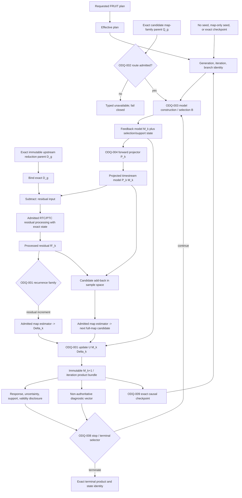

# SCI-FRUIT v0.1 — Iterative DAG And State Ownership

Status: Stage A candidate graph; nodes marked `ODQ` are unresolved and are not
normative science

## Candidate Scientific DAG

The graph deliberately shows two recovered recurrence families: map the
processed residual as an increment and explicitly update an accumulated model,
or add back the projected model in sample space and map a next full candidate.
Stage A does not assert that either is correct or that they are equivalent.
`SCI-FRUIT-ODQ-001` must choose the scientific object and law before an author
may formalize equations.

## Immutable Identity Axes

Every realized node that can enter another iteration or a terminal claim needs
at least:

- FRUIT method/version and route identity;
- immutable upstream parent and candidate-parent product identities;
- observation or coadd grouping and ordered membership;
- generation, branch, absolute iteration, and terminal-selection identity;
- requested plan and effective/observation-resolved policy identity;
- model-construction, selection, projector, PTC/RTC, map-estimator, and update
  identities;
- learned/apply state identity and the iteration at which each state was fixed;
- units, calibration, WCS/grid/frame, response, covariance status, support,
  validity, and failure; and
- checkpoint predecessor or new-seed lineage.

## State Ownership Table

| State class | Candidate meaning | Primary owner | Carry/relearn question |
| --- | --- | --- | --- |
| Requested policy | User/scientific request before applicability and compatibility resolution | FRUIT for FRUIT choices; adjacent owner for its choices | Immutable request record; cannot stand in for effective state |
| Effective FRUIT plan | Route, recurrence, stopping, output, restart, and failure choices after validation | SCI-FRUIT | Frozen for a generation unless owner-authorized successor semantics exist |
| Observation-resolved plan | Exact per-observation grouping, applicable arrays/networks, grids, and admitted products | SCI-FRUIT binding plus upstream facts | Must be content-bound; changes may branch or fail rather than mutate |
| Immutable upstream state | Exact RTC/PTC/MAP/JINC/FLT/NOI products and policy identities | Adjacent package | FRUIT records binding; it does not mutate authority |
| Feedback-model state | Accumulated/selected model, increment history needed for future behavior, response/support | SCI-FRUIT | ODQ-001/003 decide initialization, update, and carry |
| Selection state | Source/support/mask/eligibility choices used to construct model | SCI-FRUIT unless explicitly external | ODQ-003/007 decide fixed, cumulative, hysteretic, or relearned semantics |
| PTC cleaning state | PTC-owned coefficients and learned state | SCI-PTC | FRUIT decides admitted lifecycle binding, not PTC equations |
| Weight/validation state | State that changes later weighting/eligibility | Owning PTC/FRUIT boundary | Exact restart must restore causal portions; owner decides update cadence |
| Apply state | Frozen operator/model actually applied in one realized operation | Owning scientific method | Must be immutable for that application and distinct from learning inputs |
| Diagnostic state | Recorded metrics that cannot influence future output | FRUIT/validation record | May be omitted from exact restart only if causally inert |
| Stop/terminal state | Criteria evaluation and exact terminal-selection result | SCI-FRUIT | Cannot be inferred from hard maximum or file availability |
| NOI generation state | Exact randomization/ensemble/conditional target identity | SCI-NOI with FRUIT target binding | Fixed-state, successor learning, and replay remain distinct |

## Causal Completeness Rule

A state item belongs in an exact checkpoint if changing or omitting it while
holding the declared parent and effective plan fixed can change any later
required scientific product, response, support, validity, failure, stopping
decision, or terminal identity. This causal test—not the present serialization
schema—defines checkpoint completeness.

## Nonretroactivity

Each completed iteration and uncertainty generation is immutable. Later
learning, a new terminal choice, a changed route, or an NOI-informed
continuation creates a successor generation/branch; it does not mutate or
retroactively validate earlier products.
