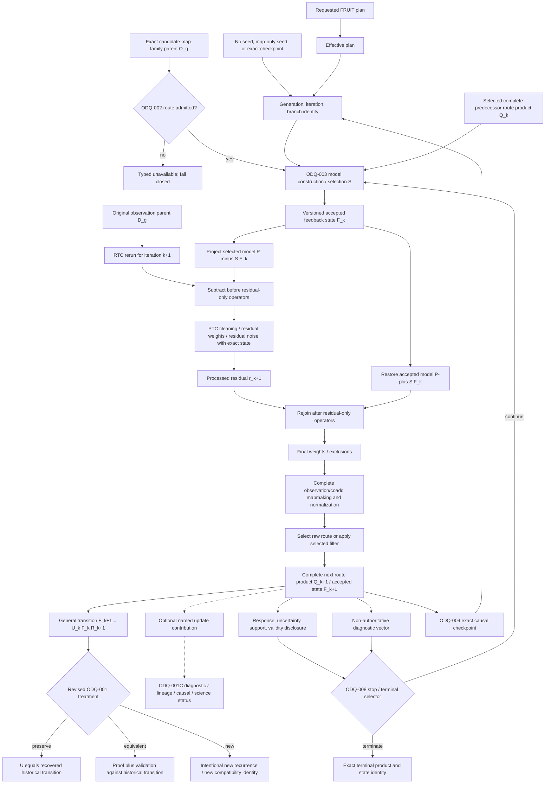

# SCI-FRUIT v0.1 — Iterative DAG And State Ownership

Status: Stage A candidate graph; nodes marked `ODQ` are unresolved and are not
normative science

## Historical-Reference DAG For Owner Review

The graph now shows one recovered historical reference: original-observation
rerun, model subtraction before residual-only operations, model restoration,
and replacement of the carried numerical predecessor by a newly completed
route product. It does not show additive residual accumulation as recovered
behavior. A map-domain or fused formulation enters the `equivalent` branch only
after the proof and validation in
[`ADDITIVE_REFORMULATION_EQUIVALENCE_ANALYSIS.md`](ADDITIVE_REFORMULATION_EQUIVALENCE_ANALYSIS.md).
Otherwise it is the `new` branch.

`F_k` is provisional owner-facing notation for the versioned accepted feedback
state. The historical storage object was `Q_k`, a complete selected route map
bundle; model selection/support was reconstructed when that bundle was
projected. ODQ-001A must approve or replace that typed relationship.

## Immutable Identity Axes

Every realized node that can enter another iteration or a terminal claim needs
at least:

- FRUIT method/version and route identity;
- immutable upstream parent and candidate-parent product identities;
- observation or coadd grouping and ordered membership;
- generation, branch, absolute iteration, and terminal-selection identity;
- requested plan and effective/observation-resolved policy identity;
- model-construction, selection, projector, PTC/RTC, map-estimator, and update
  identities;
- learned/apply state identity and the iteration at which each state was fixed;
- units, calibration, WCS/grid/frame, response, covariance status, support,
  validity, and failure; and
- checkpoint predecessor or new-seed lineage.

## State Ownership Table

| State class | Candidate meaning | Primary owner | Carry/relearn question |
| --- | --- | --- | --- |
| Requested policy | User/scientific request before applicability and compatibility resolution | FRUIT for FRUIT choices; adjacent owner for its choices | Immutable request record; cannot stand in for effective state |
| Effective FRUIT plan | Route, recurrence, stopping, output, restart, and failure choices after validation | SCI-FRUIT | Frozen for a generation unless owner-authorized successor semantics exist |
| Observation-resolved plan | Exact per-observation grouping, applicable arrays/networks, grids, and admitted products | SCI-FRUIT binding plus upstream facts | Must be content-bound; changes may branch or fail rather than mutate |
| Immutable upstream state | Exact RTC/PTC/MAP/JINC/FLT/NOI products and policy identities | Adjacent package | FRUIT records binding; it does not mutate authority |
| Feedback-model state | Versioned accepted `F_k`, historically backed by one selected complete route product plus model selection/support/response identity | SCI-FRUIT | ODQ-001A/001B/003 decide initialization, transition, and carry |
| Update contribution | Optional named difference or contribution associated with one transition | SCI-FRUIT if defined | ODQ-001C decides diagnostic, equivalence-witness, causal, or science status; no default calibration |
| Selection state | Source/support/mask/eligibility choices used to construct model | SCI-FRUIT unless explicitly external | ODQ-003/007 decide fixed, cumulative, hysteretic, or relearned semantics |
| PTC cleaning state | PTC-owned coefficients and learned state | SCI-PTC | FRUIT decides admitted lifecycle binding, not PTC equations |
| Weight/validation state | State that changes later weighting/eligibility | Owning PTC/FRUIT boundary | Exact restart must restore causal portions; owner decides update cadence |
| Apply state | Frozen operator/model actually applied in one realized operation | Owning scientific method | Must be immutable for that application and distinct from learning inputs |
| Diagnostic state | Recorded metrics or update differences that cannot influence future output | FRUIT/validation record | May be omitted or compacted only if causally inert and persistence rules permit |
| Stop/terminal state | Criteria evaluation and exact terminal-selection result | SCI-FRUIT | Cannot be inferred from hard maximum or file availability |
| NOI generation state | Exact randomization/ensemble/conditional target identity | SCI-NOI with FRUIT target binding | Fixed-state, successor learning, and replay remain distinct |

## Causal Completeness Rule

A state item belongs in an exact checkpoint if changing or omitting it while
holding the declared parent and effective plan fixed can change any later
required scientific product, response, support, validity, failure, stopping
decision, or terminal identity. This causal test—not the present serialization
schema—defines checkpoint completeness.

## Nonretroactivity

Each completed iteration and uncertainty generation is immutable. Later
learning, a new terminal choice, a changed route, or an NOI-informed
continuation creates a successor generation/branch; it does not mutate or
retroactively validate earlier products. Immutable identity does not require
permanent storage of every intermediate. ODQ-001D must state which objects are
required for restart/reproducibility, which may be compacted or reconstructed,
and which may expire under a bounded retention policy.
