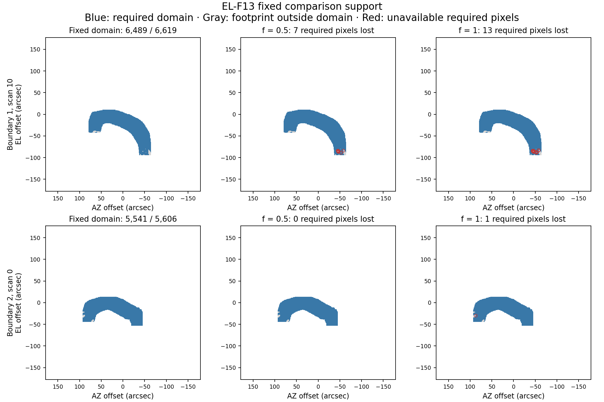

# EL-F13 scan-agreement feasibility result

Date: 2026-09-05. Decision:
`SCI-FRUIT-EL-F13-SCAN-AGREEMENT-FEASIBILITY-R0.1`.

EL-F13 completed its six approved offline evaluations. **It supplies no positive
evidence for a retention intervention.** The primary known-harm comparison is
unassessed because both retention probes lose required comparison pixels. Only
one later probe is measurable, and it worsens agreement with both references.
This is a completed, limited feasibility result, not an intervention screen
success or a qualified method.

## Program adherence and recovered continuity

This continues the [scientific-contract program](../../doc/scientific_contracts/README.md)
under the [approved EL-F13 design](../../doc/scientific_contracts/packages/SCI-FRUIT/v0.1/empirical_lane/EL_F13_RETAINED_SCAN_AGREEMENT_DESIGN_R0.1.md)
and its [prior-work record](../../doc/scientific_contracts/packages/SCI-FRUIT/v0.1/empirical_lane/EL_F13_INPUT_AND_PRIOR_WORK_R0.1.md).
The [owner authorization](../../doc/scientific_contracts/packages/SCI-FRUIT/v0.1/empirical_lane/SCIENTIFIC_OWNER_EL_F13_AUTHORIZATION_2026-09-05.md)
binds the exact proposal at `9b75104dd6df1708fe28f7de2178fcb2f85cf3c5`.
The initial requested `d39d4685b` is an ancestor on the same empirical branch.
The tracked tree was clean before this work; both untracked review archives
were present and their hashes still match. The toltec-context route and the
repository supplied continuity, with no scientific authority taken from a
conversation summary.

The historical recurrence remains the mandatory control. Faster accumulation
and simple early stopping remain rejected. EL-F11's nearly identical 4,229-pixel
oracle-targeted responses remain diagnosis evidence only: normalized inner
product 0.9996376, fitted scale 1.0040724, scaled residual 2.69205%, and identical
top-1% pixel sets. The UID 4460 diagnosis branch remains closed. EL-F12's Half
and Hold trajectories remain [not promising](../fruit_loop_el_f12_response_intervention_2026-09-05/SCIENTIFIC_INTERPRETATION_R0.1.md); their original source, Neptune,
support and convergence failures have not been relaxed or relabeled.

The accepted same-build historical recurrence is the comparison control. Exact
`f70701ad` executable equivalence remains unavailable, so full Gate D remains
unavailable. The development and qualification populations stay separate.

This analysis changes no reduction or production behavior. All implementation
and exposed empirical evidence remain outside the Stage B author channel.

## What was actually tested

At each completed H/uninjected boundary, the predictor used that boundary's
existing spool, ledger, checkpoint and three same-grid maps only. It enumerated
every newly eligible key and discarded the old selection and response scores.
The entire spool was validated and reconstructed before any new partition.
Historical N/C/Q, term sums, occurrence and unique-detector counts, finalized
signal and formal coefficient planes all reproduced exactly. The exact native
column conversion reproduced the companion FITS maps without interpolation.

Each eligible key had a fixed deletion comparator and two retention probes,
with coefficients 0, 0.5 and 1. References used the other even and odd scans,
removing every currently eligible UID in that array from both references.
These are fixed-processed-sample comparisons. They do not reproduce changing
RTC/PTC cleaning or a later adaptive trajectory.

The census contained no eligible keys at boundaries 0, 3, 4 or 5. Boundary 2
also retained one already-assigned disposition; boundaries 3–5 each retained
two. Nothing was dropped to create a cleaner test population. Both newly
eligible keys were in a2000; no a1100 or a1400 key was newly eligible.

## Measured result

Both initial comparison domains passed the declared 256-pixel and 90% overlap
requirements. Those requirements do not permit a probe to lose any pixel from
the fixed domain.

| Boundary and key | Fixed domain / footprint | Coefficient 0.5 | Coefficient 1 |
| --- | ---: | --- | --- |
| 1: UID 5279, scan 10 | 6,489 / 6,619 (98.036%) | Unavailable: 7 required pixels lost | Unavailable: 13 required pixels lost |
| 2: UID 5282, scan 0 | 5,541 / 5,606 (98.841%) | Measurable; no gain with either reference | Unavailable: 1 required pixel lost |

The 130 and 65 footprint pixels initially outside the respective fixed domains
failed the deletion comparator's science-support cut. None was removed through
a fitted region, a changed threshold or a later outcome. The reference coverage
and numerical-conditioning requirements passed on the retained domains.

For boundary 2's half-retention probe, the RMS disagreement with the even-scan
reference increases from **88.4629 to 91.9114 mJy/beam**. With the odd-scan
reference it increases from **97.1460 to 102.1210 mJy/beam**. The propagated
roundoff bounds are about 3.3–3.5 × 10⁻⁸ mJy/beam, far smaller than either
increase. Neither required improvement condition passes.

Full-grid support changes are retained as well. Compared with fixed-sample
deletion, half/full retention lose 25/31 pixels at boundary 1 and 15/20 pixels
at boundary 2; each gains one pixel. Those full-grid counts include changes
outside the fixed comparison domain. They are descriptive probe support
changes, not measurements of actual next-iteration actions.

The [probe table](PROBE_SUMMARY_R0.1.csv) and
[artifact audit](POST_FREEZE_ARTIFACT_AUDIT_R0.1.json) retain baseline errors
even where a retention error is unavailable. A missing retention error has a
stated support reason; it is never replaced by a smaller-domain calculation.

## What this establishes, and what remains unknown

All six prediction records, maps and access logs were frozen before the
reporting process opened the bound EL-F12 outcome files. The authors had already
seen those outcomes; this is a data-dependency separation, not blinding.

The primary first-action challenge is **`negative_challenge_unassessed` for
both probes**. Unavailability is not evidence that the predictor correctly
rejected a harmful action. The two probes concern one shared opportunity,
not two independent pointings. Boundary 2 receives no isolated harm label,
because later EL-F12 outcomes also include earlier intervention effects.

The construction tests showed that the implementation can accept genuinely
helpful retention in a declared analytic example, so it is not an always-veto
rule. They also showed the intended limitation: two references sharing the same
wrong feature can make retention pass. Agreement alone therefore cannot identify
true sky or certify an action as safe. There is no positive empirical benefit
case here, and neither a population false-action rate nor a beneficial-action
rate can be estimated.

## Completion and next owner decision

The six successful workers used one CPU thread each, in sequence, totaling
127.011 seconds of worker wall time. Maximum reported worker RSS was
1,547,845,632 bytes (1.442 GiB). The complete retained output stays below 4 GiB,
and implementation, tests, analysis and retention completed within the approved
two-hour aggregate limit; the exact receipt is in the result manifest.

There were zero Citlali runs, replays, restarts or new observations. The earlier
startup and FITS-representation failures remain retained, together with their
registered routine repairs. The numerical guard, scientific thresholds, input
population and scope did not change. The final helper passed 32 focused tests;
the broader offline FRUIT/baseline suite passed all 304 tests and the required
configuration preflight passed. Native sources and the Citlali executable were
not changed or invoked, so no new native build or CTest result is claimed.

**Do not proceed to another intervention on the strength of this score.**
The next significant owner decision is whether to commission a new benefit-
signal design that can address shared-reference contamination and attainable
end-to-end improvement under the historical control. Changing this test's
comparison support or thresholds would be a new method decision, not a repair.

Before any actual intervention, a concrete proposal must still fix joint
actions, duration, ordinary caps and reason precedence, exact paired inputs,
attainable benefit endpoints, and source recovery, morphology, residual leakage,
support, convergence, runtime and memory protections. Independent-pointing
replication remains required before recommending a policy. No qualification,
production change, Unity work or Stage B is authorized by this result.
