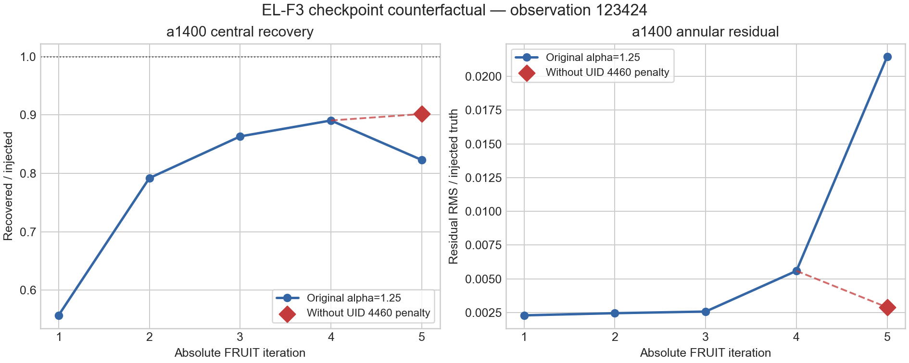

# SCI-FRUIT EL-F3 late-penalty counterfactual result

Result: **valid counterfactual; the UID 4460 hard penalty made a substantial
causal contribution to the exposed a1400 collapse, with full reversal of both
registered losses**

Test ID: `SCI-FRUIT-EL-F3-LATE-PENALTY-COUNTERFACTUAL-R0.1`

This is development evidence from one already exposed checkpoint. It is not a
method qualification, stopping rule, detector-quality decision, historical
comparison, or production authorization.

## Intervention and validity

The original EL-F2 iteration-4 control and injected reduction directories were
copied to the registered isolated output root. Recursive comparison established
that both copies were identical to their sources before intervention. The
original checkpoints and reduction products were not modified.

The checkpoint editor then removed exactly this one carried record from only
the injected copy:

| Field | Removed value |
|---|---|
| producer | `mapdiag:raw_obs` |
| reason | `map_pixel_outlier_detector_dominance` |
| iteration | 4 |
| scan index | 5 |
| detector UID | 4460 |
| network | -1 |
| array | 1 (a1400) |
| factor | 0 (complete exclusion) |
| score | 4 pixels |
| scan-local | true |

The transformed checkpoint contains three rather than four effective detector
penalties. Its machine audit verifies that every other dimension, variable,
value, type, and attribute remained equal. The source checkpoint hash remained
`c9eee5fada65fe7d9172d39ba84fb275b4124eea635933c95c29b101e6c2192f`;
the transformed checkpoint hash is
`0882f0072eefa5188eaa193d192e4c1e5a990f247638c15aaaed240e6197c008`.

The control sham ran first. Every signal, kernel, and weight image in all three
arrays is bitwise equal to the original EL-F2 control iteration 5. Every
checkpoint variable is also value-identical. The control gate therefore
passed before the counterfactual ran.

Citlali restarted its output-directory suffix at `redu00`; the FITS products
and checkpoint identify the state as absolute FRUIT iteration 5. Non-copying
`redu05` aliases were added so the frozen analysis manifest continues to name
the absolute iteration. No product content was changed by those aliases.

## Execution

Both one-iteration trajectories used the frozen executable SHA-256
`a49082dde8f71d6f50edd8c378ad94195496b5eb0e0855b746e189f3442acbcc`,
one configured thread, and `grppiex: seq`.

| Order | Trajectory | Transition | Wall (s) | User (s) | System (s) | Maximum RSS (bytes) | Retained (KiB) |
|---:|---|---|---:|---:|---:|---:|---:|
| 1 | control sham | 4 to 5 | 31.48 | 29.64 | 1.04 | 885686272 | 116476 |
| 2 | injected without UID 4460 penalty | 4 to 5 | 30.89 | 29.69 | 0.76 | 891731968 | 122844 |

Both exited zero and ended in normal Citlali completion. Neither log contains
an error- or critical-level message. Each repeats the same known warning from
all four parent EL-F2 runs that the telescope input omits optional configured
fields. Aggregate wall time was 62.37 seconds and retained size was 239,320
KiB, well within the registered limits.

## Prospective mechanism result

The frozen a1400 comparison is:

| Quantity | Original iteration 4 | Original iteration 5 | Counterfactual iteration 5 |
|---|---:|---:|---:|
| kernel-normalized central recovery | 0.890451 | 0.822828 | **0.901542** |
| annular residual / injected truth | 0.00559106 | 0.0214741 | **0.00288776** |
| full-kernel recovery | 0.839546 | 0.744853 | 0.857110 |
| major FWHM / kernel | 0.956532 | 0.951671 | 0.962076 |
| minor FWHM / kernel | 0.958263 | 0.895653 | 0.967507 |
| centroid error (arcsec) | 0.046003 | 0.299145 | 0.082446 |
| kernel-residual relative RMS | 0.668815 | 0.846812 | 0.321729 |

The prospectively defined reversal fractions are:

- central-recovery loss: `q_R = 1.1640106584432361`;
- annular-residual loss: `q_A = 1.1702004853233525`.

Both exceed 0.5, so the registered classification is
`substantial_causal_contribution`. Both also exceed 1.0, so the secondary
`full_reversal` condition is true. In plain language, withholding this one
hard exclusion did more than eliminate the observed iteration-5 loss on both
registered measures: iteration 5 became slightly better than the original
iteration 4.

The effect is array-local at the measured product boundary. For a1100 and
a2000, every counterfactual signal, kernel, and weight image is bitwise equal
to the original injected iteration-5 image. All three a1400 image planes
differ. This is consistent with the removed record's array identity and makes
an unrelated whole-run perturbation implausible.

UID 4460 was learned again at the end of the counterfactual iteration and is
present in its new checkpoint with `iteration=5`, checkpoint scan index 5,
factor zero, and score four. The human-facing log calls this scan 6. That
rediscovered record could affect a later iteration, but the registered test
stopped after iteration 5. The result therefore isolates the consequence of
applying the iteration-4 record during iteration 5; it does not establish what
should happen at iteration 6.

## Inherited science screen

The mechanism result does not convert EL-F2 into a successful candidate. The
counterfactual a1400 state now passes the frozen recovery, centroid, annular-
residual, and kernel-residual protections but remains narrowly below both
allowed width ratios (`0.962076` and `0.967507`, versus a lower limit of
`0.97`). The unchanged a1100 state still fails widths and annular residual;
the unchanged a2000 state still fails widths, centroid, and annular residual.
Consequently `all_array_inherited_screen_pass` is false.

This distinction matters: EL-F3 answered the causal question it registered,
not the broader question of whether alpha 1.25 is scientifically acceptable.

## Interpretation and disposition

The earlier association is now causal for this checkpoint. The factor-zero
map-diagnostic penalty carried out of iteration 4 is responsible for the large
a1400 degradation observed when the original state advances to iteration 5.
The controlled injection had moved UID 4460 from three contributing target
pixels in the control to the configured hard threshold of four, and applying
the resulting exclusion changed the next map substantially.

This does **not** establish that UID 4460 is a good detector, that hard
penalties are always harmful, or that removing all such penalties is a valid
recurrence. EL-F1 contains late degradation not explained by this event, and
one exposed pointing checkpoint cannot define a general policy. It does show
that the present learning path can turn a one-pixel threshold crossing into a
complete next-iteration detector exclusion with a large scientific effect.

The implementation ordering supplies a concrete hypothesis for that policy
problem. `pointing_run_impl.h` restores the feedback map to the cleaned
timestream before it populates the final observation map;
`observation_output_execution.h` then writes that raw-observation map; and
`mapdiag_output_impl.h` invokes the detector-dominance learner on that map.
Thus this learner observes the complete post-add-back map rather than a
residual-only map. That is implementation evidence, not scientific authority,
but it connects the empirical result directly to the Stage-A model-bypass
question.

The scientifically motivated next candidate should therefore address the
map-diagnostic penalty policy itself, rather than introduce a global stop rule
or tune alpha again on observation 123424. The leading candidate is to keep
the complete-map diagnostic product but prevent the accepted astronomical
model from supplying evidence for a detector-dominance exclusion—for example,
by deriving the causally consumed penalty from a residual-only view. A new
prospective test must also verify that genuine off-source detector failures
remain detectable and should cover harmful and benign penalty events in more
than one observation. Making penalties merely provisional remains a fallback
hypothesis, not a co-equal change to mix into the same test. This requires a
new bounded authorization. No further iteration or variant follows from
EL-F3.

## Evidence identities

Repository artifacts:

| Artifact | Bytes | SHA-256 |
|---|---:|---|
| `PRIMARY_EXECUTION_R0.1.csv` | 387 | `54ea6528ea5882d2799830c39438ad1be18146b0d617bdc6d249f2554e63ea24` |
| `COUNTERFACTUAL_METRICS_R0.1.csv` | 1076 | `36e9080992f21f810506d4ca0ffc42e97748e40e9a3b3172e4cbd5d9d5a9ae20` |
| `COUNTERFACTUAL_RESULT_R0.1.json` | 493 | `0aa4acd429fa09b60dab7dc9e3f4fd2785f521fc52b941b335f644e54055ff99` |
| `COUNTERFACTUAL_EFFECT_R0.1.png` | 119425 | `ca7ef602451426569e3b21b6b0c2b71564a9e4619cd57ba4901ede27e370a821` |

External evidence:

| Artifact | Bytes | SHA-256 |
|---|---:|---|
| control log | 486398 | `a474300cc0db7852fc8e459ffd36306863fa307f1db2a3307156cf51010c0c66` |
| counterfactual log | 495971 | `deb894e2b8f90fbd81779a238dbc0c66a21d67aa9fead11a2af7be2f2fce473a` |
| checkpoint intervention audit | 1359 | `48704a60ea9e3f286b16b13e532f3d4ba90800672c47461cda4d11b716ac9e67` |
| control output checkpoint | 6502387 | `97ea5bd67662a3f24e09092f5cb77c05f958e42272d049718445194495f63b8d` |
| counterfactual output checkpoint | 6507137 | `f5b7904ec88968f3c598685486360fbc51046766bb05a6ba22282a07913a98e4` |

The six output FITS identities are retained by exact path in the external
development root. The a1100/a1400/a2000 hashes are respectively
`2ba0832872f0c6f282e7421db404a52dd3139ab2bac036285dda934e3fbebf9f`,
`8581e555cfed6b00b3dfad3151b49eb13f73523e2e4d122fc5b34ee2e4a403c5`,
and `aee4c8791fdcab38da0df65d096c36173f6a4cb2d6e9744af66dfd7845a7a209`
for the control; and
`d16d89d59a35cab3632c541dbf605c4b20746ce99adafdc19c52d21d57537f55`,
`58954b865702f7168b86d2a7aa733989715457d3fe75720d0301a0b37189805c`,
and `c6886bc618e4691654fb040381a863b11dc715cbcd204df81bb4950f3cdd433d`
for the counterfactual.

## Repository verification

All 207 baseline and FRUIT-loop Python tests pass, including the nine focused
checkpoint-editor and counterfactual-analyzer tests. Ruff and Python byte-
compilation checks pass. A fresh analyzer run is byte-for-byte equal to both
recorded numerical outputs, the YAML and JSON records parse successfully, the
figure passed direct visual inspection, and `git diff --check` passes. Compiled
CTest and configuration preflight were not rerun because EL-F3 changes no C++
code, configuration schema, or production configuration.
