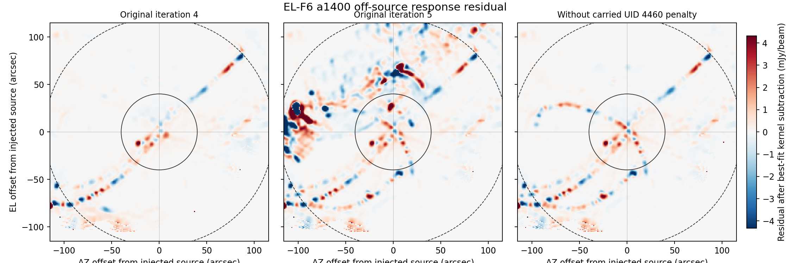

# SCI-FRUIT EL-F6 off-source penalty counterfactual result

Result: **valid counterfactual; the carried UID 4460 hard penalty made a
substantial causal contribution to the off-source a1400 shape/leakage
degradation**

Test ID: `SCI-FRUIT-EL-F6-OFF-SOURCE-PENALTY-COUNTERFACTUAL-R0.1`

This is development evidence from one exposed checkpoint, observation, and
off-source position. It is not a detector judgment, penalty-policy selection,
FRUIT recurrence qualification, or production authorization.

## Intervention and validity

The complete EL-F5 off-source injected iteration-4 reduction directory was
copied twice into the registered isolated root. Both copies were recursively
equal to the source before intervention; the original EL-F5 products were not
modified.

The fail-closed editor removed exactly one record from only the counterfactual
copy:

| Field | Removed value |
|---|---|
| producer | `mapdiag:raw_obs` |
| reason | `map_pixel_outlier_detector_dominance` |
| iteration | 4 |
| scan index | 5 |
| detector UID | 4460 |
| network | -1 |
| array | 1 (a1400) |
| factor | 0 (complete exclusion) |
| score | 4 pixels |
| scan-local | true |

The source checkpoint SHA-256 is
`2d600fde6b642ea053bc49d357bed16c800bb1dd689c0ee5ae084e115970fb7c`;
the transformed checkpoint SHA-256 is
`9f8faf73fc759202258ba58109ba499bd73d8f513d93ea763df75069ae78f942`.
The machine audit verifies that all other values and all types, dimensions,
and attributes remained equal.

The untouched injected sham ran first. All nine signal, kernel, and weight
planes are bitwise equal to the original EL-F5 off-source injected iteration
5, and every checkpoint variable is value-identical. The restart-validity gate
therefore passed before the counterfactual was run.

Citlali named each restart output `redu00`; its FITS products and checkpoints
identify absolute FRUIT iteration 5. Non-copying `redu05` aliases expose that
absolute identity to the frozen analysis without changing product content.

## Prospective causal result

The two primary a1400 measures are:

| Quantity | Original k=4 | Original k=5 | Counterfactual k=5 | Reversal |
|---|---:|---:|---:|---:|
| kernel-residual relative RMS | 0.320673 | 0.727804 | **0.337799** | **0.957935** |
| annular residual / injected truth | 0.00327048 | 0.0231344 | **0.00406285** | **0.960110** |

Both reversal fractions exceed the prospectively registered 0.5 threshold,
so the classification is **`substantial_causal_contribution`**. Neither quite
reaches the separately registered 1.0 full-reversal threshold. Withholding the
one carried penalty removes about 96% of each observed iteration-4-to-5 loss;
the remaining counterfactual values are 5.3% and 24.2% above their respective
iteration-4 levels.

The figure shows response after subtraction of its best-fit same-iteration
kernel. The solid and dashed circles mark the 40- and 120-arcsec registered
annulus boundaries. The large iteration-5 residual structure largely returns
to the iteration-4 appearance when the carried UID 4460 exclusion is withheld.

## Flux and source-shape diagnostics

These quantities were secondary by design:

| Quantity | Original k=4 | Original k=5 | Counterfactual k=5 |
|---|---:|---:|---:|
| central recovery | 1.043975 | 1.037055 | 1.037009 |
| absolute central error from unity | 0.043975 | 0.037055 | **0.037009** |
| full-kernel recovery | 1.056239 | 1.056704 | 1.056405 |
| absolute full-kernel error from unity | 0.056239 | 0.056704 | **0.056405** |
| major FWHM / kernel | 1.002745 | 1.014704 | 1.013854 |
| minor FWHM / kernel | 1.017032 | 1.016491 | 1.015544 |
| centroid error (arcsec) | 0.047439 | 0.065055 | 0.065017 |

Removing the penalty changes neither flux estimate meaningfully: central
recovery moves by `-0.0000461` and full-kernel recovery by `-0.000299`, both
slightly closer to unity. The causal effect is therefore specifically the
large response-shape and leakage change, not a recovered-flux increase.

## Array localization and later state

For a1100 and a2000, all six counterfactual signal, kernel, and weight planes
are bitwise equal to the original EL-F5 injected iteration 5. All three a1400
planes differ. The observed consequence is thus localized to the removed
record's array at this product boundary.

UID 4460 is learned again at the end of the counterfactual iteration with
`iteration=5`, checkpoint scan index 5, array 1, score four, and factor zero.
That new record could affect iteration 6, but EL-F6 stops at iteration 5. The
test isolates the consequence of applying the iteration-4 record; it makes no
claim about a later trajectory or a permanent exclusion policy.

## Execution and parser repair

Both one-iteration replays used the exact frozen EL-F5 executable, one thread,
and sequential GRPPI execution.

| Order | Trajectory | Transition | Wall (s) | User (s) | System (s) | Maximum RSS (bytes) |
|---:|---|---|---:|---:|---:|---:|
| 1 | untouched injected sham | 4 to 5 | 30.66 | 29.46 | 0.61 | 858144768 |
| 2 | injected without UID 4460 penalty | 4 to 5 | 30.30 | 29.35 | 0.62 | 859111424 |

Both exited zero, ended in normal Citlali completion, and contain no error- or
critical-level message. Aggregate wall time was 60.96 seconds, maximum RSS was
0.800 GiB, and the external EL-F6 root retained 257,960 KiB.

The first analyzer invocation stopped before writing or printing a scientific
result because its timing parser accepted GNU token order but not the local
macOS order. A tested, explicitly recorded pre-result repair accepts both
forms. It did not change a metric, threshold, comparator, intervention, or
trajectory; the raw logs were not changed. All 223 baseline and FRUIT-loop
Python tests pass with the repair.

## Interpretation

EL-F6 converts the EL-F5 off-source association into a causal result for this
checkpoint. Applying the iteration-4 UID 4460 factor-zero exclusion causes
nearly all of the large a1400 response-shape and residual-leakage degradation
seen at iteration 5. Because the injected source is roughly 60 arcsec from map
center and about 56 arcsec from Neptune's fitted a1400 position, overlap with
Neptune's core is not required for this causal interaction.

Together, EL-F3 and EL-F6 now show the same one-record causal mechanism at two
injection positions in observation 123424: more than full reversal for the
centered response measures and about 96% reversal for the off-source shape/
leakage measures. This is compelling same-observation evidence. It is not yet
evidence that the mechanism is generic across scans, source amplitudes,
detectors, observing modes, or atmospheric conditions.

The result also does not select the remedy. EL-F4 already showed that globally
deriving detector-dominance penalties from a feedback-excluded map removes
this harmful event but creates other scientific regressions. The next useful
candidate should therefore be a narrow, prospectively motivated safeguard
that distinguishes source-supported threshold crossings from genuine
detector failures, and it must be tested against both harmful and legitimately
useful penalty events. Repeating the same UID-4460 removal again would add
little.

## Claim limit

This result does not establish that UID 4460 is a good detector, that all hard
penalties are harmful, or that carried penalties should simply be discarded.
It does not qualify or select a recurrence, penalty policy, stopping rule,
science profile, or production configuration, and it authorizes no additional
test automatically.
