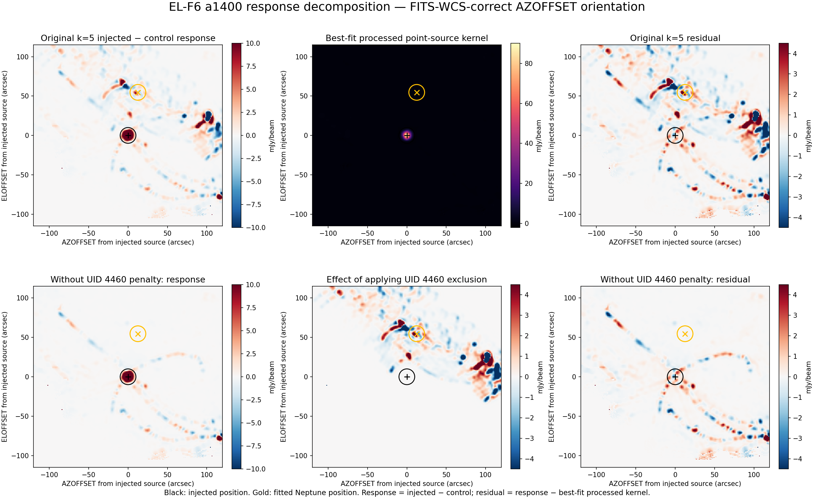

# SCI-FRUIT EL-F6 off-source penalty counterfactual result r0.2

Result: **valid counterfactual; the carried UID 4460 hard penalty caused a
substantial increase in non-kernel, scan-shaped structure in the total paired
a1400 response. The compact injected source itself was not spread into those
arcs.**

Test ID: `SCI-FRUIT-EL-F6-OFF-SOURCE-PENALTY-COUNTERFACTUAL-R0.1`

Status: **owner-reviewed interpretation correction; numerical result and
registered classification unchanged**

This revision supersedes the scientific interpretation in
[`EXECUTION_RESULT_R0.1.md`](EXECUTION_RESULT_R0.1.md), but does not replace or
rewrite that preserved result. No reduction was rerun, no product was edited,
and no algorithm, configuration, metric, threshold, intervention, or
classification changed.

## What the experiment actually measures

For each iteration the original analysis forms the total paired response

`T = signal_I(injected) - signal_I(control)`

and then the displayed residual

`E = T - beta * kernel_I(injected)`,

where `beta` is the best-fit full-map kernel scale. These are scientifically
useful definitions, but `T` is an isolated source-transfer map only while the
injected and control reductions apply equivalent processing operators.

At iteration 5 they do not. The injected trajectory carries the scan-local,
factor-zero UID 4460 exclusion and the control trajectory does not. That
exclusion is applied before RTC and PTC processing, so the two branches no
longer have the same detector participation, shared cleaning, weighting, or
map response. Real Neptune signal, atmosphere/noise, and scan-synchronous
structure therefore need not cancel in `T`.

Consequently, the registered kernel-residual and annular measures quantify
**non-kernel structure in the total causal response to adding the source**, not
an independently identified halo or broadening of the injected astronomical
source.

## Preserved causal result

The registered primary measurements remain exactly:

| Quantity | Original k=4 | Original k=5 | Counterfactual k=5 | Reversal |
|---|---:|---:|---:|---:|
| kernel-residual relative RMS | 0.320673 | 0.727804 | **0.337799** | **0.957935** |
| annular residual / injected truth | 0.00327048 | 0.0231344 | **0.00406285** | **0.960110** |

Both reversal fractions exceed the prospectively registered 0.5 threshold,
so the mechanical classification remains
**`substantial_causal_contribution`**. Its corrected meaning is that applying
the one carried penalty caused about 96 percent of the measured
iteration-4-to-5 increase in total paired-response non-kernel structure. It is
not a finding that 96 percent of an astronomical point-source halo was caused
by that detector.

The causal validity also remains intact:

- the untouched sham reproduced all nine signal, kernel, and weight planes
  bitwise and every checkpoint variable value-identically;
- the intervention removed exactly one checkpoint record and preserved every
  other value;
- all six a1100 and a2000 planes remained bitwise equal; and
- UID 4460 was learned again only at the end of iteration 5, outside the
  tested transition.

## Compact source and response decomposition

The injected source is at map-world `(AZOFFSET, ELOFFSET) = (0, -60)` arcsec.
The figure below recenters that position to `(0, 0)`. The fitted iteration-5
Neptune position is shown in gold at approximately `(12.539, 54.665)` arcsec
relative to the injection.

The original r0.1 residual figure displayed array columns from left to right
while labeling them as increasing `AZOFFSET`; the frozen FITS WCS has
`CDELT1=-1 arcsec`. The r0.2 figure flips the image columns so its horizontal
axis follows the FITS `AZOFFSET` convention. That visualization correction
does not affect the radial annular measurement, fitted widths, centroid
separation, reversal fractions, or causal classification.

The compact injected component remains well localized:

| Quantity | Original k=5 | Without carried UID 4460 penalty |
|---|---:|---:|
| fitted response amplitude (mJy/beam) | 92.3353 | 92.3311 |
| response major/minor FWHM (arcsec) | 7.7977 / 7.5896 | 7.7912 / 7.5825 |
| kernel major/minor FWHM (arcsec) | 7.6847 / 7.4665 | 7.6847 / 7.4664 |
| response/kernel centroid separation (arcsec) | 0.06505 | 0.06502 |
| kernel-normalized central recovery | 1.037055 | 1.037009 |
| full-kernel recovery | 1.056704 | 1.056405 |

Within 20 arcsec of the injected position, applying the penalty changes the
signal map by only `0.2581 mJy/beam` RMS, against an original total response
RMS of `15.2147 mJy/beam`. This is inconsistent with interpreting the visible
arcs as a displaced or multiply imaged compact source.

## Real-source leakage and scan geometry

The same comparison is very different near the real source. Within 20 arcsec
of the fitted Neptune position:

| Map quantity | RMS (mJy/beam) |
|---|---:|
| original injected-minus-control response | 2.4426 |
| response without the carried UID 4460 penalty | 0.1024 |
| direct effect of applying the penalty | 2.4370 |

Thus nearly all of the differential structure around Neptune is created by
the unmatched penalty state, even though both branches contain the same real
observation. Significant structure also remains away from both compact source
regions: in the registered 40--120 arcsec injection-centered annulus after
excluding a 25-arcsec Neptune neighborhood, the original response RMS is
`2.2993 mJy/beam`, the no-penalty value is `0.4122 mJy/beam`, and the direct
penalty effect is `2.2739 mJy/beam`.

The four off-source pixels that triggered the UID 4460 record lie about
107--109 arcsec from the injection. Reconstructing that detector's pointing
from the frozen APT offsets and telescope pointing places those pixels within
about 1.1 arcsec of its observation-wide scan trajectory. This supports a
scan-geometry interpretation, but does not prove that every arc is the direct
track of UID 4460. Because the detector is excluded before shared cleaning,
its removal can change the processed data from other a1400 detectors in that
scan and distribute the effect over several scan paths.

These facts support the following bounded interpretation:

> The injected source changes learned state. Applying the resulting UID 4460
> exclusion changes the a1400 processing operator for one scan, causing real
> field and scan-synchronous material to survive the injected-minus-control
> subtraction as arc-shaped non-kernel structure.

This is not evidence of a conventional telescope pointing offset. It also
does not independently validate absolute pointing: the synthetic source and
its map use the same pointing stream, so a separate pointing/timing audit
would be required for that purpose.

## Consequences for EL-F5 and future measurements

EL-F5 remains valid evidence that the exact penalty event and subsequent
non-kernel response change recur when the injected source is moved away from
Neptune's core. Its earlier phrase "shape/residual leakage" must now be read as
**total paired-response leakage under branch-dependent learned state**, not as
an isolated astronomical source-shape measurement.

Future empirical work must distinguish at least two legitimate quantities:

1. the total end-to-end causal response, including any learned-state changes
   induced by the injected signal; and
2. matched-operator source transfer, for which detector participation,
   penalties, masks, weights, and other state are held equivalent between the
   injected and control branches.

A real-field leakage diagnostic should accompany either quantity when the
background contains a bright source. These distinctions should be fixed
before a later experiment is interpreted as angular-scale or flux transfer.

## Claim limit

EL-F6 establishes a one-record causal effect on the total paired a1400
response for observation 123424, this source location, and this checkpoint.
It does not establish a pointing failure, point-source smearing, a calibrated
large-scale astronomical response, detector quality, a generic hard-penalty
rule, or the correct remedy. It does not qualify or select a recurrence,
penalty policy, stopping rule, science profile, or production configuration,
and it authorizes no additional test automatically.
