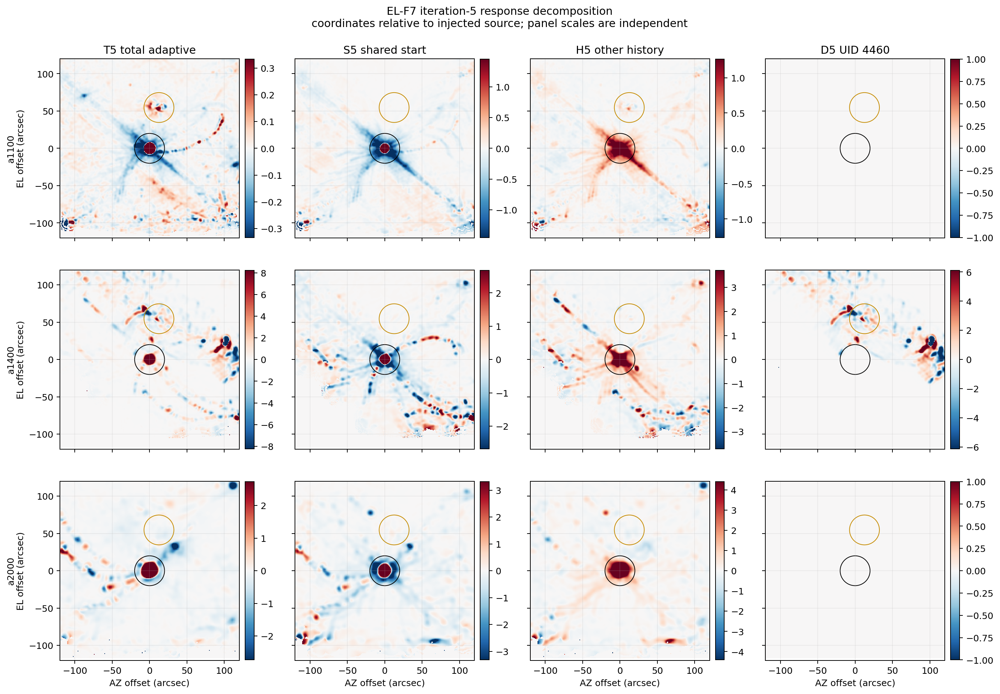

# FRUIT EL-F7 shared-start response result r0.1

Result: **valid shared-start decomposition; current-step response, earlier
injected history, and the UID 4460 effect are now separately identified for
observation 123424 iteration 5**

Test ID: `SCI-FRUIT-EL-F7-SHARED-START-RESPONSE-DECOMPOSITION-R0.1`

Status: **completed owner-authorized development experiment; not a qualified
method or a fully matched-operator transfer measurement**

## Plain-language result

Starting both branches from the same uninjected iteration-4 state changed the
interpretation in a useful way.

The source added for only iteration 5 produces a compact source plus visible
scan-shaped structure in all three arrays. The earlier injected FRUIT history
then adds back much of the previously accumulated compact-source response and
cancels some of the current-step structure away from the source. In a1400, the
separate UID 4460 penalty contributes very little at the injected source but
creates almost all of the large structure around real Neptune and in the
outer annulus.

So two statements are simultaneously true:

1. the UID 4460 hard exclusion is the specific cause of the large EL-F5/EL-F6
   a1400 real-field and annular leakage; and
2. the ordinary one-step response itself is not a clean processed-kernel copy,
   even when the incoming state is identical.

The second statement is not yet a failure of FRUIT. A source introduced only
in iteration 5 lacks the accepted source model accumulated over iterations
1--4. The large compact contribution in the history term is therefore partly
the intended operation of an iterative recovery method, not automatically
contamination.

## Validity

All registered gates passed:

- both restart-source copies recursively matched the untouched EL-F5 control
  iteration-4 directory before execution;
- the no-injection sham reproduced all nine a1100/a1400/a2000
  signal/kernel/weight planes bitwise;
- every sham checkpoint variable was value-identical to the existing EL-F5
  control iteration-5 checkpoint;
- realized sham and probe configurations differed only in output/restart paths
  and the injection enabled state; the registered start, amplitude, position,
  recurrence, and processing settings matched;
- units, WCS/grid, normalization, and finite support matched for all four input
  maps;
- the exact identity `T5 = S5 + H5 + D4460,5` passed in every array; and
- both runs completed normally with zero unexpected error/critical messages.

The maximum closure residual is `1.4211e-14 mJy/beam` in every array. The
predeclared roundoff bounds range from `1.1695e-12` to `1.5575e-12`
mJy/beam.

## Response identities

The retained component maps are:

- `T5 = A5-C5`: existing total adaptive trajectory response;
- `S5 = P5-C5`: new shared-incoming-state one-step response;
- `H5 = N5-P5`: all earlier injected-history state other than the removed
  UID 4460 record, including the accepted feedback model and interactions; and
- `D4460,5 = A5-N5`: the UID 4460 intervention effect established by EL-F6.

Coordinates are relative to the injected source. Black circles mark its
20-arcsec region; gold circles mark the fitted Neptune region. Every panel has
its own symmetric color range, so colors must not be compared as absolute
amplitudes between panels. UID 4460 affects a1400 only; the a1100 and a2000
`D5` maps are exactly zero.

## Compact-source response

| Array | Total adaptive central recovery | Shared-start central recovery | Total width / kernel, major/minor | Shared-start width / kernel, major/minor |
|---|---:|---:|---:|---:|
| a1100 | 0.981291 | 0.858066 | 0.9981 / 1.0052 | 0.9889 / 0.9634 |
| a1400 | 1.037055 | 0.885121 | 1.0147 / 1.0165 | 0.9285 / 0.9034 |
| a2000 | 0.967963 | 0.739569 | 1.0085 / 0.9858 | 0.9322 / 0.8864 |

The shared-start fixed-kernel projection recovers `0.4984`, `0.7075`, and
`0.6299` of the injected a1100, a1400, and a2000 amplitudes, respectively.
The corresponding earlier-history projections add `0.1303`, `0.2905`, and
`0.3823`. Near the source, `S5` and `H5` are positively aligned, with cosines
`0.820`, `0.711`, and `0.819`. This is consistent with the earlier accepted
feedback state building the source over successive iterations.

The aperture-integrated fractions are retained but are not used as clean flux
estimates here. Broad positive and negative structure makes them sensitive to
the aperture and cross terms; for example, the `H5` aperture fractions exceed
their compact fixed-kernel projections in every array.

## Real-field and annular structure

RMS values below are in mJy/beam. No post hoc dominance threshold is applied.

| Array | Region | S5 shared start | H5 earlier history | D5 UID 4460 | T5 total |
|---|---|---:|---:|---:|---:|
| a1100 | injected source r<20 | 8.54409 | 2.93980 | 0 | 11.0828 |
| a1100 | Neptune r<20 | 0.015509 | 0.095195 | 0 | 0.095381 |
| a1100 | annulus 40--120, Neptune excluded | 0.093685 | 0.081197 | 0 | 0.038133 |
| a1400 | injected source r<20 | 10.7230 | 5.50672 | 0.262866 | 15.1422 |
| a1400 | Neptune r<20 | 0.036519 | 0.107303 | 2.43696 | 2.44263 |
| a1400 | annulus 40--120, Neptune excluded | 0.393198 | 0.470325 | 2.27360 | 2.29897 |
| a2000 | injected source r<20 | 11.9613 | 8.15787 | 0 | 19.2194 |
| a2000 | Neptune r<20 | 0.091316 | 0.140074 | 0 | 0.121720 |
| a2000 | annulus 40--120, Neptune excluded | 0.381638 | 0.343258 | 0 | 0.360100 |

In a1400, the magnitude of `D5` is nearly the complete total response around
Neptune (`2.43696` versus `2.44263`) and in the annulus (`2.27360` versus
`2.29897`). This agrees with EL-F6's causal result while now showing the other
two components separately.

The component sums cannot be interpreted from RMS alone. `S5` and `H5` are
strongly anticorrelated in the annulus, with cosines `-0.915`, `-0.557`, and
`-0.511` for a1100, a1400, and a2000. The earlier history therefore cancels a
substantial amount of current-step annular structure. All registered inner
products and signed cross terms are retained in `CROSS_TERMS_R0.1.csv`.

## What changed in learned state

At the end of the shared-start probe, its checkpoint differs from the
no-injection checkpoint in only two variables:

- `fruit_feedback_signal`; and
- `fruit_feedback_kernel`.

There is no difference in persisted detector penalties, sample masks,
weight-validation accumulators, or target pixels. In particular, the
shared-start probe does **not** learn the UID 4460 penalty at the end of
iteration 5. In this exact observation, the penalty therefore requires the
earlier injected trajectory/history; a single late injected transition is not
sufficient to recreate it.

This checkpoint evidence does not prove that every within-iteration operator
was fixed. It only shows that no additional persisted learned state beyond the
feedback maps differs at the completed boundary.

## Performance

The sham and probe took `31.31` and `30.77` seconds, respectively. Aggregate
wall time was `62.08` seconds and peak resident memory was `892,796,928` bytes
(`0.8315 GiB`). The complete external EL-F7 root retained `271,408 KiB`, well
inside the registered limits. Neither trajectory required a replacement.

## Consequence for the next experiment

EL-F7 supports a narrower next design target: preserve the accumulated source
history while changing only how a newly learned hard detector penalty is
carried or applied. A broad feedback reset or blanket penalty bypass would
discard behavior that EL-F7 shows is part of the intended iterative recovery.

A future packet may compare a prospectively defined hard-penalty safeguard
from the exact injected iteration-4 state, with the existing EL-F5 and EL-F6
paths as controls. It must keep all non-target penalties and other state fixed,
measure both compact recovery and real-field/annular leakage, and state whether
it tests penalty strength, persistence, or application timing. No such choice
or run is authorized by EL-F7.

## Claim limit

`S5` is the cleanest currently available response from a common incoming state,
but it is not a fully matched-operator transfer function. `H5` combines the
accepted feedback model with every other earlier-history difference and does
not identify those effects individually. `D5` is conditional on the EL-F6
intervention order. None of the four maps is automatically an independently
calibrated sky product.

This one pointing and source location does not establish generality across
observations, detectors, amplitudes, morphologies, or science profiles. EL-F7
does not qualify or select a recurrence, safeguard, detector-penalty policy,
stopping rule, method, Stage B contract, Gate-D launch, or production default.
