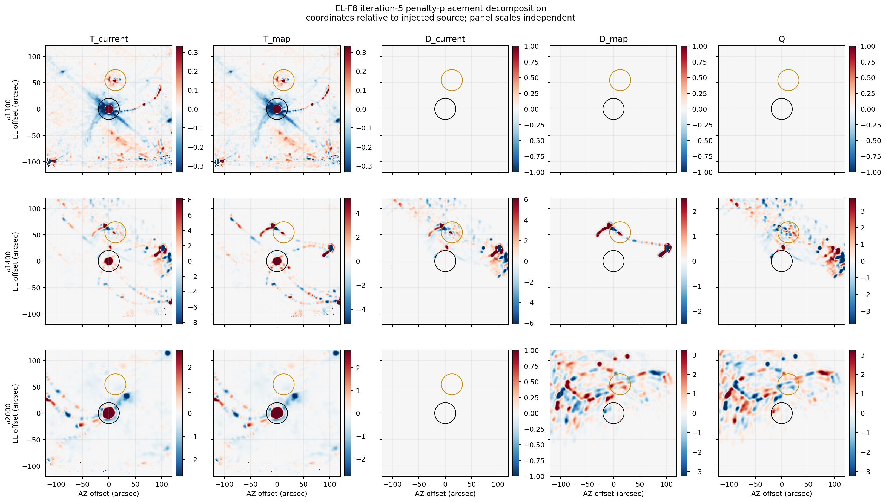

# FRUIT EL-F8 scientific interpretation r0.4

Test ID: `SCI-FRUIT-EL-F8-PENALTY-PLACEMENT-DECOMPOSITION-R0.1`

Result: **mixed mechanism, with the direct mapped contribution larger in the
registered Neptune and annular regions**

Status: **descriptive development evidence from one pointing observation;
not a policy selection or qualification result**

## Owner-facing answer

The large a1400 imprint is not adequately described as either a single bad
detector directly drawing arcs on the map or as an artifact caused only by
removing that detector before shared cleaning. Both effects are present.

When UID 4460 is retained through RTC/PTC cleaning and excluded only before
map accumulation, most of the registered Neptune-region and annular effect
remains. This is the detector's direct mapped contribution. Applying the same
hard exclusion earlier, before RTC/PTC, adds another material component by
changing the shared cleaning solution seen by all participating a1400
detectors.

The experiment therefore supports a **mixed, direct-larger** interpretation.
It does not support a pure early-exclusion-amplification interpretation, and
it does not establish a generic rule about individual detectors.

## What was separated

The registered a1400 identities are

\[
D_{\rm current}=A5_{\rm current}-N5,
\qquad
D_{\rm map}=A5_{\rm map}-N5,
\]

\[
Q=A5_{\rm current}-A5_{\rm map}
 =D_{\rm current}-D_{\rm map}.
\]

- `D_current` is the total effect of the existing carried UID 4460 penalty,
  where the detector is excluded before shared RTC/PTC cleaning.
- `D_map` is the direct map-stage effect: the detector participates in shared
  cleaning and is excluded only before map accumulation.
- `Q` is the additional effect introduced by removing the detector before the
  shared cleaning solution is formed.

The identity closed within the registered floating-point bounds in all three
arrays. The exact a1400 maximum closure residual was
`1.4211e-14 mJy/beam`, compared with the registered
`1.4452e-12 mJy/beam` bound.

## Continuous evidence

RMS values are in mJy/beam. Percentages are the corresponding terms in the
squared-RMS accounting for `D_current`; the small signed cross term is shown
separately because `D_map` and `Q` need not be orthogonal.

| Region | `D_current` RMS | `D_map` RMS | `Q` RMS | Direct variance term | Early/shared variance term | Cross term |
|---|---:|---:|---:|---:|---:|---:|
| Neptune, r < 20 arcsec | 2.43696 | 2.13653 | 1.20638 | 76.86% | 24.51% | -1.37% |
| Annulus, 40--120 arcsec excluding Neptune | 2.27360 | 2.05442 | 0.96340 | 81.65% | 17.95% | +0.40% |
| Complete finite map | 1.54787 | 1.17976 | 1.00656 | 58.09% | 42.29% | -0.38% |
| Injected source, r < 20 arcsec | 0.26287 | 0 | 0.26287 | 0% | 100% | 0% |

No numerical dominance threshold was registered, so these measurements are
not converted into an artificial pass/fail claim. In the two regions selected
before execution to characterize the arcs, the direct term is plainly the
larger continuous component, while the 18--25 percent early/shared term is too
large to dismiss. Over the complete map the two mechanisms are more nearly
balanced. Their cross-correlation is close to zero in the registered regions,
so the split is not the result of two large components merely cancelling one
another.

Each displayed component uses a symmetric scale suited to that component, so
color intensity must not be compared between columns as an absolute-amplitude
scale. The table above provides the quantitative comparison.

The injected compact source itself is stable. Its a1400 kernel-normalized
central recovery changes from `1.037055` to `1.037009`; the corresponding
aperture response change attributable to `Q` is approximately `-0.7%`. The
map-stage direct term is zero in the 20-arcsec injected-source aperture because
UID 4460 does not contribute mapped samples there in this scan. The much
larger placement response is associated with the real field and the detector's
scan path, not with broadening or splitting the injected compact source.

## Why one detector can leave a large map-shaped effect

UID 4460 was not silently ignored by the pipeline. Before the learned hard
penalty it was APT-accepted and moderately deweighted, with relative weight
`0.7587`. The map diagnostic then identified it as the leading contributor at
four globally unusual pixels and carried a factor-zero exclusion into the
next iteration.

In the map-placement replay, all 676 raw scan samples enter RTC/PTC without
that hard exclusion. At map accumulation, the learned record proposes 305
downsampled samples for exclusion: 34 are already flagged for other reasons
and the remaining 271 are newly flagged, so all 305 are absent from the map.
Those samples project along the detector's scan trajectory. Their removal can
therefore produce extended tracks or arcs rather than a compact spot. Moderate
deweighting reduces this leverage but does not make it zero, particularly
where local coverage and redundancy vary.

In the existing placement, the exclusion also removes all of UID 4460's raw
samples before RTC/PTC. Because those are shared, data-dependent cleaning
operations, this changes the solution applied to the other a1400 detectors.
That redistributed effect is `Q`. It is why the full imprint cannot be read
as a literal image made only from UID 4460 samples.

The four original trigger pixels reinforce this distinction. Their final
signal values are bitwise equal between the current- and map-placement runs,
while their weights change slightly. The scientifically important response is
distributed along mapped trajectories and through shared processing rather
than confined to the four pixels that caused the learned decision.

## Validity and boundaries

The two current-placement compatibility runs reproduce all nine historical
signal, kernel, and weight planes bitwise and reproduce all scientific
checkpoint values. The registered checkpoint-policy intervention changed only
the normalized placement field. Units, WCS/grid, normalization, finite
support, paired configuration, application accounting, and component closure
all pass. All four trajectories completed with zero unexpected error or
critical messages in an aggregate `124.58 s`; peak resident memory was
`860,274,688` bytes.

The direct UID 4460 interpretation applies only to a1400. Two map-diagnostic
exclusions move in a2000, so its response is retained only as a side-effect
measurement. The a1100 busy-detector exclusion does not move and its placement
components are zero.

This is one UID, one scan, one pointing observation, one carried decision, and
one iteration. It does not show that UID 4460 is intrinsically bad, prove that
map-only exclusion is scientifically preferable, set a production default,
select a soft factor, establish a universal flagging rule, qualify FRUIT, or
authorize Gate D or Stage B.

## Recommended next decision

Do not adopt `pre_mapmaking` as a safeguard from this result alone. It removes
the material shared-cleaning interaction, but the larger direct mapped
component remains and the scientific consequences of allowing a suspect
detector to influence RTC/PTC have not been tested on a genuine detector
failure.

The next narrow study should be a read-only **map-leverage and flagging audit**
using the already retained EL-F8 products. It should determine where UID 4460
has high fractional influence after ordinary weights, how that influence
tracks local hit count and redundancy, and which existing detector-level
quality statistics fail to describe the scan-local map pathology. Only after
that audit should an owner packet compare candidate safeguards such as
map-only hard exclusion, a bounded soft factor, or sample-local exclusion.
No such follow-on is authorized by EL-F8.
