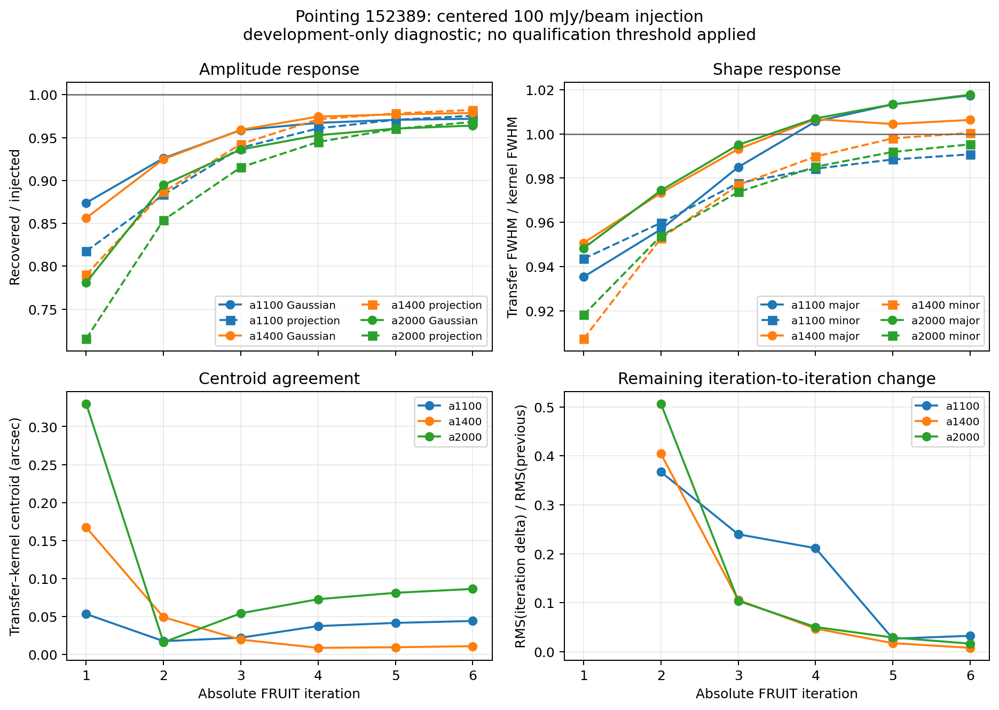

# FRUIT six-iteration known-source development check: pointing 152389

Status: **exploratory development evidence only; exact restart is not reliable
for this enabled learning path; not qualification or a stopping-rule decision**

## The simple result

The current FRUIT method recovers nearly all of this one bright, centered
100 mJy/beam test source by iterations 5--6. Its recovered shape and position
also closely match the processed source kernel. Additional recovery from
iteration 5 to 6 is small.

| Array | Central recovery, iter 5 | iter 6 | Full-kernel recovery, iter 6 | Iter-6 major/minor size vs kernel | Iter-6 centroid error |
| --- | ---: | ---: | ---: | ---: | ---: |
| `a1100` | 97.07% | 97.19% | 97.55% | 101.74% / 99.08% | 0.044 arcsec |
| `a1400` | 97.71% | 97.87% | 98.23% | 100.63% / 100.04% | 0.011 arcsec |
| `a2000` | 96.05% | 96.40% | 96.83% | 101.77% / 99.53% | 0.086 arcsec |

The central recovery gain from iteration 5 to 6 is only 0.12, 0.16, and 0.35
percentage points. That looks like a plateau for this source. It is not yet a
general convergence result: only one bright compact source was tested, no
stopping tolerance was chosen in advance, and non-kernel structure remains in
the complete injected-minus-control map.



## The important restart finding

A short replay from the exact iteration-4 checkpoint was intended only to
check an unusual timing slowdown. It instead found that the current checkpoint
does not reproduce the complete future trajectory.

- Replayed iteration 5 matches the uninterrupted iteration 5 bit-for-bit for
  every signal, kernel, and weight image.
- Replayed iteration 6 remains exact for `a1400` and `a2000` but differs in
  all three `a1100` images. The `a1100` signal difference is 12.12% of the
  uninterrupted map RMS.
- At the end of iteration 5, the uninterrupted checkpoint has learned a new
  detector exclusion for UID 1489. The replay checkpoint has not.

The reason is specific and causal. Prior map-pixel-outlier records tell the
next iteration which pixels need detailed contributor tracing. Those records
are described in the code as diagnostic history and are not saved in the
checkpoint. The uninterrupted process still has them in memory, finds that
UID 1489 dominates eight selected pixels, and excludes it on the next pass.
The restarted process does not have the history, so it misses that decision.

This is exactly the failure mode already anticipated by Stage A's
`FRUIT-GAP-011`: diagnostic history may be omitted only if no future update,
stop, or selection consumes it. Here, a future selection does consume it.
Accordingly, this run fails the exact-restart requirement. We should not use a
restart-dependent trajectory for qualification, nor define a restart-safe
stopping rule, until this state is made complete or the causal dependency is
removed and validated.

## Timing disposition

The uninterrupted injected run took about 41--51 seconds per iteration through
iteration 4, then 1,361 and 2,650 seconds for iterations 5 and 6. The replay
completed those two iterations in 39.84 and 40.38 seconds, 80.74 seconds total,
with zero swaps. The large slowdown did not repeat. It is recorded as a
transient execution anomaly, not a property of FRUIT and not a performance
measurement suitable for method comparison.

## Boundaries

The injected source enters after RTC processing, calibration, despiking,
initial learned masks, and detector selection. This test covers the current
PTC-cleaning/FRUIT/mapmaking recurrence for one positive source at map center.
It does not measure pre-RTC losses, off-center or extended response, faint
emission, atmosphere leakage, superiority to historical Citlali, or readiness
for production. The continuous six-iteration curve remains useful descriptive
development evidence despite the separate restart failure.

## Review files

- [`TEST_DEFINITION.md`](TEST_DEFINITION.md) contains the frozen test and full
  disposition.
- [`injected_source_iteration_metrics.csv`](injected_source_iteration_metrics.csv)
  and
  [`injected_source_iteration_metrics.md`](injected_source_iteration_metrics.md)
  contain the six-iteration scientific measurements.
- [`manifest.json`](manifest.json) hashes the continuous paired analysis.
- [`EXECUTION_TIMING_REPLAY_DEFINITION.md`](EXECUTION_TIMING_REPLAY_DEFINITION.md)
  contains the timing-replay definition and causal restart diagnosis.
- [`restart_replay_comparison.csv`](restart_replay_comparison.csv) contains all
  18 exact image comparisons.
- [`restart_replay_manifest.json`](restart_replay_manifest.json) contains the
  failing result, checkpoint penalty rows, and hashes of its evidence.

The restart comparison can be regenerated from the repository root with:

```bash
$HOME/tolteca/bin/python tools/fruit_loops/compare_restart_replay.py \
  --reference /Users/gwilson/work_toltec/local_data/fruit-development/point-152389/fruit-injection-development/centered-100mjy-iter1-6-r0.1/injected/reduced \
  --replay /Users/gwilson/work_toltec/local_data/fruit-development/point-152389/fruit-injection-development/centered-100mjy-iter1-6-r0.1/timing-replay-from-iter4/attempt-02/reduced \
  --obsnum 152389 \
  --checkpoint-iteration 5 \
  --output validation/fruit_loop_point_152389_injected_convergence_development_2026-09-02/restart_replay_comparison.csv \
  --manifest-output validation/fruit_loop_point_152389_injected_convergence_development_2026-09-02/restart_replay_manifest.json \
  --test-id SCI-FRUIT-POINT-152389-INJECT-CENTER-100MJY-ITER1-6-RESTART-R0.1 \
  --evidence /Users/gwilson/work_toltec/local_data/fruit-development/point-152389/fruit-injection-development/centered-100mjy-iter1-6-r0.1/setup/citlali_injected_source_injected.yaml \
  --evidence validation/fruit_loop_point_152389_injected_convergence_development_2026-09-02/TIMING_REPLAY_FROM_ITER4.yaml \
  --evidence validation/fruit_loop_point_152389_injected_convergence_development_2026-09-02/timing_replay_attempt_02_time.txt \
  --evidence /Users/gwilson/work_toltec/local_data/fruit-development/point-152389/fruit-injection-development/centered-100mjy-iter1-6-r0.1/injected/reduced/redu04/citlali.log.gz \
  --evidence /Users/gwilson/work_toltec/local_data/fruit-development/point-152389/fruit-injection-development/centered-100mjy-iter1-6-r0.1/injected/reduced/redu04/learning_iter_5.csv \
  --evidence /Users/gwilson/work_toltec/local_data/fruit-development/point-152389/fruit-injection-development/centered-100mjy-iter1-6-r0.1/timing-replay-from-iter4/attempt-02/reduced/redu00/citlali.log.gz \
  --evidence /Users/gwilson/work_toltec/local_data/fruit-development/point-152389/fruit-injection-development/centered-100mjy-iter1-6-r0.1/timing-replay-from-iter4/attempt-02/reduced/redu00/learning_iter_5.csv
```
