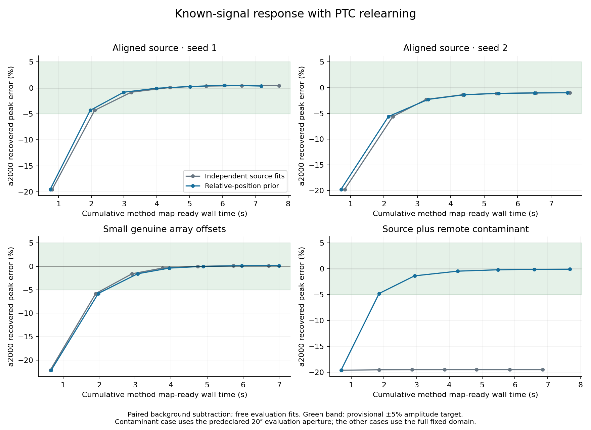
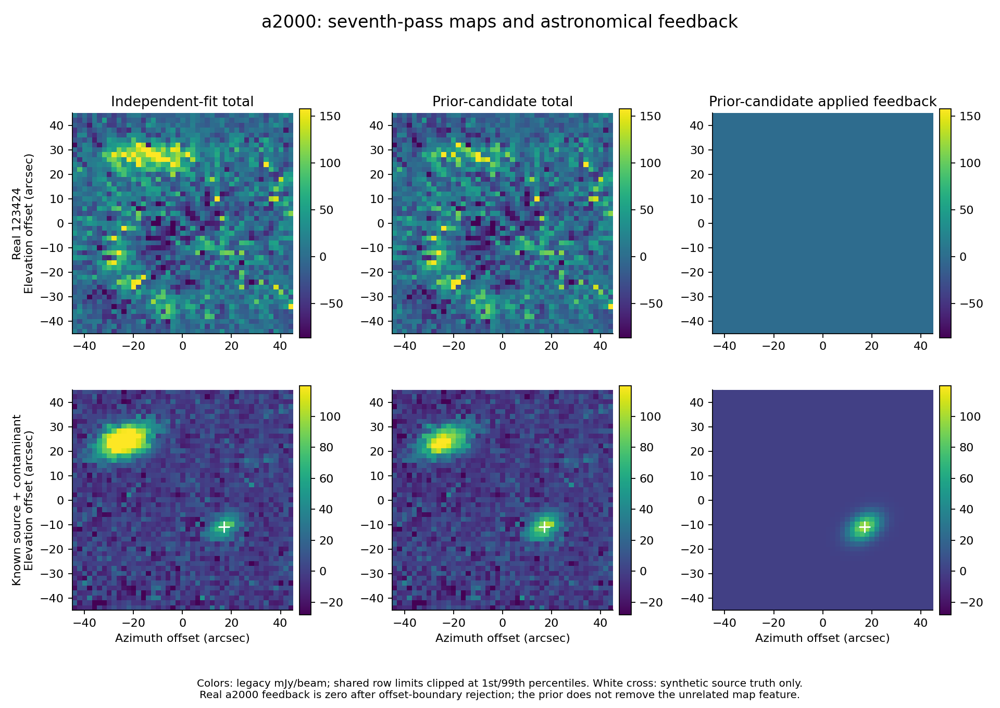

# POINT positional priors: decision and evidence

2026-09-11 — **REVISE.** Relative-array positional information demonstrates a
useful source-association benefit. This particular candidate still fails the
predeclared morphology/residual gate, so it is not retained as an adequate
POINT successor. The bounded test is complete; no scientific revision or
129081 evaluation was performed.

## Program adherence and prior-work recovery

The [owner authorization](OWNER_DIRECTION.md) corrects the empirical premise:
a1100/a1400 are very accurately aligned, and a2000 has a small systematic
relative offset below 2 arcsec. It authorizes this new screen after the previous
candidate's rejection. Follow the [program charter](../../doc/scientific_contracts/README.md)
and the recovered method/input/control sources bound by the
[protocol](PROTOCOL.md) and [freeze](FREEZE.json). Candidate code and gates were
committed at `ae758cd2f` before any trajectory. Frozen contracts and all prior
experiments remain unchanged; no upstream calibration or production source is
modified.

## What was tested

Control G is the previous independent per-array coherent Gaussian method.
Candidate J jointly fits a free common a1100/a1400 position, retaining separate
amplitudes, widths, angles and backgrounds. It then fits a2000 with a free
relative displacement inside a 2-arcsec disk. a2000 cannot drag the reference
pair's position. Its feedback is rejected if the fitted displacement reaches
the boundary or neither reference array admits a source. Every array still
needs its own positive signal evidence; backgrounds never enter feedback.

Exact reference-pair sharing and the hard disk are experimental approximations,
not measured zero uncertainty or a known a2000 offset vector. Absolute source
position and all amplitudes/shapes remain free. Both arms use the same immutable
pre-PTC parent, rank-5 relearning and ordinary maps on every pass. The original
unconstrained fitter evaluates resulting maps, so forced model agreement cannot
establish pointing recovery.

## Positive result and the gate that fails

The 11 predeclared cases include real 123424, two Gaussian/null realizations,
the earlier two-component mismatch, small genuine offsets, an offset outside
the prior, an absent a2000 source, and a remote contaminant with/without the
desired source. All relevant learning is rerun. Known-signal response subtracts
the matching background trajectory; the contaminant comparison subtracts the
contaminant-only trajectory. Truth never enters inference.

| Test | Independent fits G | Prior candidate J | Interpretation |
| --- | --- | --- | --- |
| Desired a2000 source with remote contaminant: final peak error | −19.48% | **−0.07%** | Useful association/recovery benefit |
| Same case: first joint amplitude/width/centroid recovery | None within seven passes | **Pass 2, 1.85 s** | All three arrays qualify by pass three |
| Aligned and small-offset Gaussian cases | Final joint targets pass | Final joint targets pass | No amplitude degradation beyond the 2-percentage-point allowance |
| Two all-array nulls / absent a2000 | No source promotions | **0 / 0 promotions** | Prior does not create feedback in these tests |
| Two-component mismatch, a1100 direct map-error RMS | 0.162 mJy/beam | **0.283 mJy/beam** | +75.0%; exceeds allowed +10% |
| Same mismatch, a1100 exterior-error RMS | 0.0356 mJy/beam | **0.0633 mJy/beam** | +77.9%; also fails |

In the contaminant case, J's final a2000 width errors are −0.66% and −0.23%,
and centroid error is 0.033 arcsec. These use the predeclared 20-arcsec
evaluation aperture around the injected source. Full-domain free fits, direct
errors and absolute maps are retained separately. J never admits the
contaminant-only a2000 feature without a reference-pair anchor.

For the mismatch, J improves a2000 direct error by 45.0%, but worsens a1100
and changes its fitted major-width error from −3.23% to −8.45%. The absolute
error remains small compared with the injected peak; nevertheless it fails the
frozen nondegradation gate. The evidence does not isolate exact positional
sharing versus a changed numerical fit solution as the cause. No post-result
gate relaxation, solver search or new scientific revision was used.

## Real pointing and limits of the prior

In real 123424, J rejects a2000 feedback at the offset boundary on all seven
passes. Its a2000 map therefore remains exactly at the bootstrap result; it
stops reinforcing the displaced feature but does not demonstrate recovery of
the weak source. The unconstrained evaluator still selects the remote structure.
The prior-constrained trial centroid near (12.92,−7.50) arcsec is **not** a
recovered pointing result or a measured array-offset calibration.

Relative to G, a1100's fitted amplitude is effectively unchanged, with both
width changes below 0.1%. a1400 amplitude increases 2.21%, its major width
decreases 5.97%, and its free centroid moves 0.45 arcsec. The independent
a1100/a1400 centroid separation becomes about 0.32 arcsec, versus 0.81 arcsec
for G. Better agreement alone does not establish better flux or morphology.
The earlier peak/shape differences from OG also remain unresolved.

The deliberate 4-arcsec a2000 offset triggers rejection throughout and leaves
−23.60% amplitude error. This correctly exposes a limit of the assumed prior;
it is not successful recovery. The 1.70-arcsec injected offset passes recovery.
Boundary hits in the real data do not disprove the owner's alignment evidence:
physical alignment and a Gaussian centroid fitted after cleaning are different
quantities. A hard physical-offset bound is not automatically a justified hard
bound on that fitted centroid.

## Cost, verification and next decision

Seven real-data passes take **6.57 s for G and 7.86 s for J**, a **19.7%**
method-time increase. Inclusive development times are 6.77 s and 8.35 s.
Inference costs are charged to both arms; these are single measured trajectories,
not a timing distribution. On the simple Gaussian, one array reaches joint
targets a pass later under J. The value demonstrated here is handling source
confusion, not a general pass-count reduction. The identified OG control remains
205.38 s over its full, different pipeline; no end-to-end OG speedup is claimed.

All **154 passes** completed without trajectory failure in 175.96 s, with
2.19 GB peak process memory. Three focused tests passed with warnings treated
as errors. [Verification](VERIFICATION.json) checked 498 product files, all
replacement/admission rules, fixed support and background exclusion. G exactly
reproduces the previous six-case control; independent application of stored
PTC state reconstructs final real maps within 2e-12 mJy/beam. Every iteration's
map/model/state, source fit, rejection, model-change metric and timing is retained.
Seven passes do not establish convergence or a deployable stopping rule.

**Recommend revising the way positional information constrains inference.**
The measured benefit justifies carrying it forward, while the mismatch failure
prevents acceptance of this exact method. A further bounded revision should
address the reference-pair morphology cost and distinguish geometric alignment
from the uncertainty/response of processed-map fits. Its precise numerical
choice remains a new owner decision. No additional run is initiated, and
129081 remains reserved because development did not pass.

See [numerical evidence](NUMERICAL_EVIDENCE.json),
[compact gate assessment](DECISION_EVIDENCE.json), and
[result manifest](RESULT_MANIFEST.json). Full products remain outside Git in
the manifest-listed local directory and must accompany relocation or archival.
