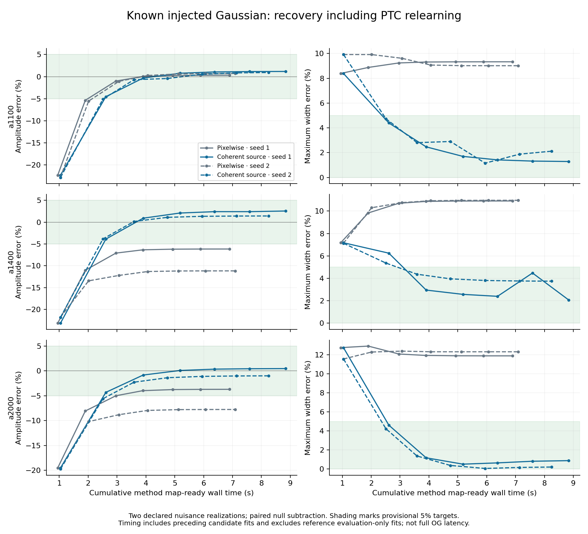
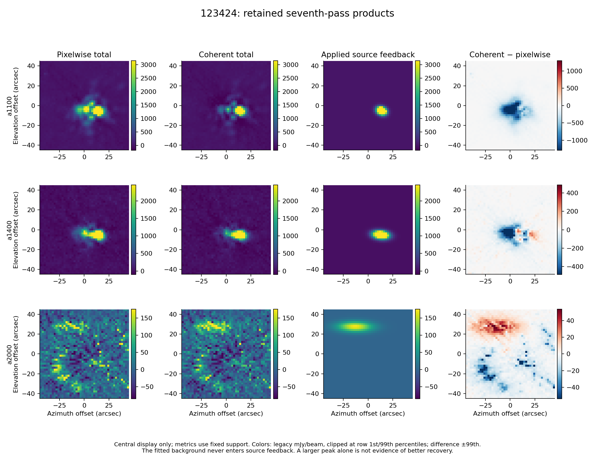

# POINT coherent-source feedback: decision and evidence

2026-09-11 — **REJECT candidate r0.2 as tested.** The bounded experiment is
closed after its one permitted revision. Coherent feedback improves controlled
source recovery substantially, but this candidate does not reliably identify
the source in real 123424. There is no policy recommendation or qualified
successor. Observation 129081 remains reserved and was not evaluated.

## Program adherence and prior-work recovery

The [owner direction](OWNER_DIRECTION.md) authorized this isolated innovation
screen under the [program charter](../../doc/scientific_contracts/README.md).
The [protocol](PROTOCOL.md) and [initial freeze](FREEZE.json) preceded execution.
The [one revision](REVISION_R0.2.md) and [successor freeze](FREEZE_R0.2.json)
preceded its comparison. Frozen contracts, weighting closure, prior reductions
and historical evidence retain their existing meanings. This experiment changes
no production behavior or upstream source/profile authority.

## What was compared

The matched reference P selects positive pixels above three times a declared
map-scatter scale. Candidate G fits one elliptical Gaussian plus a plane to the
reconstructed total map. Amplitude, centroid, both widths and angle are free
within the predeclared broad numerical bounds. Only the Gaussian enters feedback;
the fitted plane never does. No expected flux or nominal position/width enters
inference. Both arms replace feedback, subtract it from the same immutable
calibrated pre-PTC parent, and relearn rank-5 PTC on every pass. Network grouping,
uniform coefficients, ordinary 2-arcsec maps, masks and support are common.

The initial candidate's brightest-pixel fit start trapped a1400 at a rejected
boundary solution. Its one revision used coherent template scores to initialize
the same three free fits. The revised reference maps reproduced exactly, so the
change in candidate behavior is attributable to that revision. Both campaigns
and every development iteration are retained.

## Controlled recovery: useful positive evidence

Two predeclared nuisance realizations used 123424 geometry and detector scales.
Each had a null and a known nonnominal Gaussian; one also had a two-component
mismatch source. Injection preceded learning, and each arm/case/pass relearned
independently. The measured response subtracts the corresponding null output.
These are conditional tests of the declared nuisance construction, not ensemble
bias estimates or optical/absolute-flux qualification.

Joint targets are 5% peak-amplitude error, 5% error in each width, and centroid
error below 5% of the minor width. At pass seven:

| Array | Reference peak error, seeds 1 / 2 | Candidate peak error, seeds 1 / 2 | Candidate first joint-target pass, seeds 1 / 2 |
| --- | ---: | ---: | ---: |
| a1100 | +0.32% / +0.72% | +1.17% / +0.93% | 2 / 3 |
| a1400 | −6.15% / −11.16% | +2.55% / +1.41% | 3 / 3 |
| a2000 | −3.70% / −7.76% | +0.47% / −0.99% | 2 / 3 |

The reference misses the joint targets throughout seven passes in every array.
The candidate meets them in all arrays by pass three: **3.90 s and 3.59 s**
cumulative method time for the two seeds. Its final maximum absolute amplitude
error is 2.55%, and maximum width error is 3.75%. Earliest target attainment uses
known truth for evaluation; it is not an available stopping rule.

For the mismatch, candidate/reference direct map-error ratios are 0.235, 0.143
and 0.263; exterior-error ratios are 0.207, 0.152 and 0.236. However, the a2000
Gaussian-summary major width still differs by −7.75% from the composite truth's
best-fit Gaussian. Lower direct residuals do not establish general shape recovery.
The candidate admits no source in either null: zero promotions across 42
array/pass decisions. These nulls did not reproduce the real-data failure.

## Real 123424: why the candidate is rejected

The following uses the common free Gaussian evaluator on final total maps.
The last column separately compares with the identified OG reduction's own
published pointing estimate, rather than relabeling our fit as OG's estimator.

| Array | Candidate/reference peak change | Candidate/reference major / minor width change | Candidate separation from OG pointing |
| --- | ---: | ---: | ---: |
| a1100 | +64.06% | −61.72% / −27.65% | 0.58 arcsec |
| a1400 | +9.58% | −21.34% / −3.17% | 0.055 arcsec |
| a2000 | +56.76% | −16.06% / −5.87% | **46.43 arcsec** |

The strong-array candidate centroids are closer to OG than the reference's,
which is encouraging. Their large peak and shape changes nevertheless do not
establish improved real photometry. In a2000, G retains a feature near
(−13.14, +27.29) arcsec, while OG reports (+15.30, −9.41) arcsec. G is also
49.88 arcsec from the reference's fitted feature. OG is a benchmark, not truth;
P also fails to provide convincing a2000 source identification. This is an
unresolved identification conflict, not a measured 46.43-arcsec true error.

G lowers the real Gaussian-fit residual RMS in all arrays, but exterior RMS
increases by 9.60%, 1.01% and 0.61%. The a2000 feedback repeatedly reinforces
the same displaced structure. A stable fit, lower residual RMS or larger peak
therefore cannot establish the required useful POINT improvement. This failure
prevents a keep decision without requiring numerical agreement with OG.

## Cost, integrity and disposition

Real-data seven-pass method map-ready time is **6.59 s for P and 7.78 s for G**:
an 18.0% candidate cost increase at equal pass count. Timing includes preceding
candidate inference and excludes P's evaluation-only fitting. Inclusive
development wall times are 8.98 s and 7.99 s; their ordering reflects different
evaluation costs and must not be claimed as a method speedup. The controlled
benefit is recovery in fewer passes. All timings are single measured trajectories.
Model-change RMS decreases from 39.66 to 7.78 for P and 33.76 to 5.04 for G;
seven passes do not establish convergence or a terminal-selection rule.

The [OG benchmark](OG_BENCHMARK.json) is
`POINT-123424-OG-RECURRENCE-EL-F2-ALPHA1-CONTROL-2026-09-02`:
seven historical-recurrence passes, **205.38 s full wall time**, including its
diagnostics. It uses different upstream work, JINC, weights and learning, and
one numerical thread versus this harness's four BLAS threads. No end-to-end
speedup against OG is established or claimed.

The two campaigns completed 168 passes with zero trajectory failures; campaign
times were 106.08 s and 109.59 s and peak process memory was 2.02 GB.
[Verification](VERIFICATION.json) checked all 544 retained product files,
replacement/background exclusion, unchanged inputs and exact reference
reproduction. Independent application of saved PTC state reconstructs the final
real maps within 2.8e-12 mJy/beam. Focused invariant tests passed with warnings
treated as errors. Required support stayed fixed.

The substantive finding is that coherent feedback can recover source wings
lost by pixelwise selection in this controlled setting. The tested candidate's
admission cannot reliably distinguish a compact source from structured real
contamination. Reject this version; the single revision is exhausted, no sweep
or further diagnosis follows, and 129081 remains reserved. Any later candidate
needs a new bounded owner direction addressing that specific weakness.

Full numbers are in [r0.2 evidence](NUMERICAL_EVIDENCE_R0.2.json),
[initial evidence](NUMERICAL_EVIDENCE_R0.1.json) and
[decision/OG evidence](DECISION_EVIDENCE.json). The
[result manifest](RESULT_MANIFEST.json) binds review files and both external
product manifests. Full maps, models, learned state and pass receipts remain
outside Git at those manifest-listed local paths; they must accompany any
future relocation or archival of this experiment.
