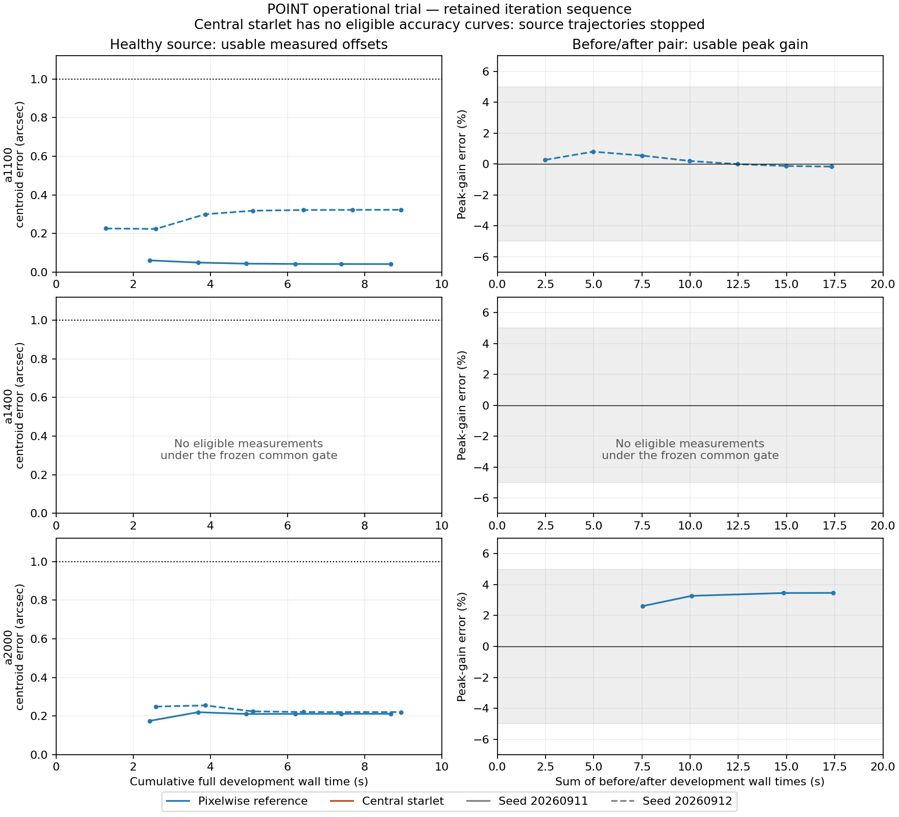
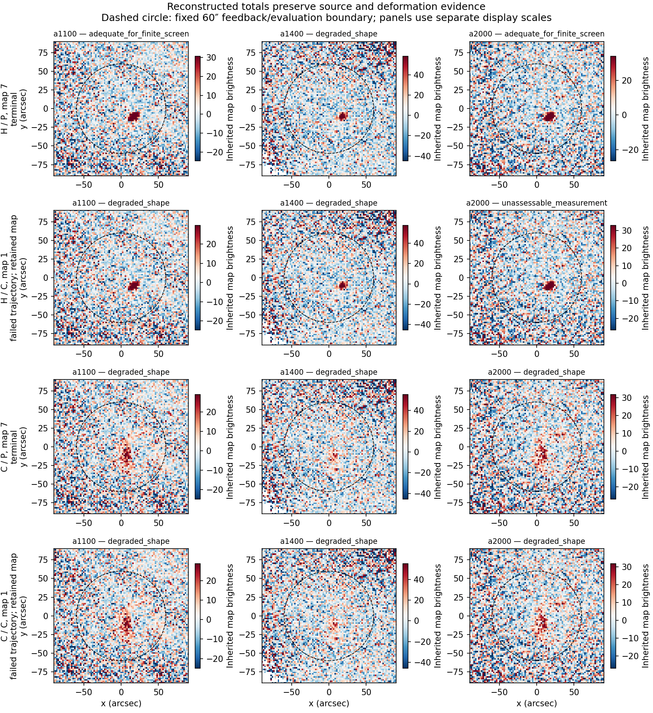

# POINT use-case trial: revise; no operational improvement established

2026-09-12. **The tested candidate is not accepted. Recommend a bounded
revision of completion and measurement rules before another comparison.**

## Program adherence and prior-work recovery

This completes the [owner-authorized trial](PROTOCOL.md) under the
[scientific-contract program](../../doc/scientific_contracts/README.md).
Commit `7836bc8c3` froze the source, inputs, eight states/two nuisance seeds,
rank-5 control, seven-pass sequences and operational gates before execution.
The owner selected a 1-arcsec per-observation pointing criterion. All older
scientific sources, experiment dispositions and reduction products remain
preserved. This is development evidence, not independent authorship, numerical
qualification or production approval.

The trial answers three distinct questions:

1. **Does the central source rule retain its null benefit? Yes, in these
   registered development cases.** C admitted no false models; P admitted
   false pixels in every null/background array case. Neither arm's separate
   POINT source-report rule issued a positive source report in those cases.
2. **Does the budget-only starlet successor demonstrate better POINT recovery
   or latency? No.** None of its twelve synthetic source trajectories reached
   a valid terminal result. The real-data run completed at substantially
   higher cost, without an available operational measurement under this evaluator.
3. **Do all the new gate failures mean the POINT information is bad? No.**
   The common shape/score veto withheld eight reference centroid measurements
   that actually met the owner's 1-arcsec target in the controlled cases.

## What ran

P is the unchanged pixelwise policy on original D. C is the same central
starlet objective and 60-arcsec evidence/model domain as the prior screen,
with the planned solver limit raised from 300 to 3000 iterations. Both solver
success and relative projected-gradient ≤1e-4 were still required. No new
radius, prior, threshold, shape family or objective penalty was introduced.

Every pass subtracts the current model from its immutable pre-PTC parent,
relearns PTC, reconstructs the total and infers replacement feedback. Both arms
processed real123424 and the eight synthetic states under both registered
nuisance seeds. Failed next models were retained but never applied.

| Execution measure | Result |
| --- | ---: |
| Registered trajectories | 34 |
| P completed | 17/17 |
| C completed | 5/17: real123424 and four null/background cases |
| C synthetic source trajectories completed | 0/12 |
| Actual cleaning calls / allowed maximum | 167 / 238 |
| Total comparison wall time | 400.12 s |
| Peak process memory | 1.94 GiB |
| Retained run payloads | 584 files, 389,773,390 bytes |

Eleven C source trajectories stopped after bootstrap; T with seed 20260911
stopped after its second map. This is why the run used fewer than the maximum
cleaning calls. It is failure handling, not useful early stopping or pass savings.

## Source evidence, pointing and gain

There were twelve null/background array cases, each retained through seven
passes. C had **zero accepted false models in all 84 array-pass decisions**;
P had false admitted pixels in all 84. Both source-report counts were zero.
These are repeated uses of two known nuisance seeds, one also used for noise
calibration. They are not 84 independent false-alarm trials or a qualified
false-alarm rate. The result also illustrates that false feedback admission
and a false operational source report are different events.

The registered terminal gates give the following record. “Unavailable” below
blocks the candidate claim; it is not a measured failure of its terminal
centroid or gain, since those products do not exist.

| Use-specific check | P terminal result | C terminal result |
| --- | --- | --- |
| Startup gross-distortion warning, U1 | 6/6 source/array cases | Unavailable: source trajectories stopped |
| Peak gain H/D within 5%, U2 | 2/6 available and passing | Unavailable |
| Centroid within 1″ with common measurement gate, U3 | 10/18 passing | Unavailable |
| Controlled 10% response-loss test, U4 | 2/6 available and passing | Unavailable |
| Unchanged H pair within 5% | 1/3 passing | Unavailable |
| Response-health safeguard, U5 | 6/6, with the affected array unavailable | Unavailable |
| Boundary warning, E | 6/6 | Unavailable |

The gross-coma bootstrap already established a source and a shape warning in
all six array/seed cases. The bootstraps are bitwise identical between arms.
That is useful startup evidence, but it is not a successful C terminal result
or proof of improved feedback. Accurate reconstruction of all coma wings was
not needed to obtain this warning in the test.

U5's apparent full pass is deliberately narrow: the two unaffected arrays
retain ratios of exactly one under the same nuisance realization, while a1400
is labeled unreliable both before and after the imposed fault. Thus the test
preserves a warning, but **does not demonstrate detection or measurement of
the new a1400 response loss**. The registered allowance for an unavailable
affected array cannot be promoted to an actual tune-health sensitivity result.

### The common measurement veto is too broad for routine pointing

Across H, H-shift and D, both seeds and all arrays, **all 18 terminal P fitted
centroids have controlled errors of 0.0336–0.5888 arcsec**. Only ten receive an
available measurement label. Seven of the other eight are withheld because
the core residual fraction exceeds 0.25; the eighth misses the five-scale
peak-score check. The fitted centroid errors remain below 1 arcsec in all eight.

The investigator's shared shape/score availability rule therefore withholds
useful finite-case pointing information. A poor Gaussian shape description
or residual/noise structure may matter for width and peak interpretation;
it is not demonstrated here to invalidate the offset. A shape warning also
cannot, by itself, diagnose physical telescope deformation rather than noise
or processing response. The operational-use distinction needs to extend into
the evaluator's availability rules, not just the list of reported metrics.

This is a gate-design finding. It neither changes the registered 10/18 score
nor qualifies the raw fits' uncertainty or general pointing reliability.
The same distinction must be retained for C's bootstrap fits: their small
errors do not demonstrate a benefit from feedback that was never applied.

For context, the raw terminal P peak-gain errors are below. Four pairs fail
the common availability rule, so these are **diagnostics, not substituted
gate passes**.

| Array | H/D error, seed 20260911 | H/D error, seed 20260912 |
| --- | ---: | ---: |
| a1100 | −0.128% | −0.169% |
| a1400 | +5.962% | +1.561% |
| a2000 | +3.467% | +2.630% |

Five raw ratios lie inside 5%; one does not. For the unchanged H comparison,
the available a2000 ratio is 0.88335, outside the unity target despite no true
response change. This demonstrates a real finite-realization photometric
limitation even after separating the availability veto. Two reused nuisance
seeds cannot quantify an operational false-degradation rate.

Only available measurements with valid feedback decisions appear in these
curves. Empty panels and absent C curves are explicitly unavailable results.
All iterations and raw measurement diagnostics remain in the receipts.

## What the solver failure actually means

Of 60 nonempty C array solves, 39 satisfy both gates and 21 are rejected at
the 3000-iteration limit. **Nineteen of the 21 rejected solves already meet
the registered relative projected-gradient threshold.** They fail the
separately required optimizer-success status. This status follows the
optimizer's own tolerances and is not synonymous with the relative-gradient
condition checked by the harness.

Two fail both requirements: a2000 H-shift/seed20260911 has gradient ratio
1.31247e-4, and a2000 E/seed20260912 has 1.12066e-4. Thus it would also be
incorrect to describe every failure as only a solver-status issue.

The longer budget demonstrates that the two completion checks select
different stopping conditions. It does not justify simply accepting the old
failed iterates. Nor does a small gradient establish correct amplitude,
morphology or uncertainty. The selected coefficients, full trial images,
objectives and gradients are preserved for each solve. No completion rule was
changed after seeing these results.

## Real123424, residuals and cost

Both real trajectories completed all seven passes. C took **43.51 s**,
versus **8.07 s** for P: 5.39 times the matched full development wall time,
above this trial's predeclared 2× cost bound. C spent 35.65 s in feedback
inference. Cleaning plus mapping took 6.09 s for C and 6.17 s for P, so the
measured extra cost is dominated by inference.

All real fitted results are withheld as operational measurements by the
common evaluator: shape warnings in a1100/a1400 and support/association issues
in a2000. The diagnostic coordinates are:

| Array | P fitted centroid (arcsec) | C fitted centroid (arcsec) | OG published centroid (arcsec) |
| --- | --- | --- | --- |
| a1100 | (10.396, −5.276) | (11.110, −5.324) | (12.963, −5.575) |
| a1400 | (11.654, −5.329) | (11.811, −5.327) | (12.740, −5.352) |
| a2000 | (−20.938, −21.676) | (−13.326, +27.272) | (+15.301, −9.412) |

The weak-array fits select inconsistent locations and do not establish source
association. The strong-array C fits are somewhat closer to OG, but OG is a
benchmark with different processing and measurement definitions, not truth.
This is not evidence of 1-arcsec recovery or calibrated photometric improvement.
All apparent peaks, widths, signed residuals and support records are retained
in [DIAGNOSTIC_EVIDENCE.json](DIAGNOSTIC_EVIDENCE.json) and the full receipts.

For the five completed paired trajectories, the largest C/P exterior-RMS ratio
is 1.02343, below 1.10. The required source-case terminal leakage comparisons
remain unavailable. The identified OG run took 205.38 s with one thread and
broader upstream, diagnostic, JINC and output scope. Its time is reported as
an operational benchmark; no end-to-end speedup against OG is claimed.

These are total maps, not fitted feedback models. Failed C trajectories show
their retained bootstrap maps, clearly labeled. Plotting scales differ between
panels; numerical amplitude comparisons use the recorded measurements.

## Disposition and one concrete next decision

**Revise; do not keep or recommend this candidate as an operational POINT
improvement.** Preserve its central null-admission benefit and the new evidence
that a common shape veto is unnecessarily restrictive for routine pointing.
The trial does not demonstrate a primary recovery/time benefit, and no
independent-pointing replication has occurred.

A useful next owner decision would authorize one tightly bounded successor:

- Make optimizer termination implement an explicitly selected numerical
  completion criterion, rather than repeatedly enlarging the cap while two
  differently scaled stopping rules disagree. The existing relative-gradient
  threshold is a concrete candidate for that decision; retaining finite,
  objective, support and recovery checks remains necessary.
- Separate centroid usability from peak/shape usability and health warnings.
  The actual controlled offset errors should govern the 1-arcsec screen;
  a health warning must not automatically make a correct offset unavailable.
  Also distinguish preservation of an existing U5 warning from sensitivity
  to a newly imposed fault.

These are prospective method/gate decisions, not routine post-result bug
repairs. No revised method, rerun, broader population, threshold/rank/domain
sweep or 129081 comparison is executed here. The next exercise should still
return a bounded keep/revise/reject answer rather than become a broad optimizer
or telescope-health qualification project.

## Verification and retained artifacts

[VERIFICATION.json](VERIFICATION.json) records 17 bitwise matched bootstraps,
133 applied-model continuity checks, all 144 C selection checks and all 60
nonempty objective/gradient recomputations. Eighty-four sampled learned-state
checks confirm original-parent residual means, covariance eigen-identities
and rank-five basis orthogonality. Verification made zero cleaning calls.
All 34 parent-immutability receipts pass, and all 584 run payload hashes match.

The four pre-execution unit tests passed. No unexpected execution warning or
exception occurred; the solver-limit trajectory failures are retained intended
failure outcomes. A routine reporting-key defect left the original analyzer's
`OG` field null. [supplement.py](supplement.py) retrieves the actual fields
from the already-bound source and verifies the already-bound benchmark log;
the original output remains intact. No numerical run, gate or input population
changed for that repair.

All 108 payloads across the four preceding result packets, 57 frozen ordinary-MAP
payloads, and the protected worktree/archive states remain unchanged. The opaque
archives were checked for presence/status only, never read, hashed or unpacked.
The run resides at `/private/tmp/sci-fruit-point-operational-gates-20260912-r0.1`;
the result manifest binds its products and the compact review files here.
