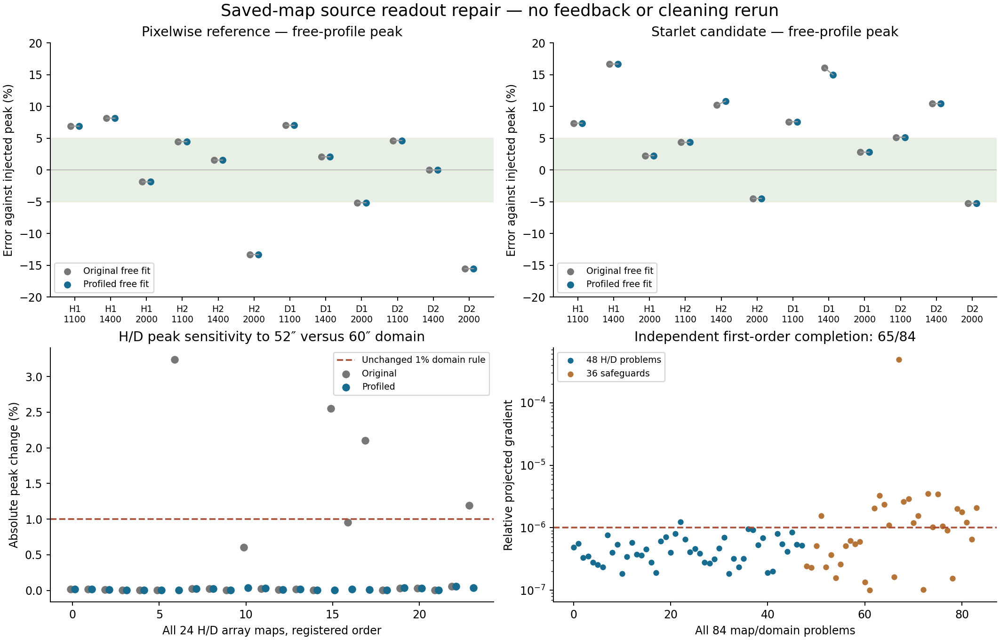

# Source fitter repair: better availability, unchanged absolute peak counts

2026-09-13 · SCI-FRUIT v0.1 development · r0.1

## Program adherence and prior-work recovery

Follow the [charter](../../doc/scientific_contracts/README.md),
[reviewed prior work](../../doc/scientific_contracts/packages/SCI-FRUIT/v0.1/method_preparation/ordinary_map/method_definition/r0.4/PRIOR_WORK.md)
and [owner-authorized frozen protocol](PROTOCOL.md). This is a new terminal
saved-map readout result. Every previous packet, map, parameter, label and
registered outcome is preserved. **Starlet remains parked for POINT.**

## Fitter verdict

**The repair clears all six known objective defects without truth-assisted
initialization, but does not fully meet its independent numerical-completion
criterion.** All 84 selected solutions are finite, in bounds, rank four and no
worse in objective than their saved counterparts. The three existing map-derived
starts, model, coefficient constraints, domains and scientific rules were retained.
The new route profiles amplitude and plane coefficients while optimizing free
geometry, with fixed numerical scaling and tolerances declared before execution.

The intermediate 48 linear re-solves make essentially no change: largest
relative peak change is 2.97e-8, plane-coefficient change 6.47e-8, and relative
objective improvement 1.94e-16. None clears a witness. The old linear part was
already solved; the consequential problem lies in geometry selection or its
coupling to the linear parameters.

All six defective saved fits sit at **theta = +pi**, with an outward angle
gradient. Their old solver terminated on objective change. This is specific
evidence consistent with trapping at the angle coordinate boundary, where the
physical Gaussian orientation is periodic. Remaining bound-aware gradients are
also larger than the new diagnostic criterion. The original analytic derivative
passes an independent finite-difference fixture. These observations do not isolate
which of profiling, numerical scaling, termination or path selection was decisive;
this was one repair, not a factorial solver study. No angle bound was changed.

| Known witness | Domain | Original SSE | Linear re-solve SSE | Repaired SSE | Feasible witness SSE |
| --- | ---: | ---: | ---: | ---: | ---: |
| H_20260912 / P / a1100 | 52″ | 227467.21 | 227467.21 | 219150.64 | 221505.99 |
| H_20260912 / C / a1400 | 60″ | 932970.07 | 932970.07 | 926275.15 | 929081.49 |
| D_20260911 / C / a1100 | 52″ | 224670.39 | 224670.39 | 219794.24 | 220537.21 |
| D_20260911 / C / a1400 | 60″ | 1132653.34 | 1132653.34 | 1127336.63 | 1130140.74 |
| D_20260911 / C / a2000 | 52″ | 251056.20 | 251056.20 | 248548.80 | 249376.89 |
| D_20260912 / C / a2000 | 52″ | 227070.29 | 227070.29 | 223513.77 | 223919.10 |

All 252 starts terminated on small objective change, rather than the solver's
gradient condition or evaluation limit. The independent bound-aware criterion
passes **65/84 selected fits: 47/48 H/D and 18/36 safeguards**. The sole H/D miss
is C/H second-seed a2000 at 60″ (1.234e-6 versus the registered 1e-6 criterion).
The other misses are one shifted-source, nine null and eight boundary fits;
none is hidden or rerun. The largest residual criterion is 4.92e-4 in a null
inner fit. Optimizer success is not being promoted to a completion certificate.

Different starts sometimes find substantially different higher-cost solutions:
17 problems have all-start peak spreads above 5% and centroid diameters above 1″.
Among the prospectively defined similar-cost solutions, however, the largest
peak spread is **0.0397%** and centroid diameter **0.00853″**. For H/D alone these
are 0.000396% and 0.0000294″. Those are small compared with the operational
budgets, but are not a global-optimum or unique-parameter certificate. Nearly
circular orientation is never an extra rejection. [All numerical records](NUMERICAL_TABLES.md)
retain the incomplete judgments and every start in the linked JSON.

## POINT interpretation

**Repairing the common readout restores four withheld H/D peaks. It does not
improve the absolute peak-accuracy counts or establish a sufficient candidate
advantage.** Numerical and operational labels below are new results on the
same saved maps; they do not replace the registered historical labels.

At 60″, out of all 12 H/D peaks or six H/D ratios per arm:

| Quantity | Pixelwise original → repaired | Starlet original → repaired |
| --- | ---: | ---: |
| Raw absolute peak error within 5% | 6/12 → 6/12 | 4/12 → 4/12 |
| Usable peaks | 6/12 → 7/12 | 6/12 → 9/12 |
| Usable absolute peaks within 5% | 2/12 → 3/12 | 3/12 → 4/12 |
| Raw matched-noise gain within 5% | 5/6 → 5/6 | 6/6 → 6/6 |
| Usable matched gain within 5% | 2/6 → 3/6 | 1/6 → 4/6 |
| Raw crossed-noise gain within 5% | 3/6 → 3/6 | 2/6 → 3/6 |
| Usable crossed gain within 5% | 1/6 → 2/6 | 1/6 → 2/6 |
| Usable centroid within 1″ | 12/12 → 12/12 | 12/12 → 12/12 |

These usability counts apply the unchanged data-only rules; they are not full
numerical qualification counts. The nine usable C peaks include the one H/D
fit that misses the independent first-order criterion described above.

Linear re-solving at the old geometry leaves every corresponding accuracy count
unchanged. At 52″, repaired absolute counts are P 6/12 and C **4/12**, compared
with original P 6/12 and C 5/12. Thus lower objective does not necessarily improve
truth agreement. Both repaired domains have P 5/6 and C 6/6 raw matched ratios,
and 3/6 crossed ratios in each arm. At 60″ the largest repaired raw absolute
errors remain **15.53% (P)** and **16.69% (C)**; largest matched-ratio errors are
5.96% and 1.47%, and crossed errors 16.18% and 7.90%.

The old truth-template coefficient still gives P 0/12 and C 11/12 within 5%
on both domains. It measures amplitude against the injected profile, not the
free-profile peak of a distorted map, and is neither the target of this repair
nor evidence for whole-source fidelity. The earlier interpretation is narrowed
accordingly. Remaining crossed-noise error could mix map noise, background
coupling and noise-dependent cleaning response; two reused realizations cannot
separate them.

## The four domain-rejection cases

All four inner fits now beat their known feasible witness. Their original peak
domain-sensitivity failures disappear under the **unchanged 1% rule**, and all
four newly pass the existing peak-usability rule:

| Case | Original domain change | Repaired domain change | Old → new peak usable |
| --- | ---: | ---: | --- |
| H_20260912 / P / a1100 | 3.2402% | 0.0028% | no → yes |
| D_20260911 / C / a1100 | 2.5517% | 0.0054% | no → yes |
| D_20260911 / C / a2000 | 2.1007% | 0.0073% | no → yes |
| D_20260912 / C / a2000 | 1.1919% | 0.0352% | no → yes |

Across all H/D states, maximum domain changes fall from 3.240% to 0.0366%
for P and 2.552% to 0.0589% for C. Low peak-score withholding remains separate:
five P peaks and three C peaks remain withheld. Shape warning changes only for
C/H second-seed a1400, from warning to no warning; the new fit changed, not the
warning threshold. H/D maximum centroid error stays near 0.589″ for P and improves
from 0.716″ to 0.581″ for C. The largest C centroid change is 0.1405″; all source
association and support judgments remain data-only.

## Safeguards and cost

The single saved shifted-source state retains all three usable centroids and
peaks in each arm, with maximum centroid error about 0.362″. The null state
reports **zero source evidence, usable centroids or usable peaks** in both arms.
All three near-boundary maps in each arm still carry support warnings and
withhold precision centroids and peaks, even where the raw centroid improves.
No favorable boundary fit removes the support limitation. The retained shape
warnings also remain. These are finite safeguards, not a false-positive rate.

The full normal fitter took **2.085 s for 84 fits**, median 19.1 ms and range
13.6–97.3 ms per map/domain. This includes initialization, all three starts,
analytic derivatives and 4,776 linear solves, of which 84 initialize the plane.
There were 4,692 profiled residual calculations, maximum 189 per start,
zero numerical-difference evaluations in the benchmark, and no work-cap increase.
The separate 48 linear diagnostics took 24.1 ms; applying the saved-evidence
judgments took 66.7 ms. The run including I/O and preservation checks took
5.01 s at 106.4 MiB peak RSS. Verification/report costs are separate.

Archived terminal evaluation for the same maps took 5.66 s, but includes both
fit domains and other evaluator work, with no isolated old-fitter timings.
This is context, not a controlled fitter speedup measurement. The new readout
does not erase the starlet trajectories' recorded runtime failures.

## Verification and stopping point

Independent saved-parameter checks reproduce all 252 attempted models, costs,
gradients and linear ranks, all 84 original costs, and the 48 fixed-geometry
results; no verification refit was used. The largest normalized linear normal
residual is 4.08e-16. Analytic-fixture derivative discrepancies are 4.16e-10 for
the profiled residual and 9.85e-11 for the old full model. The unchanged evaluator
reproduced every one of the 42 historical terminal judgments before the run.

The source/input freeze was committed before execution; the repaired outputs
were saved and hash-frozen before witness and truth scoring. All 281 prior
packet payloads, 1,804 external products, 57 frozen authority payloads and opaque
archive statuses remain unchanged. No PTC, feedback fits, new reductions, new
noise, observations, reserved pointings, thresholds, OOF or production changes.

**Stop here.** The common readout is more trustworthy for this bounded comparison,
with identified numerical-completion limitations. Starlet stays parked. No wider
repair, trajectory rerun, noise campaign or method change is initiated.

[Complete readout sequence, geometry and backgrounds](READOUT_TABLES.md) ·
[Old/new judgments](JUDGMENT_TABLES.md) · [Every gain ratio](RATIO_TABLES.md) ·
[Numerical completion and ambiguity](NUMERICAL_TABLES.md) ·
[Verification](VERIFICATION.json) · [Manifest](RESULT_MANIFEST.json).

