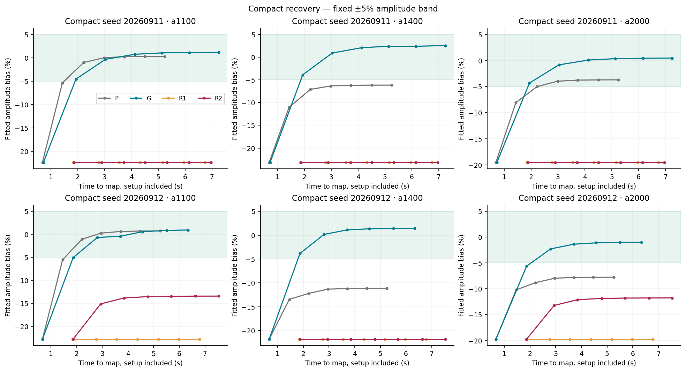
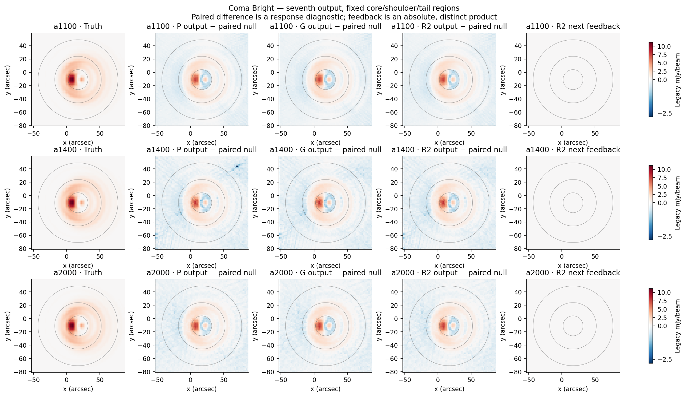

# POINT RBF feedback — bounded experiment closed

2026-09-11. **Feedback: REJECT both tested candidates for POINT adoption.**
**Concentration: REVISE before empirical use; retain the verified calculation.**
The basis can represent the intended PSFs, but these fits and admission rules do
not produce useful recovery. This rejects two concrete methods, not the whole
RBF idea. The one revision allowance is exhausted; no further sweep is proposed.

The [owner directive](OWNER_DIRECTIVE.md) authorized this isolated screen under
the [program charter](../../doc/scientific_contracts/README.md). The
[protocol](PROTOCOL.md) adopts prior input/control bindings and scientific
recovery; it does not reopen generic Stage B or production contracts. The
[compact numerical evidence](DECISION_EVIDENCE.json) supports the findings below.
All maps, learning states, coefficients, fits, decisions, errors and timings are
retained through the [result manifest](RESULT_MANIFEST.json).

**What was tested.** P is the matched pixelwise control; G is the independent
single-Gaussian control. R1 uses positive Gaussian RBFs on a 3″ lattice, 4″ FWHM,
3,093 centers per array, uniform pixel fitting and a jointly fitted plane that
never enters feedback. A fixed quadratic neighbor penalty has strength 0.01.
Two checkerboard fits must predict held-out pixels with scores ≥5 and agree
with cosine ≥0.8. These are empirical coherence rules, not false-alarm
probabilities. R2 changes only penalty strength to 1.0. No cross-array prior is
used. Both retain the immutable parent, replacement model, rank-5 network PTC
relearning on every residual, ordinary map, projection and seven-pass budget.
The output map and inferred feedback remain separate products.

Nine cases per candidate cover real 123424, two compact/null pairs, the existing
two-component mismatch, independent comatic truth at two brightnesses, and a
background-only case. Every arm independently reruns learning. The exact
candidate/input/code freezes precede execution: R1 at `7d3c41c71`, R2 at
`a06db7408`. Both 189-pass campaigns completed without trajectory failures.

**Representation worked; noisy inference did not.** The initial 4″ lattice /
5″ basis failed the noiseless diffraction-core check. The one preparation
resolution adjustment passed: raw errors are 0.64–0.85% for the compact source,
3.46–3.55% for diffraction, and 1.03–1.58% for coma across arrays and grid phases.
Independent pupil propagation supplies the optical truth. R1 penalized coma
error is 1.85–2.38%. See the [representation decision](REPRESENTATION_DECISION.md).

R1 rejects all injected sources. The fitted positive fields contain enough noise
that the two subsets disagree even when compact-source cross-prediction scores
are high. The [single revision](REVISION_R0.2.md) strengthens smoothing without
changing admission or recovery gates. It improves agreement, but its noiseless
compact-model error rises to 41–45%. In empirical data it admits only a1100 and
a2000 of the second compact realization. No candidate reaches the joint compact
amplitude/width/centroid target in seven passes; G reaches it in two or three.

Final compact amplitude bias, in percent; each cell lists seed 20260911 / seed
20260912. The acceptance band is ±5%; widths and centroids must also pass.

| Array | P | G | R1 | R2 |
|---|---:|---:|---:|---:|
| a1100 | +0.32 / +0.72 | +1.17 / +0.93 | -22.32 / -22.82 | -22.32 / -13.45 |
| a1400 | -6.15 / -11.16 | +2.55 / +1.41 | -23.14 / -21.78 | -23.14 / -21.78 |
| a2000 | -3.70 / -7.76 | +0.47 / -0.99 | -19.53 / -19.74 | -19.53 / -11.77 |

The two admitted R2 compact cases have near-correct fitted widths and Gaussian
centroid errors of 0.029″ and 0.064″, yet their amplitudes remain low. Broad
excess structure makes brightness in the fixed 60″ diagnostic aperture **88%
and 70% high**. A plausible central fit therefore does not establish faithful
brightness recovery. In the two-component mismatch, both R candidates reject
feedback; their direct map error is 4.65–8.36 times G and exterior error is
5.24–9.00 times G, failing the +10% nondegradation allowance.

**No comatic improvement was demonstrated.** Both R candidates reject both
brightness levels on every pass. R and G therefore retain identical bootstrap
responses here; P differs slightly but provides no useful improvement. Final R
measurements follow, with bright / half-bright values. Errors use the frozen
truth-centered 60″ aperture; pointing means signed brightness centroid relative
to the noiseless centroid, not injected translation or a Gaussian center.

| Array | Integrated-brightness error | Image error | Centroid error (″) | Wing-brightness error |
|---|---:|---:|---:|---:|
| a1100 | −59.0% / −59.0% | 44.7% / 44.7% | 0.65 / 0.65 | −61.6% / −61.6% |
| a1400 | −62.0% / −62.0% | 45.9% / 45.8% | 2.25 / 2.24 | −65.7% / −65.6% |
| a2000 | −59.8% / −59.7% | 45.0% / 45.0% | 1.73 / 1.74 | −63.0% / −63.0% |

The bright/half image limits were 15%/25%, brightness limits 10%/15%, centroid
limits 0.4″/0.8″, and wing limits 20%/30%. Every array fails. Fixed core, shoulder
and tail measurements, raw signed measurements and unadjusted errors remain in
the full metrics; outer-plane subtraction cannot conceal them.

The chosen brightnesses are an important limitation. Equal integrated brightness
to the compact injection gives a comatic peak of only 11.16 mJy/beam; the second
level is 5.58. Even the oracle truth-norm/annular-scatter ratio is only 3.93–6.57
at the brighter level before accounting for cleaning attenuation or covariance.
This is not a calibrated significance. **The requested detectable comatic regime
was not established across arrays.** The paired response reveals signal but does
not prove standalone detectability. Thus this screen does not settle whether a
better RBF estimator could recover a clearly detected comatic source. The
compact-source failures still suffice to reject these methods. Brightnesses were
not increased after seeing the result.

**Nulls, real pointing and cost.** Neither candidate admits a model in either
null or the background-only trajectory, in any array/pass. These few cases are
a failure screen, not a measured rare-failure rate. Rejecting everything would
also pass that screen and is not success. Real R1 admits a1100/a1400; R2 admits
all arrays. Both change real source morphology substantially, without known
truth to establish improvement. Final R2 common-fit centroids are
(8.78, −5.29), (10.27, −5.14), and (−20.78, −21.04) arcsec; widths are
22.78×11.14, 20.33×7.77, and 44.41×11.63 arcsec. The real a2000 association
problem is not solved. The [real-map comparison](figures/real_maps.png) and
per-pass measurements retain P/G/R results separately.

The identified OG control is
`POINT-123424-OG-RECURRENCE-EL-F2-ALPHA1-CONTROL-2026-09-02`, with 205.38 seconds
full wall time. Its native operational POINT centroids are retained separately
from the common free Gaussian evaluation in the numerical evidence: these are
different observables, neither is truth. OG uses different upstream processing,
JINC, weighting, thread count and diagnostic scope. No harness/OG ratio is an
end-to-end speedup claim.

In the R2 matched campaign, the seventh real map takes 5.23 s for P, 6.56 s for G,
and **7.84 s for R2**, including its 1.19 s observation-specific basis setup.
R2's warm value is 6.65 s. R1's first-observation value is 7.69 s. Median R2
per-pass PTC/mapmaking/inference/diagnostic/output costs are respectively
0.477/0.191/0.065/0.003/0.061 s; 0.221 s of external evaluation is separately
excluded from method time. Current-map readiness excludes unused next-model
inference. Equal-pass R2 cost is 1.50× P, but **cost at comparable useful recovery
is unavailable** because R never qualifies; this is not a runtime gate pass.
All pass-to-pass changes remain recorded, and stable rejected feedback is not
scientific convergence. The campaigns took 198.56 and 198.12 s, peaked at
2.72 GB RSS, and retained about 907 MB of numerical payloads together.

**Concentration is not validated by this experiment.** Full overlap-matrix
integration agrees with direct grid integration to better than 10⁻¹⁵ relative
error. Noiseless R1 comatic effective-area bias is 0.92–1.12%, with grid-phase
changes below 0.2 percentage point. Those checks support the calculation only.
All empirical comatic measurements are unavailable after admission. The raw
rejected fits have effective-area errors around +246% to +290%; the two admitted
R2 compact fits are +3235% and +3557%. Those are biased source estimates, not
measurements of poor focus. The [diagnostic plot](figures/concentration_bias.png)
shows the raw-fit audit. A_eff uses fixed supported D and excludes the plane;
N_eff uses clipped basis integrals and remains basis-dependent. Integrated
map brightness is not automatically physical flux. Concentration never selected
fitting, support, admission, stopping or the reconstruction verdict.

**Integrity and next boundary.** Five focused tests pass. The largest solver KKT residual is 1.02×10⁻⁵;
no fit approaches the iteration cap. The maximum conditioning bound is 4,840.91
for R1 and 417.19 for R2. This corrects the preparation prose’s “below 4,830”;
the original machine records already contain the correct bound. Verification checks all
1,344 campaign payload hashes, exact P/G reproduction, replacement/projection,
nonnegative coefficients, admission, and independent reconstruction from stored
PTC state (maximum error below 3×10⁻¹² mJy/beam). All 57 frozen ordinary-MAP
payloads and previous experiment packets are preserved; the two opaque archives
were checked by status only. Observation 129081 is **historically characterized,
reserved for new feedback comparisons, not untouched holdout data**; no new
scientific read or trajectory was performed. Production, profiles and Unity
remain unchanged. The bounded experiment is closed. Any new estimator/admission
or brighter-signal design requires a separate owner decision; these results do
not authorize another iteration or qualification.
