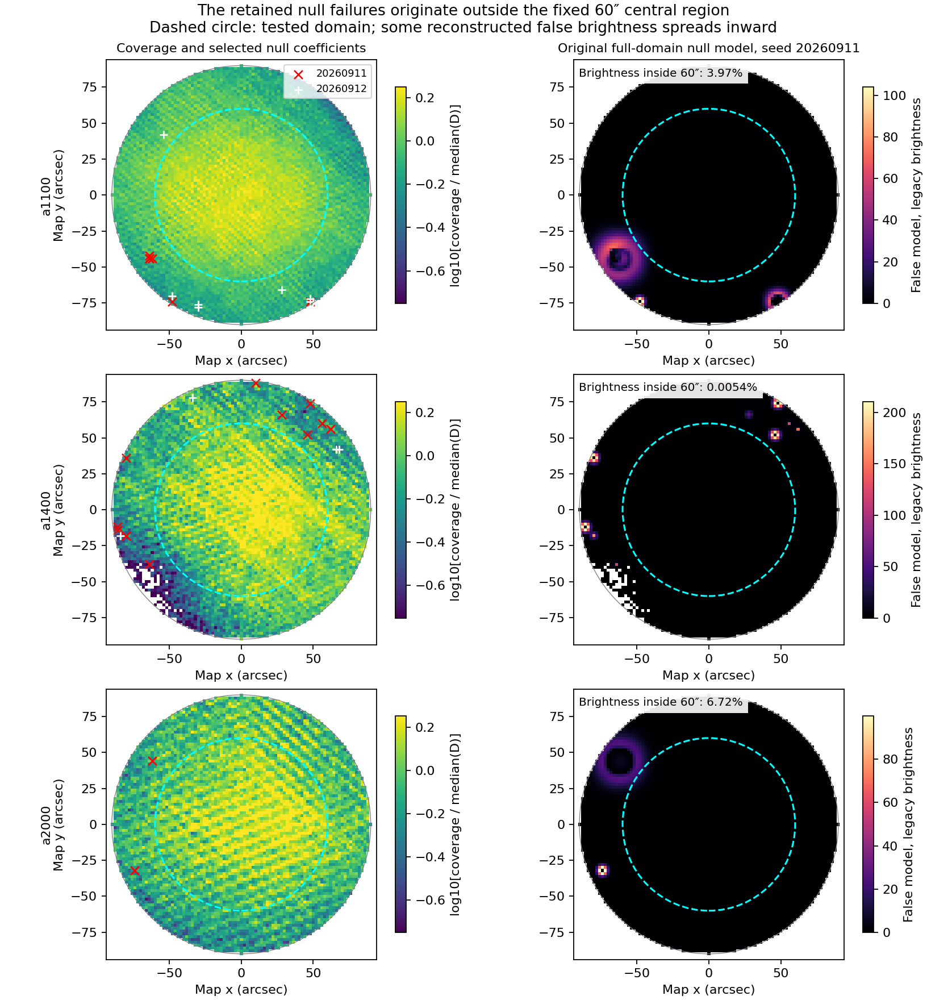
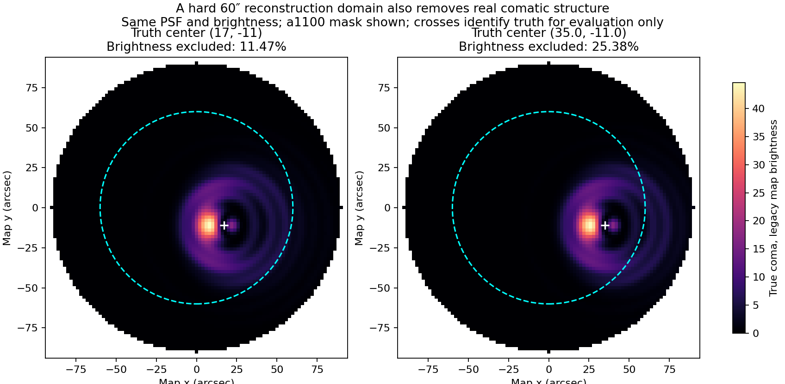

# Central targeting removes null feedback; the 60″ reconstruction domain fails the full screen

## Program adherence and prior-work recovery

This completes the [owner-directed test](PROTOCOL.md) following the
[review discussion](REVIEW_DISCUSSION.json), under the
[scientific-contract program](../../doc/scientific_contracts/README.md).
Commit `f79e93b46` froze the exact domain, normalization repair, cases and bounds
before the spatial audit and estimator comparison. Earlier scientific authority
and experimental products remain unchanged. No independent author was dispatched.

**The owner's edge/domain hypothesis is supported by the retained evidence.**
Restricting coefficient selection and reconstructed feedback to the fixed
60-arcsec central domain removes every observed null/background admission.
However, this specific candidate still fails the complete screen: required
source solves are unavailable, and the domain excludes too much of the offset
comatic source. Preserve the central-location finding; do not promote this
60-arcsec reconstruction policy.

My previous comparison of raw false peaks with the compact-source peak was
incomplete for the central POINT question. The full-domain rejection remains
valid, but recommending a return to the broader contract before testing this
spatial explanation was premature.

## Where the original failures occurred

All **32 selected coefficients in the two nulls** and all **20 in the
background-only cases** lie outside 60 arcsec. Their radii span 68.41–89.31
arcsec. The difference is not just the larger number of searchable outer
coefficients:

| Retained cases | Central eligible coefficients | Central selected | Outer eligible coefficients | Outer selected |
| --- | ---: | ---: | ---: | ---: |
| Two null seeds, all arrays/bands | 78,428 | 0 | 89,826 | 32 |
| Background-only, all arrays/bands | 39,214 | 0 | 44,913 | 20 |

The null outer selection rate is 3.56 per 10,000 eligible coefficients; its
central rate is zero in these realizations. The background cases share a
nuisance seed with a null, and coefficients/scales are correlated. These counts
are descriptive, not independent trials or false-alarm probabilities.

Of the 52 selections, 46 lie in the lower-Q stratum and six in the upper.
Their local Q ranges from 0.19 to 1.16 times the array's original D median.
Thus the failures are strongly associated with the outer region and often
lower coverage, but they are not exclusively the lowest-coverage pixels.
The original band/Q-stratum weights were already applied. The audit records
standardized coefficient distributions by radius, band and stratum; it does
not claim these two strata provide exact local coefficient uncertainties.
The selected absolute coefficient/scatter ratios range from 5.006 to 7.268.
There are 30 selections in detail band 1, 14 in band 2 and eight in band 3;
none occurs in detail band 4 or the coarsest band.

The reconstructed false brightness was not entirely confined outside 60 arcsec.
For calibration-null a1100/a1400/a2000, the fractions inside were respectively
**3.97%, 0.0054%, and 6.72%**. Central peaks were 23.60, 0.106 and 17.47 in the
legacy map-brightness units, compared with full-domain peaks 104.10, 210.75 and
99.70. The large central values occur at the 60-arcsec boundary. The other null
has at most 0.174% of its false brightness inside. This is why the test changed
inference directly rather than merely ignoring outer peaks in the report.

## The matched central comparison

F retained the original supported radius <=90 arcsec. C used its intersection
with radius <=60 arcsec about the existing commanded-origin map coordinate
(0,0). Source positions remained free within that region. Both retained the
full surrounding map, original background annulus, wavelet transform and masks,
original Q split and noise scatters, threshold, objective, positivity and solver
limits. No spatial taper was applied.

| Check | Full domain F | Central domain C |
| --- | ---: | ---: |
| Null admissions | 5/6 | **0/6** |
| Background-only admissions | 3/3 | **0/3** |
| Pure-plane admissions | 0/3 | 0/3 |
| Usable feedback from six processed compact cases | 0/6 | 0/6 |
| Usable feedback from three processed coma4 cases | 0/3 | 0/3 |

All central null/background/plane zeros are available empty-support results,
not zeros substituted for failed fits. This demonstrates the location-domain
benefit on the development examples. It does not establish independent-pointing
reliability or a general null rejection rate.

C had 54 solver-limit failures, 32 empty-support results and one accepted solve
(real123424 a1100). F had 55 failures, 14 empty results and 18 accepted solves.
Every required synthetic recovery solve still reached the fixed 300-iteration
limit. All six processed compact C solves meet the relative-gradient threshold,
but the separately required solver-success condition does not pass. Neither
condition was relaxed. A smaller domain did not resolve the numerical issue.

The zero-MAD defect was explicitly repaired in both arms: noiseless maps use
the fixed calibration-null outer MAD for solver coordinates, scaling Y and
sigma together. Every formerly blocked nonempty noiseless solve could therefore
be attempted. All **51 original nonzero-MAD controls are bitwise identical**
in returned model, last iterate and selected coefficients to the old results.
The repair changed neither their noise calibration nor their behavior.

Last iterates remain diagnostic, not available feedback. They nevertheless
prevent an overly simple interpretation of the remaining failure. The six
noiseless compact C iterates have fitted peak errors below 0.155% and image
errors of 1.23–2.59%. In contrast, original-phase noiseless coma4 image errors
are 39.7–66.2%, and compact truth-plus-null image errors are 58.1–114.5% despite
some reasonable fitted compact parameters. Brightness, source-fit parameters
and a small gradient alone cannot establish morphology recovery. These are
unfinished-iterate measurements, not converged performance claims.

## A hard central image boundary also removes real source structure

The 60-arcsec trial radius was fixed before this audit, using an existing
experimental length scale. It was not selected from the null peak locations
and is not an accepted operational pointing-error bound. Four map-level stress
inputs moved the compact and coma4 truths from (17,-11) to (35,-11), keeping
shape and brightness unchanged. These tests did not rerun PTC learning.

All truth denominators retain the original D. No truth was renormalized or
cropped to C to make the comparison pass.

| Coma4 truth location | Original-D brightness outside C | Wing brightness outside C | Unavoidable fixed-aperture image-error floor |
| --- | ---: | ---: | ---: |
| (17,-11) | 11.45–11.47% | 10.01% | 11.24% |
| (35,-11) | 25.38% | 31.04% | **29.01%** |

The image-error floor is the norm of truth excluded by C divided by the full
truth norm in the unchanged evaluation aperture. Every model constrained to
zero outside C has at least that error, regardless of its solver or brightness
inside C. For the offset coma it exceeds both the 15% noiseless and 25%
truth-plus-null limits. **This domain cannot pass the declared offset-coma
requirements even with perfect numerical convergence.** Integrated brightness
alone could conceal the loss by overestimating the interior.

The offset compact source loses only 0.000028% of its brightness geometrically.
The issue is therefore the combination of absolute pointing offset and source
extent, not a requirement to force the source onto the nominal position.

## Scope, verification and disposition

The run completed **174 estimator calls on 29 maps in 72.66 s**, with **0.68 GiB**
peak RSS and approximately 27 MiB of outputs. It made **zero new PTC passes**
and ran no FRUIT trajectories. C's worst per-map median array inference was
0.594 s, versus 0.674 s for F; both exceeded 0.5 s on 18/29 maps. C's maximum
individual call was 0.618 s. Fixed F-then-C order and unavailable solves limit
any performance interpretation; this is not an OG or production latency result.

[Verification](VERIFICATION.json) recomputed all 174 selected supports and all
128 attempted-solve objectives/gradients; checked unchanged transform functions,
background and calibration; and verified the 51 bitwise controls. Three focused
pre-execution tests passed. There were no unexpected execution warnings or
errors. Failed solves, clipping, phase-check unavailability and all source
metrics are retained in [DECISION_EVIDENCE.json](DECISION_EVIDENCE.json) and
[NUMERICAL_RESULTS.json](NUMERICAL_RESULTS.json). The complete spatial audit is
[SPATIAL_AUDIT.json](SPATIAL_AUDIT.json).

All 44 source/input bindings, 23 prior starlet packet payloads, 49 RBF payloads,
13 audit payloads and 57 frozen ordinary-MAP payloads remain unchanged. Protected
worktrees and both opaque review archives retain their recorded state; the
archives were not read, hashed or unpacked. New products are retained under
`/private/tmp/sci-fruit-starlet-central-domain-20260912-r0.1` and bound by
[RUN_PRODUCT_MANIFEST.json](RUN_PRODUCT_MANIFEST.json).

The bounded test is complete. The supported result is **central location
information removes these observed edge admissions**. The tested 60-arcsec
reconstruction candidate is **not accepted**, and its offset-coma support failure
is independent of the solver. No automatic radius scan, threshold change or
solver revision follows.

The next scientific decision, if development continues, is whether to separate
where POINT source evidence may originate from how much spatial extent the
accepted source model may occupy, while also resolving reconstruction fidelity
and numerical completion. That is a new bounded design decision, not permission
for full trajectories. It is more directly motivated by these results than
abandoning the central-target hypothesis or selecting another representation.
129081 remains reserved for new comparisons, with historical exposure disclosed;
no Unity, production, qualification or OOF work occurred.
