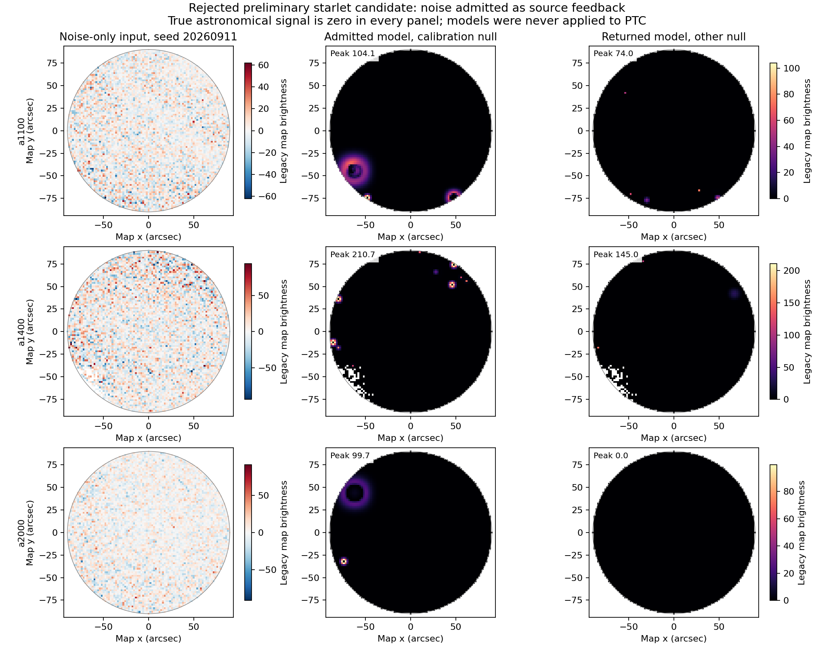

# POINT starlet preliminary result: reject this candidate

## Program adherence and prior-work recovery

This completes the [owner-approved screen](OWNER_APPROVAL.md) under the
[program charter](../../doc/scientific_contracts/README.md). The exact
[proposal](../fruit_point_rbf_admission_audit_2026-09-11/STARLET_SCREEN_PROPOSAL.md),
[execution protocol](PROTOCOL.md), source and inputs were frozen at commit
`fb8a4612d` before execution. The common rank-5 ordinary-map harness and retained
RBF first maps were reused. Both previous RBF rejections remain in force.
This is experimental evidence, outside the frozen scientific-author channel.

**Reject this starlet estimator/admission combination at the preliminary
stage.** Noise alone produces admitted positive source models. This failure
is decisive independently of the solver and noiseless-test limitations below.
No model from this screen was applied in a subsequent cleaning pass.

## Compact evidence

| Required check | Observed | Disposition |
| --- | --- | --- |
| Calibration availability | All 30 band/coverage-stratum cells available | Pass |
| Calibration null, seed 20260911 | Source admitted in 3/3 arrays | Fail |
| Other null, seed 20260912 | Source admitted in 2/3 arrays | Fail |
| Saved background-only maps | Source admitted in 3/3 arrays | Fail |
| Pure plane | No source admitted in 3/3 arrays | Pass |
| Processed compact sources, two seeds | Coefficients selected in 6/6; usable model in 0/6 | Fail: solver limit |
| New processed 4× coma | Coefficients selected in 3/3; usable model in 0/3 | Fail: solver limit |
| Required noiseless recovery and phase checks | Prescribed normalization is zero | Unavailable |
| Required compact/coma4 truth-plus-null recovery | Required solves hit 300 iterations | Unavailable |
| Per-map median array inference <=0.5 s | Exceeded on 10/25 maps; worst 0.602 s | Fail |
| Maximum array inference <=2 s | 0.630 s | Pass for measured attempts |

There were 75 array-level estimator calls on 25 maps: 18 accepted solves,
14 empty-support results, 29 iteration-limit failures, and 14 nonempty-support
cases with unavailable zero-scatter normalization. These calls share existing
nuisance realizations and coverage; they are not 75 independent trials.
The second null is a separate preliminary check, already exposed development
data. Neither null calibrates a false-alarm rate.

The calibration-null models alone have the following spurious peaks. For scale,
the compact injected source has peak 100 in the same legacy map-brightness
units. These are not physical flux-density measurements.

| Array | Selected coefficients, all bands | False model peak | Positive model pixels |
| --- | ---: | ---: | ---: |
| a1100 | 6 | 104.10 | 730 |
| a1400 | 12 | 210.75 | 447 |
| a2000 | 2 | 99.70 | 650 |

The admission problem is substantive. A five-MAD coefficient threshold still
selects noise in these maps, and matching only the selected coefficients can
produce substantial positive structure elsewhere. The objective contains no
constraint on unselected coefficients. The retained null solves satisfy the
specified numerical criteria, so simply allowing more solver iterations cannot
repair this failure. This observation does not establish that every starlet
estimator would fail, or that another threshold would suffice. No threshold,
mask, positivity rule, objective, or numerical limit was revised.

## The brighter coma supplied the intended detectable regime

Exactly one new PTC bootstrap used the frozen four-times normalization,
seed 20260911, immutable synthetic parent, zero applied model, and rank-5
network/chunk relearning. The sampled truth was verified exactly equal to four
times the original bright-coma map. All 144 learned group states were saved.

| Array | Observed-source oracle score | Paired-null score | Processed-response score |
| --- | ---: | ---: | ---: |
| a1100 | 23.425 | 0.142 | 23.282 |
| a1400 | 15.037 | -1.774 | 16.810 |
| a2000 | 20.130 | 0.305 | 19.825 |

Each observed-source score exceeds the predeclared five-scale marker. This
resolves the earlier weak-array detectability limitation for this specific
brighter input. The scores use the realized processed template and empirical
covariance of spatial projections of the other null. They are descriptive
oracle benchmarks, with overlapping placements and only two nuisance seeds;
they are not calibrated significances or a deployable detection rule. The
factored diagnostic reproduced the prior bright-coma audit numbers to numerical
tolerance. Oracle information never entered the starlet estimator.

## Numerical limitations and support

All six compact and all three brighter-coma processed-map solves reached the
fixed 300-iteration limit. Some achieved the projected-gradient criterion, but
solver success was also required; they correctly remained unavailable. Their
last iterates, coefficients, objectives and gradients were preserved. Evaluation
of these failed iterates is explicitly marked diagnostic-only in
[DECISION_EVIDENCE.json](DECISION_EVIDENCE.json); none was promoted to feedback.
A failed iterate is not evidence of converged photometric or morphology quality.

The proposal's numerical normalization was incomplete for its noiseless tests:
the truth is zero outside D, making its outer-annulus MAD exactly zero. The
specified division therefore cannot be performed when coefficients survive.
Those recovery and phase tests remain unavailable, rather than measured
starlet representation failures. This design gap should have been caught when
preparing the proposal. It was disclosed before execution, and no fallback was
invented after viewing results. Correcting it would not remove the independent
null-admission failure or reopen the closed candidate.

Coverage was not changed to accommodate the source. Eligible D pixels by band
were:

| Array | D pixels | Detail 1 | Detail 2 | Detail 3 | Detail 4 / coarse |
| --- | ---: | ---: | ---: | ---: | ---: |
| a1100 | 6361 | 6361 | 6361 | 6361 | 6043 |
| a1400 | 6289 | 6269 | 6102 | 5420 | 2317 |
| a2000 | 6361 | 6361 | 6361 | 6361 | 5725 |

All band/stratum calibration cells exceed 64 pixels; the smallest has 703.
The a1400 coarse coefficients cover only 36.8% of D. This is a substantial
coverage limitation, but these results do not isolate it as the cause of
rejection. Complete-support masks exclude coefficients affected by missing
pixels; zero filling creates no evidence. All returned models remain
nonnegative on D and exactly zero outside it. Signed wavelet details are
retained, and the fitted plane never becomes feedback.

## Cost, preservation and next boundary

The numerical screen took **21.88 s**, including setup, one bootstrap,
estimator calls, evaluation and product writing. Peak resident memory was
**2.21 GiB**, with approximately **12.5 MiB** of run outputs at completion.
New cleaning took **0.500 s**, followed by **0.173 s** of mapmaking. Calibration
itself took 0.008 s. Four numerical threads were requested through the process
environment and threadpool context; the backend reported no inspectable pool.
Per-array medians, maxima and serial three-array sums are retained. Timing
failed or unavailable solves does not establish useful completed-method latency.
No full FRUIT runtime, iteration saving, source recovery or OG improvement is
claimed. The identified OG operational benchmark remains preserved.

[Verification](VERIFICATION.json) confirms the transform sum, exact masked
adjoint, gradient, signed coefficients, missing-pixel exclusion and background
removal; all 75 selected supports were recomputed. Stored objectives and
projected gradients were verified for all 47 attempted solves. There were no
unexpected execution warnings or errors. The 29 solver-limit outcomes are
recorded expected scientific gate failures, not hidden successful runs.

All 30 frozen source/input files, 49 prior RBF packet payloads, 13 audit
payloads and 57 frozen ordinary-MAP payloads remain unchanged. Both protected
worktrees and the two opaque untracked review archives retain their recorded
status; the archives were neither read, hashed nor unpacked. All prior reduction
products are preserved. The new products remain under
`/private/tmp/sci-fruit-point-starlet-preliminary-20260911-r0.1`, bound by
[RUN_PRODUCT_MANIFEST.json](RUN_PRODUCT_MANIFEST.json); the full estimator
records are also retained here in [NUMERICAL_RESULTS.json](NUMERICAL_RESULTS.json).

The authorized preliminary experiment is complete and this candidate is
closed. **Do not advance it to full trajectories or automatically redesign it.**
A separate owner decision is needed for any new estimator or changed screen.
The useful retained advances are a detectable independent comatic benchmark
and a concrete null failure that a successor must address. Returning to a
bounded POINT reference contract remains a valid next direction; this result
does not justify a new open-ended search. 129081 remains reserved for new
feedback comparisons, with historical exposure disclosed. No Unity,
production, qualification, OOF, or independent-author work occurred.
