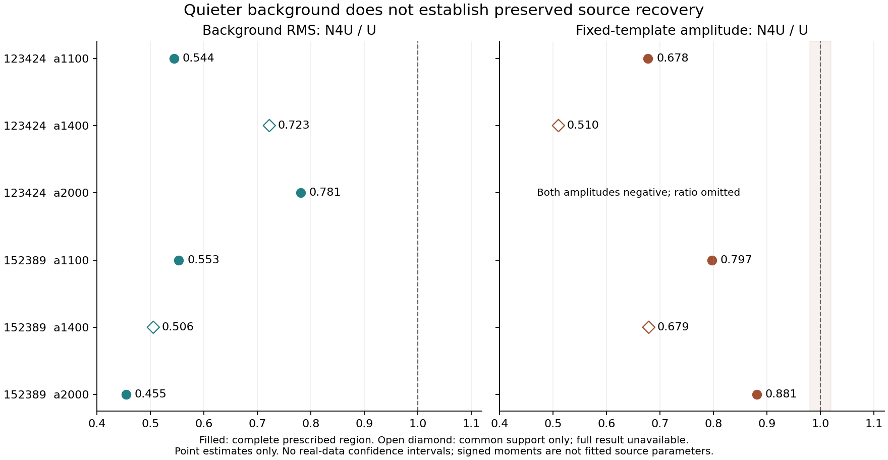

# Weighting matters; this screen does not select a policy

2026-09-10. **Approved Q02 r0.6 screen complete. Q02-C remains open.**

## Program adherence and prior-work recovery

Use the [owner approval](../../doc/scientific_contracts/packages/SCI-FRUIT/v0.1/method_preparation/ordinary_map/method_definition/q02_review/MAPPING_SCREEN_APPROVAL_2026-09-10.md)
and [exact r0.6 protocol](../../doc/scientific_contracts/packages/SCI-FRUIT/v0.1/method_preparation/ordinary_map/method_definition/q02_review/r0.6/MAPPING_SCREEN_PROTOCOL.md),
including its charter-linked recovery and frozen sources. Adopt their scope
and preserve the [preceding precision diagnostic](../fruit_q02_weight_precision_2026-09-09/SCIENTIFIC_REPORT.md).
This report is empirical evidence for the manager/owner, outside independent
scientific authorship. Generic Stage A/B, Q01 and Q02-A/B substance are unchanged.

## What the screen established

Uniform weighting is not harmless under every declared detector-noise regime.
The synthetic test passes in the equal-noise case and in the case dominated by
a shared correlated component. It fails at least one required criterion in
seven other cases. For example, with half the detectors having twice the
independent noise standard deviation, uniform RMS is 25.1% higher than N4U;
with a fourfold contrast it is 110.4% higher. These are measured outcomes under
the declared synthetic laws. They do not establish the true noise population
of either TolTEC observation or qualify N4U as optimal.

The real-data maps show substantial changes as well. In the four cases with
a complete prescribed background region, N4U lowers its spatial RMS by
21.9–54.5%. However, the three complete cases with positive native template
amplitudes also change those amplitudes by about -32.2%, -20.3% and -11.9%.
Every one exceeds the 2% observed-change alert. These are the exact fixed
origin/width template measurements, not fitted source fluxes or measured
physical attenuation. Both a1400 cases lose required outer support, and the
registered signed moments cannot supply a complete morphology comparison.

| Observation / array | Full background RMS N4U / U | Native template amplitude U → N4U (mJy/beam) | Missing required pixels U / N4U |
| --- | ---: | --- | ---: |
| 123424 a1100 | 0.5443 | 830.37 → 562.66 | 0 / 0 |
| 123424 a1400 | unavailable | unavailable | 2 / 9 |
| 123424 a2000 | 0.7812 | -28.75 → -30.61 | 0 / 0 |
| 152389 a1100 | 0.5534 | 75.30 → 60.01 | 0 / 0 |
| 152389 a1400 | unavailable | unavailable | 3 / 3 |
| 152389 a2000 | 0.4549 | 187.04 → 164.72 | 0 / 0 |

The background region is the predeclared R–3R annulus; required support is the
full radius-3R disk. For the two a1400 cases, the common-support RMS ratios
are 0.7227 and 0.5057, but they cannot replace their unavailable full-region
results. All six central disks have complete support; the missing outer pixels
also prevent the prescribed whole-annulus background subtraction for a1400's
native source metrics. No region was shrunk to remove those failures.

## Source, shape and support remain decisive

Only the two y-width values in 123424 a1100 are available among the 24 full
native x/y width entries. Other entries are unavailable because of missing
background support, nonpositive signed total or nonpositive signed second
moment. The two available widths change from 4.33 to 5.08 arcsec, also exceeding
the 2% alert. The 123424 a2000 fixed-template amplitudes are negative in both
arms, so their source comparison remains unresolved. No positive clipping,
recentered fit, different background, new guard or alternate width definition
was substituted.

A signed-moment centroid can lie outside its pixel region when positive and
negative contributions nearly cancel. The approximately 71–73 arcsec x values
in 152389 a1100 are such moment results, not measured pointing offsets. The
figures and tables must not promote those moments to physical source parameters.
The [native maps](report/maps_152389.png) retain the actual source and residual
structure, while the [123424 maps](report/maps_123424.png) retain its more complex
central structure. This screen does not identify which arm better preserves
true sky or explain the origin of every feature.

Window maps are retained in order. They have additional support gaps, especially
in a1400 and a2000. They share the fixed coefficient generation and PTC state;
they are not independent trials and cannot yield a convergence or stationarity
claim. Ring means, powers and spatial correlations remain descriptive residual
structure, not a noise covariance or false-source probability. There is no
real-data confidence interval in this campaign.

The signed, pixel-defined response checks pass: the largest absolute departure
from the required fixed-state response is 6.38e-12 mJy/beam, below 1e-9, with
unchanged native support. This verifies the declared N/Q mapping arithmetic.
It supplies no physical source injection, subpixel response, PTC relearning,
coefficient-estimation response or FRUIT-recovery evidence.

## The missing-training fallback remained explicit

All admitted occurrences and detector columns were retained. N4U uses the
four-chunk training estimate where arithmetically defined, with relative weight
one for the two missing groups in 152389. Each still contributes 136 evaluation
occurrences. Column 91/window 2 contributes 62 central occurrences; column
4472/window 0 contributes 128. Their full-array coefficient fractions are
0.00333% and 0.00900%; their central coefficient fractions are 0.02256% and
0.13088%. These are measured influence, not a proof that the fallback is harmless.
Per-pixel contributions, concentration and maximum detector shares are saved.
No coefficient uncertainty was invented for those fallback groups. The earlier
precision diagnostic's unavailable normalized results remain unchanged.

## Verification and execution record

One scientific campaign completed: 36,864 T1 stochastic maps and 72 T2 maps.
Its elapsed time, including independent product verification, was 23.217 seconds;
peak aggregate memory was 1,570,914,304 bytes (1.46 GiB), within the two-hour/
4-GiB limits. Fifteen deterministic checks, all four analytic U benchmarks,
all signed response checks and independent product verification passed.
The 242 statistical tails retained their fixed 0.05/256 allocation. Synthetic
scientific failures are outcomes, not failed arithmetic checks.

Two earlier startup attempts stopped before scientific input access or random
trials. The [repair record](REPAIRS.md) preserves both failures and exact old
runner sources. The repairs changed process monitoring/startup metadata only.
Attempt 03 is immutable and is the sole source of scientific results. Input
hashes are unchanged. The final manifest binds all attempt, implementation and
report products; report derivatives read saved products only. Four report
figures passed visual inspection. No external reduction was copied or modified.

See the [complete tables](report/FULL_RESULT_TABLES.md),
[synthetic comparison](report/synthetic_comparison.png),
[product verification](attempt_03/PRODUCT_VERIFICATION.json) and
[result manifest](RESULT_MANIFEST.json). All intervals, alerts, unavailable
metrics, native/common supports, window differences, training generations,
per-detector influence and cost components remain available in the saved data.

## Recommended owner disposition

Close this bounded weighting screen as evidence and return to the minimum
scientific statement the reference method can support. We have demonstrated
sensitivity to weighting; we have not established a net scientific improvement
or a safe ordinary-MAP weighting policy. Carry that limitation into the method
record rather than choosing an attractive-looking map. U remains an unqualified
controlled reference; the seven synthetic failures limit any broad adequacy
claim. N4U is an evaluated candidate, with physical recovery unresolved.

The next significant owner decision is whether to close this empirical detour
and scope the minimum source-quantity/recovery requirements before further
numerical development. This is a recommendation, not a new authorized contract
revision or closure of Q02-C. Do not proceed automatically to replication,
change the estimator to repair these results, or use the reserved observation
to tune a new test. A later continuation needs an exact evidence/uncertainty
proposal, separate approval and independent-pointing replication before any
policy recommendation.

129081 remains unopened for scientific values. Historical Citlali remains the
mandatory FRUIT control, and JINC is untouched. No FRUIT/Unity/replay/production/
qualification or new scientific-author dispatch occurred.
`FRUIT-FEEDBACK-METHOD = unavailable_pending_separate_owner_approval`.
