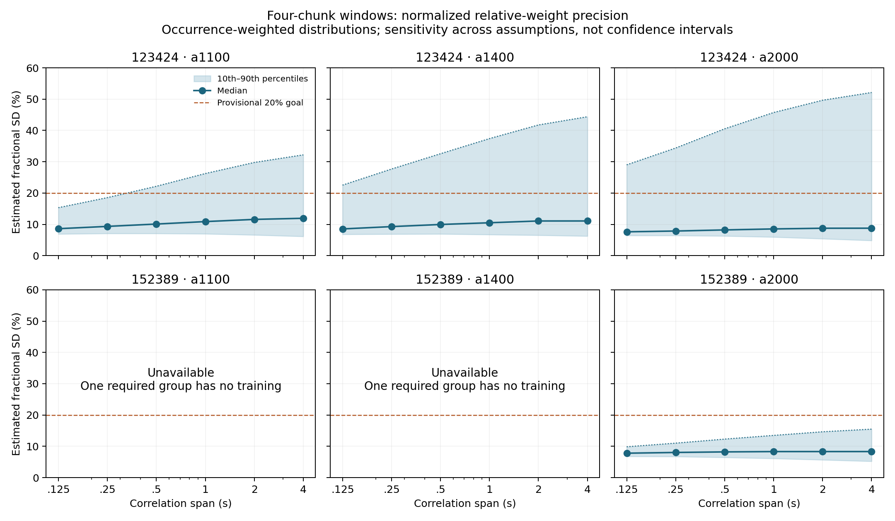

# Q02 weight precision: useful evidence, no weighting policy selected

Report completed 2026-09-10. The approved diagnostic ran on 2026-09-09.
**Execution complete; the 20% precision goal is not certified.**

## Program adherence and prior-work recovery

Use the [owner approval](../../doc/scientific_contracts/packages/SCI-FRUIT/v0.1/method_preparation/ordinary_map/method_definition/q02_review/WEIGHT_PRECISION_APPROVAL_2026-09-09.md),
[exact r0.5 protocol](../../doc/scientific_contracts/packages/SCI-FRUIT/v0.1/method_preparation/ordinary_map/method_definition/q02_review/r0.5/WEIGHT_PRECISION_PROTOCOL.md)
and its charter, roadmap and frozen recovery. Adopt their boundaries and
preserve earlier packets. This is implementation-informed empirical evidence,
not new scientific authority or an independent-author reference. Q01, Q02-A/B,
the generic core and upstream freezes remain unchanged.

## What we learned

The existing reductions can support a practical investigation of relative
weights without changing PCA chunk lengths. With four-chunk training windows,
typical estimated relative-weight uncertainty is about 8–12% in the four
observation/array cases with a complete coefficient vector. However, a sizable
tail in 123424 is less well determined, and scatter differs between chunks.
Two detector/window combinations in 152389 still have no training. These
findings support finishing a practical comparison design; they do not establish
that noise-aware weights improve a map or that uniform weights are acceptable.

A window pools only the source-excluded first halves of one, two or four
original chunks. The approximate window durations are 5, 10 and 20 seconds;
usable training is shorter and has gaps. Every coefficient uses training
available before a prospective offline mapping action. No weight was applied.
A “group” below means one detector column in one such window.

| Observation | Missing weights with 1 chunk | With 2 chunks | With 4 chunks | Complete normalized result with 4 chunks |
| --- | ---: | ---: | ---: | --- |
| 123424 | 230 groups | 4 groups | 0 groups | All three arrays |
| 152389 | 529 groups | 12 groups | 2 groups | a2000 only |

These are arithmetic availability failures, not failures of the former
64-sample proposal or of a 20% precision threshold. Under the approved rule,
one missing required weight makes the whole array's normalization unavailable.
No detector was removed, substituted with a uniform weight, or capped to make
a result available. The [full tables](report/FULL_RESULT_TABLES.md) retain all
three windows and six correlation spans for each observation/array.

The two remaining four-chunk failures are exactly:

| Observation / array | Detector column (embedded UID) | Zero-based original chunks | Training occurrences | Evaluation occurrences | Evaluation occurrences inside source guard |
| --- | --- | --- | ---: | ---: | ---: |
| 152389 a1100 | 91 (91) | 8–11 | 0 | 136 | 62 |
| 152389 a1400 | 4472 (4472) | 0–3 | 0 | 136 | 128 |

They account for 0.00333% and 0.00900% of their arrays' evaluation occurrences,
respectively. Those small fractions do not authorize ignoring them. This is a
specific missing-training behavior to resolve in a future method definition.

## Precision is promising for typical groups, with an important tail

The table shows normalized relative coefficients for four-chunk windows.
Each range spans the six predeclared correlation assumptions, 0.125–4 seconds.
Percentiles use evaluation-occurrence counts. The ranges are sensitivity
results, not confidence intervals, and do not necessarily describe the same
group at every endpoint.

| Observation / array | Median fractional SD across settings | 90th percentile across settings | Evaluation share in groups exceeding 20% at any setting |
| --- | --- | --- | ---: |
| 123424 a1100 | 8.6–11.9% | 15.3–32.2% | 23.3% |
| 123424 a1400 | 8.5–11.1% | 22.5–44.4% | 26.9% |
| 123424 a2000 | 7.6–8.8% | 29.0–52.1% | 23.5% |
| 152389 a2000 | 7.8–8.3% | 9.9–15.5% | 5.2% |

The normalized estimates for 152389 a1100/a1400 remain unavailable. Their
unnormalized inverse-scatter diagnostics cannot stand in for this target.
For 123424, the above-target groups supply 32.4–36.2% of central-guard evaluation
occurrences and 15.1–20.7% of total candidate coefficient mass, depending on
array. Their influence is not confined to a negligible outer-field population.
For 152389 a2000 the corresponding shares are 5.7% and 3.3%.

Short-window estimates can become artificially reassuring as the assumed
correlation span approaches or exceeds the training span. In the one-chunk
raw-weight diagnostic, medians fall to about 5.6–6.6% at the largest span.
That behavior is consistent with the finite-window centering limitation
predeclared in the protocol; it is not evidence that a shorter window is more
precise. No favorable correlation span was selected. Four-chunk groups have
only about six occupied four-second bins at the median; occupied bins are not
independent samples. Finite-data coverage and uncertainty of the error estimate
itself remain unavailable.

## A longer window also combines different measured scatter

Across the four original chunks, the occurrence-weighted median ratio of the
largest to smallest centered scatter is 1.58–1.88 in 123424 and 1.54–1.93 in
152389. The corresponding 90th percentiles are 4.89–11.26 and 2.38–4.41.
These ratios require all four child scatters to be available; that subset
covers 93.4–97.3% of evaluation occurrences, with exact denominators in the full
tables. No excluded subgroup was used to select a window.

These are measured scatter differences. This screen cannot separate true
noise changes from finite-sample fluctuation, residual sky contribution or
other effects. The mean-change term contributes about 0.3–1.6% of pooled
scatter at the median, so retaining only a pooled standard error would hide
relevant differences between the original chunks. Radial scatter contrasts
also remain descriptive; they do not prove source contamination or its absence.

Squared-signal correlations are positive at the shortest measured lags for
typical detectors. Cross-chunk correlations of the separately standardized
series are small in aggregate, but those series remove each chunk's own mean
and scale. Small correlations there do not establish stability of the original
scatter or independence of the shared PTC learning. All lag and support
results, including unavailable pairs, are retained.

## Disposition and next owner decision

Close this diagnostic as completed evidence. Keep four-chunk estimation as a
measured candidate, without adopting it as a policy. The results do not request
another export or a change to the PCA reduction chunks. Chasing a smaller
nominal error bar is not the next benefit test.

The next significant decision is a completed uniform-versus-noise-aware mapping
screen: an exact practical comparator with explicit behavior when training is
missing, plus the map-level evidence and loss criteria. Preserve the two
current discovery observations and their declared populations while preparing
that decision. Do not retrospectively select only the successful arrays or
quietly fill the two missing weights. If a defensible comparator is not worth
pursuing, retain this result and return to the simpler controlled reference and
contract work; that would not turn uniform weighting into a validated policy.

The later screen still owes source recovery, morphology, residual leakage,
native/common support, noise and cost measurements. Feedback stability,
convergence and terminal-product behavior stay at their later gate. Independent
pointing replication is required before a policy recommendation. 129081 remains
reserved. Historical Citlali remains the mandatory FRUIT control.

## Verification and cost

One attempt completed without an implementation repair or scientific deviation:
43.676 seconds, 887,603,200 bytes peak process memory (0.827 GiB), one process
and one numerical-library thread. The 33 manifested run products occupy about
32.1 MiB. Headless figures were visually inspected. Eleven deterministic checks
passed, including the joint derivative, a cross-detector counterexample to
independent-error propagation, exact membership and missing-data behavior.
The [product verification](report/PRODUCT_VERIFICATION.json) independently
checks saved populations, bin counts, normalization, summaries and identities.

Both discovery hashes remain unchanged. Finite-signal admission removed no
additional flag-zero, finite-coordinate occurrence; nonfinite values in 152389
were already excluded by flags. Evaluation signal access used only finite/mask
predicates. No evaluation moment, weighted map, injection, reduction, FRUIT
operation, Unity activity or push occurred. Prior frozen/review payloads and
both opaque review archives are preserved. The numerical FRUIT method remains
`unavailable_pending_separate_owner_approval`.
